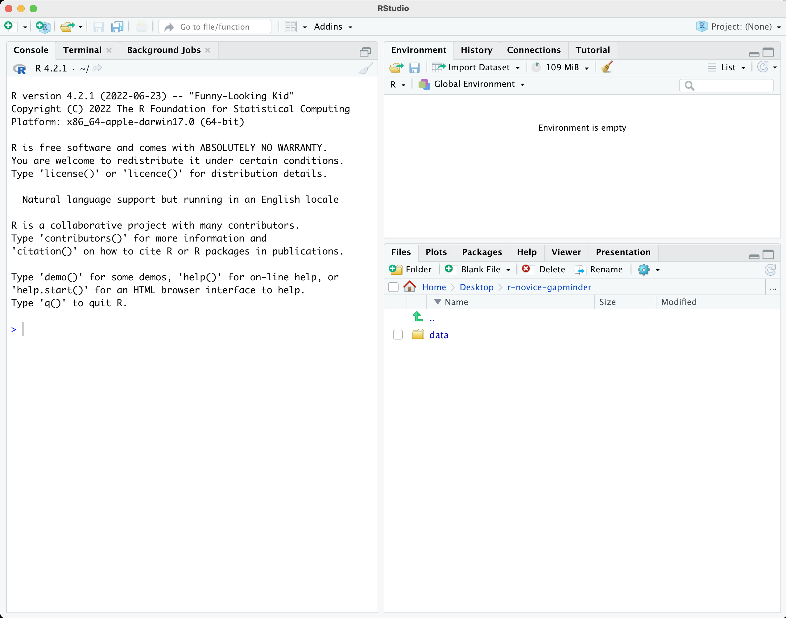
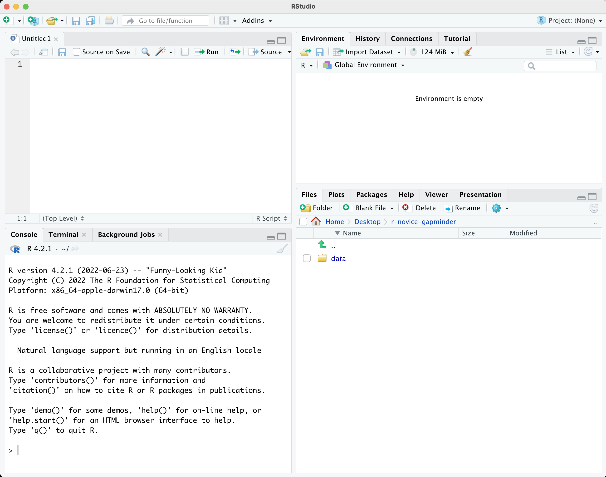

::::::::::::::::::::::::::::::::::::::: objectives

- Describe the purpose and use of each pane in the RStudio IDE
- Locate buttons and options in the RStudio IDE
- Define a variable
- Assign data to a variable
- Manage a workspace in an interactive R session
- Use mathematical and comparison operators
- Call functions
- Manage packages

::::::::::::::::::::::::::::::::::::::::::::::::::

:::::::::::::::::::::::::::::::::::::::: questions

- How to find your way around RStudio?
- How to interact with R?
- How to manage your environment?
- How to install packages?

::::::::::::::::::::::::::::::::::::::::::::::::::


## Motivation

Science is a multi-step process: once you've designed an experiment and collected
data, the real fun begins! This lesson will teach you how to start this process using
R and RStudio. We will begin with raw data, perform exploratory analyses, and learn
how to plot results graphically. This example starts with a dataset from
[gapminder.org](https://www.gapminder.org) containing population information for many
countries through time. Can you read the data into R? Can you plot the population for
Senegal? Can you calculate the average income for countries on the continent of Asia?
By the end of these lessons you will be able to do things like plot the populations
for all of these countries in under a minute!

## Before Starting The Workshop

Please ensure you have the latest version of R and RStudio installed on your machine. This is important, as some packages used in the workshop may not install correctly (or at all) if R is not up to date.

- [Download and install the latest version of R here](https://www.r-project.org/)
- [Download and install RStudio here](https://www.rstudio.com/products/rstudio/download/#download)

## Introduction to RStudio

Welcome to the R portion of the Software Carpentry workshop.

Throughout this lesson, we're going to teach you some of the fundamentals of
the R language as well as some best practices for organizing code for
scientific projects that will make your life easier.

We'll be using RStudio: a free, open-source R Integrated Development
Environment (IDE). It provides a built-in editor, works on all platforms (including
on servers) and provides many advantages such as integration with version
control and project management.

**Basic layout**

When you first open RStudio, you will be greeted by three panels:

- The interactive R console/Terminal (entire left)
- Environment/History/Connections (tabbed in upper right)
- Files/Plots/Packages/Help/Viewer (tabbed in lower right)

{alt='RStudio layout'}

Once you open files, such as R scripts, an editor panel will also open
in the top left.

{alt='RStudio layout with .R file open'}

:::::::::::::::::::::::::::::::::::::::::  callout

## R scripts

Any commands that you write in the R console can be saved to a file
to be re-run again.  Files containing R code to be ran in this way are
called R scripts.  R scripts have `.R` at the end of their names to
let you know what they are.


::::::::::::::::::::::::::::::::::::::::::::::::::

## Workflow within RStudio

There are two main ways one can work within RStudio:

1. Test and play within the interactive R console then copy code into
  a .R file to run later.
  - This works well when doing small tests and initially starting off.
  - It quickly becomes laborious
2. Start writing in a .R file and use RStudio's short cut keys for the Run command
  to push the current line, selected lines or modified lines to the
  interactive R console.
  - This is a great way to start; all your code is saved for later
  - You will be able to run the file you create from within RStudio
    or using R's `source()`  function.

:::::::::::::::::::::::::::::::::::::::::  callout

## Tip: Running segments of your code

RStudio offers you great flexibility in running code from within the editor
window. There are buttons, menu choices, and keyboard shortcuts. To run the
current line, you can

1. click on the `Run` button above the editor panel, or
2. select "Run Lines" from the "Code" menu, or
3. hit <kbd>Ctrl</kbd>\+<kbd>Return</kbd> in Windows or Linux
  or <kbd>⌘</kbd>\+<kbd>Return</kbd> on OS X.
  (This shortcut can also be seen by hovering
  the mouse over the button). To run a block of code, select it and then `Run`.
  If you have modified a line of code within a block of code you have just run,
  there is no need to reselect the section and `Run`, you can use the next button
  along, `Re-run the previous region`. This will run the previous code block
  including the modifications you have made.
  

::::::::::::::::::::::::::::::::::::::::::::::::::

## Introduction to R

Much of your time in R will be spent in the R interactive
console. This is where you will run all of your code, and can be a
useful environment to try out ideas before adding them to an R script
file. This console in RStudio is the same as the one you would get if
you typed in `R` in your command-line environment.

The first thing you will see in the R interactive session is a bunch
of information, followed by a ">" and a blinking cursor. In many ways
this is similar to the shell environment you learned about during the
shell lessons: it operates on the same idea of a "Read, evaluate,
print loop": you type in commands, R tries to execute them, and then
returns a result.

## Using R as a calculator

The simplest thing you could do with R is to do arithmetic:


```r
1 + 100
```

```{.output}
[1] 101
```

And R will print out the answer, with a preceding "[1]". [1] is the index of
the first element of the line being printed in the console. For more information
on indexing vectors, see [Episode 6: Subsetting Data](https://swcarpentry.github.io/r-novice-gapminder/06-data-subsetting/index.html).

If you type in an incomplete command, R will wait for you to
complete it. If you are familiar with Unix Shell's bash, you may recognize this  
behavior from bash.

```r
> 1 +
```

```output
+
```

Any time you hit return and the R session shows a "+" instead of a ">", it
means it's waiting for you to complete the command. If you want to cancel
a command you can hit <kbd>Esc</kbd> and RStudio will give you back the ">" prompt.

:::::::::::::::::::::::::::::::::::::::::  callout

## Tip: Canceling commands

If you're using R from the command line instead of from within RStudio,
you need to use <kbd>Ctrl</kbd>\+<kbd>C</kbd> instead of <kbd>Esc</kbd>
to cancel the command. This applies to Mac users as well!

Canceling a command isn't only useful for killing incomplete commands:
you can also use it to tell R to stop running code (for example if it's
taking much longer than you expect), or to get rid of the code you're
currently writing.

::::::::::::::::::::::::::::::::::::::::::::::::::

When using R as a calculator, the order of operations is the same as you
would have learned back in school.

From highest to lowest precedence:

- Parentheses: `(`, `)`
- Exponents: `^` or `**`
- Multiply: `*`
- Divide: `/`
- Add: `+`
- Subtract: `-`


```r
3 + 5 * 2
```

```{.output}
[1] 13
```

Use parentheses to group operations in order to force the order of
evaluation if it differs from the default, or to make clear what you
intend.


```r
(3 + 5) * 2
```

```{.output}
[1] 16
```

This can get unwieldy when not needed, but clarifies your intentions.
Remember that others may later read your code.


```r
(3 + (5 * (2 ^ 2))) # hard to read
3 + 5 * 2 ^ 2       # clear, if you remember the rules
3 + 5 * (2 ^ 2)     # if you forget some rules, this might help
```

The text after each line of code is called a
"comment". Anything that follows after the hash (or octothorpe) symbol
`#` is ignored by R when it executes code.

Really small or large numbers get a scientific notation:


```r
2/10000
```

```{.output}
[1] 2e-04
```

Which is shorthand for "multiplied by `10^XX`". So `2e-4`
is shorthand for `2 * 10^(-4)`.

You can write numbers in scientific notation too:


```r
5e3  # Note the lack of minus here
```

```{.output}
[1] 5000
```

## Mathematical functions

R has many built in mathematical functions. To call a function,
we can type its name, followed by open and closing parentheses.
Functions take arguments as inputs, anything we type inside the parentheses of a function is considered an argument. Depending on the function, the number of arguments can vary from none to multiple. For example:


```r
getwd() #returns an absolute filepath
```

doesn't require an argument, whereas for the next set of mathematical functions we will need to supply the function a value in order to compute the result.


```r
sin(1)  # trigonometry functions
```

```{.output}
[1] 0.841471
```


```r
log(1)  # natural logarithm
```

```{.output}
[1] 0
```


```r
log10(10) # base-10 logarithm
```

```{.output}
[1] 1
```


```r
exp(0.5) # e^(1/2)
```

```{.output}
[1] 1.648721
```

Don't worry about trying to remember every function in R. You
can look them up on Google, or if you can remember the
start of the function's name, use the tab completion in RStudio.

This is one advantage that RStudio has over R on its own, it
has auto-completion abilities that allow you to more easily
look up functions, their arguments, and the values that they
take.

Typing a `?` before the name of a command will open the help page
for that command. When using RStudio, this will open the 'Help' pane;
if using R in the terminal, the help page will open in your browser.
The help page will include a detailed description of the command and
how it works. Scrolling to the bottom of the help page will usually
show a collection of code examples which illustrate command usage.
We'll go through an example later.

## Comparing things

We can also do comparisons in R:


```r
1 == 1  # equality (note two equals signs, read as "is equal to")
```

```{.output}
[1] TRUE
```


```r
1 != 2  # inequality (read as "is not equal to")
```

```{.output}
[1] TRUE
```


```r
1 < 2  # less than
```

```{.output}
[1] TRUE
```


```r
1 <= 1  # less than or equal to
```

```{.output}
[1] TRUE
```


```r
1 > 0  # greater than
```

```{.output}
[1] TRUE
```


```r
1 >= -9 # greater than or equal to
```

```{.output}
[1] TRUE
```

:::::::::::::::::::::::::::::::::::::::::  callout

## Tip: Comparing Numbers

A word of warning about comparing numbers: you should
never use `==` to compare two numbers unless they are
integers (a data type which can specifically represent
only whole numbers).

Computers may only represent decimal numbers with a
certain degree of precision, so two numbers which look
the same when printed out by R, may actually have
different underlying representations and therefore be
different by a small margin of error (called Machine
numeric tolerance).

Instead you should use the `all.equal` function.

Further reading: [http://floating-point-gui.de/](https://floating-point-gui.de/)

::::::::::::::::::::::::::::::::::::::::::::::::::

## Variables and assignment

We can store values in variables using the assignment operator `<-`, like this:


```r
x <- 1/40
```

Notice that assignment does not print a value. Instead, we stored it for later
in something called a **variable**. `x` now contains the **value** `0.025`:


```r
x
```

```{.output}
[1] 0.025
```

More precisely, the stored value is a *decimal approximation* of
this fraction called a [floating point number](https://en.wikipedia.org/wiki/Floating_point).

Look for the `Environment` tab in the top right panel of RStudio, and you will see that `x` and its value
have appeared. Our variable `x` can be used in place of a number in any calculation that expects a number:


```r
log(x)
```

```{.output}
[1] -3.688879
```

Notice also that variables can be reassigned:


```r
x <- 100
```

`x` used to contain the value 0.025 and now it has the value 100.

Assignment values can contain the variable being assigned to:


```r
x <- x + 1 #notice how RStudio updates its description of x on the top right tab
y <- x * 2
```

The right hand side of the assignment can be any valid R expression.
The right hand side is *fully evaluated* before the assignment occurs.

Variable names can contain letters, numbers, underscores and periods but no spaces. They
must start with a letter or a period followed by a letter (they cannot start with a number nor an underscore).
Variables beginning with a period are hidden variables.
Different people use different conventions for long variable names, these include

- periods.between.words
- underscores\_between\_words
- camelCaseToSeparateWords

What you use is up to you, but **be consistent**.

It is also possible to use the `=` operator for assignment:


```r
x = 1/40
```

But this is much less common among R users.  The most important thing is to
**be consistent** with the operator you use. There are occasionally places
where it is less confusing to use `<-` than `=`, and it is the most common
symbol used in the community. So the recommendation is to use `<-`.

:::::::::::::::::::::::::::::::::::::::  challenge

## Challenge 1

Which of the following are valid R variable names?


```r
min_height
max.height
_age
.mass
MaxLength
min-length
2widths
celsius2kelvin
```

:::::::::::::::  solution

## Solution to challenge 1

The following can be used as R variables:


```r
min_height
max.height
MaxLength
celsius2kelvin
```

The following creates a hidden variable:


```r
.mass
```

The following will not be able to be used to create a variable


```r
_age
min-length
2widths
```

:::::::::::::::::::::::::

::::::::::::::::::::::::::::::::::::::::::::::::::

## Vectorization

One final thing to be aware of is that R is *vectorized*, meaning that
variables and functions can have vectors as values. In contrast to physics and
mathematics, a vector in R describes a set of values in a certain order of the
same data type. For example


```r
1:5
```

```{.output}
[1] 1 2 3 4 5
```

```r
2^(1:5)
```

```{.output}
[1]  2  4  8 16 32
```

```r
x <- 1:5
2^x
```

```{.output}
[1]  2  4  8 16 32
```

This is incredibly powerful; we will discuss this further in an
upcoming lesson.

## Managing your environment

There are a few useful commands you can use to interact with the R session.

`ls` will list all of the variables and functions stored in the global environment
(your working R session):


```r
ls()
```


```{.output}
[1] "x" "y"
```

:::::::::::::::::::::::::::::::::::::::::  callout

## Tip: hidden objects

Like in the shell, `ls` will hide any variables or functions starting
with a "." by default. To list all objects, type `ls(all.names=TRUE)`
instead

::::::::::::::::::::::::::::::::::::::::::::::::::

Note here that we didn't give any arguments to `ls`, but we still
needed to give the parentheses to tell R to call the function.

If we type `ls` by itself, R prints a bunch of code instead of a listing of objects.


```r
ls
```

```{.output}
function (name, pos = -1L, envir = as.environment(pos), all.names = FALSE, 
    pattern, sorted = TRUE) 
{
    if (!missing(name)) {
        pos <- tryCatch(name, error = function(e) e)
        if (inherits(pos, "error")) {
            name <- substitute(name)
            if (!is.character(name)) 
                name <- deparse(name)
            warning(gettextf("%s converted to character string", 
                sQuote(name)), domain = NA)
            pos <- name
        }
    }
    all.names <- .Internal(ls(envir, all.names, sorted))
    if (!missing(pattern)) {
        if ((ll <- length(grep("[", pattern, fixed = TRUE))) && 
            ll != length(grep("]", pattern, fixed = TRUE))) {
            if (pattern == "[") {
                pattern <- "\\["
                warning("replaced regular expression pattern '[' by  '\\\\['")
            }
            else if (length(grep("[^\\\\]\\[<-", pattern))) {
                pattern <- sub("\\[<-", "\\\\\\[<-", pattern)
                warning("replaced '[<-' by '\\\\[<-' in regular expression pattern")
            }
        }
        grep(pattern, all.names, value = TRUE)
    }
    else all.names
}
<bytecode: 0x56180e472ea0>
<environment: namespace:base>
```

What's going on here?

Like everything in R, `ls` is the name of an object, and entering the name of
an object by itself prints the contents of the object. The object `x` that we
created earlier contains 1, 2, 3, 4, 5:


```r
x
```

```{.output}
[1] 1 2 3 4 5
```

The object `ls` contains the R code that makes the `ls` function work! We'll talk
more about how functions work and start writing our own later.

You can use `rm` to delete objects you no longer need:


```r
rm(x)
```

If you have lots of things in your environment and want to delete all of them,
you can pass the results of `ls` to the `rm` function:


```r
rm(list = ls())
```

In this case we've combined the two. Like the order of operations, anything
inside the innermost parentheses is evaluated first, and so on.

In this case we've specified that the results of `ls` should be used for the
`list` argument in `rm`. When assigning values to arguments by name, you *must*
use the `=` operator!!

If instead we use `<-`, there will be unintended side effects, or you may get an error message:


```r
rm(list <- ls())
```

```{.error}
Error in rm(list <- ls()): ... must contain names or character strings
```

:::::::::::::::::::::::::::::::::::::::::  callout

## Tip: Warnings vs. Errors

Pay attention when R does something unexpected! Errors, like above,
are thrown when R cannot proceed with a calculation. Warnings on the
other hand usually mean that the function has run, but it probably
hasn't worked as expected.

In both cases, the message that R prints out usually give you clues
how to fix a problem.

::::::::::::::::::::::::::::::::::::::::::::::::::

## R Packages

It is possible to add functions to R by writing a package, or by
obtaining a package written by someone else. As of this writing, there
are over 10,000 packages available on CRAN (the comprehensive R archive
network). R and RStudio have functionality for managing packages:

- You can see what packages are installed by typing
  `installed.packages()`
- You can install packages by typing `install.packages("packagename")`,
  where `packagename` is the package name, in quotes.
- You can update installed packages by typing `update.packages()`
- You can remove a package with `remove.packages("packagename")`
- You can make a package available for use with `library(packagename)`

Packages can also be viewed, loaded, and detached in the Packages tab of the lower right panel in RStudio. Clicking on this tab will display all of the installed packages with a checkbox next to them. If the box next to a package name is checked, the package is loaded and if it is empty, the package is not loaded. Click an empty box to load that package and click a checked box to detach that package.

Packages can be installed and updated from the Package tab with the Install and Update buttons at the top of the tab.

:::::::::::::::::::::::::::::::::::::::  challenge

## Challenge 2

What will be the value of each variable  after each
statement in the following program?


```r
mass <- 47.5
age <- 122
mass <- mass * 2.3
age <- age - 20
```

:::::::::::::::  solution

## Solution to challenge 2


```r
mass <- 47.5
```

This will give a value of 47.5 for the variable mass


```r
age <- 122
```

This will give a value of 122 for the variable age


```r
mass <- mass * 2.3
```

This will multiply the existing value of 47.5 by 2.3 to give a new value of
109.25 to the variable mass.


```r
age <- age - 20
```

This will subtract 20 from the existing value of 122 to give a new value
of 102 to the variable age.


:::::::::::::::::::::::::

::::::::::::::::::::::::::::::::::::::::::::::::::

:::::::::::::::::::::::::::::::::::::::  challenge

## Challenge 3

Run the code from the previous challenge, and write a command to
compare mass to age. Is mass larger than age?

:::::::::::::::  solution

## Solution to challenge 3

One way of answering this question in R is to use the `>` to set up the following:


```r
mass > age
```

```{.output}
[1] TRUE
```

This should yield a boolean value of TRUE since 109.25 is greater than 102.


:::::::::::::::::::::::::

::::::::::::::::::::::::::::::::::::::::::::::::::

:::::::::::::::::::::::::::::::::::::::  challenge

## Challenge 4

Clean up your working environment by deleting the mass and age
variables.

:::::::::::::::  solution

## Solution to challenge 4

We can use the `rm` command to accomplish this task


```r
rm(age, mass)
```

:::::::::::::::::::::::::

::::::::::::::::::::::::::::::::::::::::::::::::::

:::::::::::::::::::::::::::::::::::::::  challenge

## Challenge 5

Install the following packages: `ggplot2`, `plyr`, `gapminder`

:::::::::::::::  solution

## Solution to challenge 5

We can use the `install.packages()` command to install the required packages.


```r
install.packages("ggplot2")
install.packages("plyr")
install.packages("gapminder")
```

An alternate solution, to install multiple packages with a single `install.packages()` command is:


```r
install.packages(c("ggplot2", "plyr", "gapminder"))
```

:::::::::::::::::::::::::

::::::::::::::::::::::::::::::::::::::::::::::::::

:::::::::::::::::::::::::::::::::::::::: keypoints

- Use RStudio to write and run R programs.
- R has the usual arithmetic operators and mathematical functions.
- Use `<-` to assign values to variables.
- Use `ls()` to list the variables in a program.
- Use `rm()` to delete objects in a program.
- Use `install.packages()` to install packages (libraries).

::::::::::::::::::::::::::::::::::::::::::::::::::


