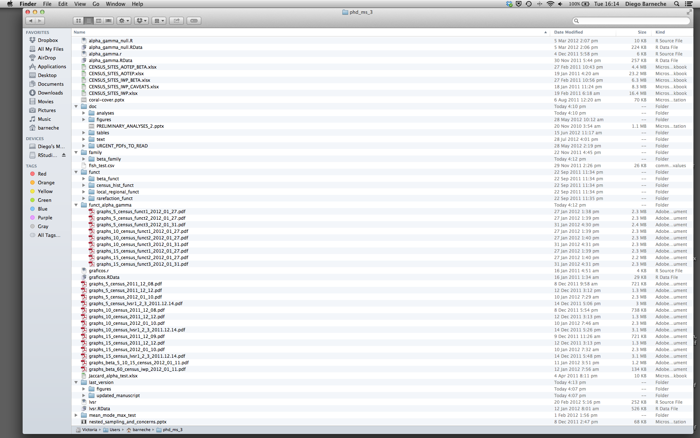

::::::::::::::::::::::::::::::::::::::: objectives

- Create self-contained projects in RStudio

::::::::::::::::::::::::::::::::::::::::::::::::::

:::::::::::::::::::::::::::::::::::::::: questions

- How can I manage my projects in R?

::::::::::::::::::::::::::::::::::::::::::::::::::


## Introduction

The scientific process is naturally incremental, and many projects
start life as random notes, some code, then a manuscript, and
eventually everything is a bit mixed together.

<blockquote class="twitter-tweet"><p>Managing your projects in a reproducible fashion doesn't just make your science reproducible, it makes your life easier.</p>— Vince Buffalo (@vsbuffalo) <a href="https://twitter.com/vsbuffalo/status/323638476153167872">April 15, 2013</a></blockquote>
<script async src="//platform.twitter.com/widgets.js" charset="utf-8"></script>

Most people tend to organize their projects like this:

{alt='Screenshot of file manager demonstrating bad project organisation'}

There are many reasons why we should *ALWAYS* avoid this:

1. It is really hard to tell which version of your data is
  the original and which is the modified;
2. It gets really messy because it mixes files with various
  extensions together;
3. It probably takes you a lot of time to actually find
  things, and relate the correct figures to the exact code
  that has been used to generate it;

A good project layout will ultimately make your life easier:

- It will help ensure the integrity of your data;
- It makes it simpler to share your code with someone else
  (a lab-mate, collaborator, or supervisor);
- It allows you to easily upload your code with your manuscript submission;
- It makes it easier to pick the project back up after a break.

## A possible solution

Fortunately, there are tools and packages which can help you manage your work effectively.

One of the most powerful and useful aspects of RStudio is its project management
functionality. We'll be using this today to create a self-contained, reproducible
project.

:::::::::::::::::::::::::::::::::::::::  challenge

## Challenge 1: Creating a self-contained project

We're going to create a new project in RStudio:

1. Click the "File" menu button, then "New Project".
2. Click "New Directory".
3. Click "New Project".
4. Type in the name of the directory to store your project, e.g. "my\_project".
5. If available, select the checkbox for "Create a git repository."
6. Click the "Create Project" button.

::::::::::::::::::::::::::::::::::::::::::::::::::

The simplest way to open an RStudio project once it has been created is to click
through your file system to get to the directory where it was saved and double
click on the `.Rproj` file. This will open RStudio and start your R session in the
same directory as the `.Rproj` file. All your data, plots and scripts will now be
relative to the project directory. RStudio projects have the added benefit of
allowing you to open multiple projects at the same time each open to its own
project directory. This allows you to keep multiple projects open without them
interfering with each other.

:::::::::::::::::::::::::::::::::::::::  challenge

## Challenge 2: Opening an RStudio project through the file system

1. Exit RStudio.
2. Navigate to the directory where you created a project in Challenge 1.
3. Double click on the `.Rproj` file in that directory.

::::::::::::::::::::::::::::::::::::::::::::::::::

## Best practices for project organization

Although there is no "best" way to lay out a project, there are some general
principles to adhere to that will make project management easier:

### Treat data as read only

This is probably the most important goal of setting up a project. Data is
typically time consuming and/or expensive to collect. Working with them
interactively (e.g., in Excel) where they can be modified means you are never
sure of where the data came from, or how it has been modified since collection.
It is therefore a good idea to treat your data as "read-only".

### Data Cleaning

In many cases your data will be "dirty": it will need significant preprocessing
to get into a format R (or any other programming language) will find useful.
This task is sometimes called "data munging". Storing these scripts in a
separate folder, and creating a second "read-only" data folder to hold the
"cleaned" data sets can prevent confusion between the two sets.

### Treat generated output as disposable

Anything generated by your scripts should be treated as disposable: it should
all be able to be regenerated from your scripts.

There are lots of different ways to manage this output. Having an output folder
with different sub-directories for each separate analysis makes it easier later.
Since many analyses are exploratory and don't end up being used in the final
project, and some of the analyses get shared between projects.

:::::::::::::::::::::::::::::::::::::::::  callout

## Tip: Good Enough Practices for Scientific Computing

[Good Enough Practices for Scientific Computing](https://github.com/swcarpentry/good-enough-practices-in-scientific-computing/blob/gh-pages/good-enough-practices-for-scientific-computing.pdf) gives the following recommendations for project organization:

1. Put each project in its own directory, which is named after the project.
2. Put text documents associated with the project in the `doc` directory.
3. Put raw data and metadata in the `data` directory, and files generated during cleanup and analysis in a `results` directory.
4. Put source for the project's scripts and programs in the `src` directory, and programs brought in from elsewhere or compiled locally in the `bin` directory.
5. Name all files to reflect their content or function.

::::::::::::::::::::::::::::::::::::::::::::::::::

### Separate function definition and application

One of the more effective ways to work with R is to start by writing the code you want to run directly in a .R script, and then running the selected lines (either using the keyboard shortcuts in RStudio or clicking the "Run" button) in the interactive R console.

When your project is in its early stages, the initial .R script file usually contains many lines
of directly executed code. As it matures, reusable chunks get pulled into their
own functions. It's a good idea to separate these functions into two separate folders; one
to store useful functions that you'll reuse across analyses and projects, and
one to store the analysis scripts.

### Save the data in the data directory

Now we have a good directory structure we will now place/save the data file in the `data/` directory.

:::::::::::::::::::::::::::::::::::::::  challenge

## Challenge 3

Download the gapminder data from [here](data/gapminder_data.csv).

1. Download the file (right mouse click on the link above -> "Save link as" / "Save file as", or click on the link and after the page loads, press <kbd>Ctrl</kbd>\+<kbd>S</kbd> or choose File -> "Save page as")
2. Make sure it's saved under the name `gapminder_data.csv`
3. Save the file in the `data/` folder within your project.

We will load and inspect these data later.

::::::::::::::::::::::::::::::::::::::::::::::::::

:::::::::::::::::::::::::::::::::::::::  challenge

## Challenge 4

It is useful to get some general idea about the dataset, directly from the
command line, before loading it into R. Understanding the dataset better
will come in handy when making decisions on how to load it in R. Use the command-line
shell to answer the following questions:

1. What is the size of the file?
2. How many rows of data does it contain?
3. What kinds of values are stored in this file?

:::::::::::::::  solution

## Solution to Challenge 4

By running these commands in the shell:


```sh
ls -lh data/gapminder_data.csv
```

```{.output}
-rw-r--r-- 1 runner docker 80K Aug 15 00:27 data/gapminder_data.csv
```

The file size is 80K.


```sh
wc -l data/gapminder_data.csv
```

```{.output}
1705 data/gapminder_data.csv
```

There are 1705 lines. The data looks like:


```sh
head data/gapminder_data.csv
```

```{.output}
country,year,pop,continent,lifeExp,gdpPercap
Afghanistan,1952,8425333,Asia,28.801,779.4453145
Afghanistan,1957,9240934,Asia,30.332,820.8530296
Afghanistan,1962,10267083,Asia,31.997,853.10071
Afghanistan,1967,11537966,Asia,34.02,836.1971382
Afghanistan,1972,13079460,Asia,36.088,739.9811058
Afghanistan,1977,14880372,Asia,38.438,786.11336
Afghanistan,1982,12881816,Asia,39.854,978.0114388
Afghanistan,1987,13867957,Asia,40.822,852.3959448
Afghanistan,1992,16317921,Asia,41.674,649.3413952
```

:::::::::::::::::::::::::

::::::::::::::::::::::::::::::::::::::::::::::::::

:::::::::::::::::::::::::::::::::::::::::  callout

## Tip: command line in RStudio

The Terminal tab in the console pane provides a convenient place directly
within RStudio to interact directly with the command line.

::::::::::::::::::::::::::::::::::::::::::::::::::

### Working directory

Knowing R's current working directory is important because when you need to access other files (for example, to import a data file), R will look for them relative to the current working directory.

Each time you create a new RStudio Project, it will create a new directory for that project. When you open an existing `.Rproj` file, it will open that project and set R's working directory to the folder that file is in.

:::::::::::::::::::::::::::::::::::::::  challenge

## Challenge 5

You can check the current working directory with the `getwd()` command, or by using the menus in RStudio.

1. In the console, type `getwd()` ("wd" is short for "working directory") and hit Enter.
2. In the Files pane, double click on the `data` folder to open it (or navigate to any other folder you wish). To get the Files pane back to the current working directory, click "More" and then select "Go To Working Directory".

You can change the working directory with `setwd()`, or by using RStudio menus.

1. In the console, type `setwd("data")` and hit Enter. Type `getwd()` and hit Enter to see the new working directory.
2. In the menus at the top of the RStudio window, click the "Session" menu button, and then select "Set Working Directory" and then "Choose Directory".
3. In the windows navigator that opens, navigate back to the project directory, and click "Open". Note that a `setwd` command will automatically appear in the console.

::::::::::::::::::::::::::::::::::::::::::::::::::

:::::::::::::::::::::::::::::::::::::::::  callout

## Tip: File does not exist errors

When you're attempting to reference a file in your R code and you're getting errors saying the file doesn't exist, it's a good idea to check your working directory.
You need to either provide an absolute path to the file, or you need to make sure the file is saved in the working directory (or a subfolder of the working directory) and provide a relative path.

::::::::::::::::::::::::::::::::::::::::::::::::::

### Version Control

It is important to use version control with projects.  Go [here for a good lesson which describes using Git with RStudio](https://swcarpentry.github.io/git-novice/14-supplemental-rstudio.html).

:::::::::::::::::::::::::::::::::::::::: keypoints

- Use RStudio to create and manage projects with consistent layout.
- Treat raw data as read-only.
- Treat generated output as disposable.
- Separate function definition and application.

::::::::::::::::::::::::::::::::::::::::::::::::::


