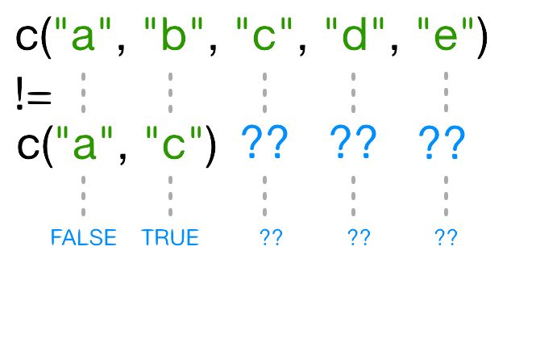

::::::::::::::::::::::::::::::::::::::: objectives

- To be able to subset vectors, factors, matrices, lists, and data frames
- To be able to extract individual and multiple elements: by index, by name, using comparison operations
- To be able to skip and remove elements from various data structures.

::::::::::::::::::::::::::::::::::::::::::::::::::

:::::::::::::::::::::::::::::::::::::::: questions

- How can I work with subsets of data in R?

::::::::::::::::::::::::::::::::::::::::::::::::::


R has many powerful subset operators. Mastering them will allow you to
easily perform complex operations on any kind of dataset.

There are six different ways we can subset any kind of object, and three
different subsetting operators for the different data structures.

Let's start with the workhorse of R: a simple numeric vector.


``` r
x <- c(5.4, 6.2, 7.1, 4.8, 7.5)
names(x) <- c('a', 'b', 'c', 'd', 'e')
x
```

``` output
  a   b   c   d   e 
5.4 6.2 7.1 4.8 7.5 
```

:::::::::::::::::::::::::::::::::::::::::  callout

## Atomic vectors

In R, simple vectors containing character strings, numbers, or logical values are called *atomic* vectors because they can't be further simplified.


::::::::::::::::::::::::::::::::::::::::::::::::::

So now that we've created a dummy vector to play with, how do we get at its
contents?

## Accessing elements using their indices

To extract elements of a vector we can give their corresponding index, starting
from one:


``` r
x[1]
```

``` output
  a 
5.4 
```


``` r
x[4]
```

``` output
  d 
4.8 
```

It may look different, but the square brackets operator is a function. For vectors
(and matrices), it means "get me the nth element".

We can ask for multiple elements at once:


``` r
x[c(1, 3)]
```

``` output
  a   c 
5.4 7.1 
```

Or slices of the vector:


``` r
x[1:4]
```

``` output
  a   b   c   d 
5.4 6.2 7.1 4.8 
```

the `:` operator creates a sequence of numbers from the left element to the right.


``` r
1:4
```

``` output
[1] 1 2 3 4
```

``` r
c(1, 2, 3, 4)
```

``` output
[1] 1 2 3 4
```

We can ask for the same element multiple times:


``` r
x[c(1,1,3)]
```

``` output
  a   a   c 
5.4 5.4 7.1 
```

If we ask for an index beyond the length of the vector, R will return a missing value:


``` r
x[6]
```

``` output
<NA> 
  NA 
```

This is a vector of length one containing an `NA`, whose name is also `NA`.

If we ask for the 0th element, we get an empty vector:


``` r
x[0]
```

``` output
named numeric(0)
```

:::::::::::::::::::::::::::::::::::::::::  callout

## Vector numbering in R starts at 1

In many programming languages (C and Python, for example), the first
element of a vector has an index of 0. In R, the first element is 1.


::::::::::::::::::::::::::::::::::::::::::::::::::

## Skipping and removing elements

If we use a negative number as the index of a vector, R will return
every element *except* for the one specified:


``` r
x[-2]
```

``` output
  a   c   d   e 
5.4 7.1 4.8 7.5 
```

We can skip multiple elements:


``` r
x[c(-1, -5)]  # or x[-c(1,5)]
```

``` output
  b   c   d 
6.2 7.1 4.8 
```

:::::::::::::::::::::::::::::::::::::::::  callout

## Tip: Order of operations

A common trip up for novices occurs when trying to skip
slices of a vector. It's natural to try to negate a
sequence like so:


``` r
x[-1:3]
```

This gives a somewhat cryptic error:


``` error
Error in x[-1:3]: only 0's may be mixed with negative subscripts
```

But remember the order of operations. `:` is really a function.
It takes its first argument as -1, and its second as 3,
so generates the sequence of numbers: `c(-1, 0, 1, 2, 3)`.

The correct solution is to wrap that function call in brackets, so
that the `-` operator applies to the result:


``` r
x[-(1:3)]
```

``` output
  d   e 
4.8 7.5 
```

::::::::::::::::::::::::::::::::::::::::::::::::::

To remove elements from a vector, we need to assign the result back
into the variable:


``` r
x <- x[-4]
x
```

``` output
  a   b   c   e 
5.4 6.2 7.1 7.5 
```

:::::::::::::::::::::::::::::::::::::::  challenge

## Challenge 1

Given the following code:


``` r
x <- c(5.4, 6.2, 7.1, 4.8, 7.5)
names(x) <- c('a', 'b', 'c', 'd', 'e')
print(x)
```

``` output
  a   b   c   d   e 
5.4 6.2 7.1 4.8 7.5 
```

Come up with at least 2 different commands that will produce the following output:


``` output
  b   c   d 
6.2 7.1 4.8 
```

After you find 2 different commands, compare notes with your neighbour. Did you have different strategies?

:::::::::::::::  solution

## Solution to challenge 1


``` r
x[2:4]
```

``` output
  b   c   d 
6.2 7.1 4.8 
```


``` r
x[-c(1,5)]
```

``` output
  b   c   d 
6.2 7.1 4.8 
```


``` r
x[c(2,3,4)]
```

``` output
  b   c   d 
6.2 7.1 4.8 
```

:::::::::::::::::::::::::

::::::::::::::::::::::::::::::::::::::::::::::::::

## Subsetting by name

We can extract elements by using their name, instead of extracting by index:


``` r
x <- c(a=5.4, b=6.2, c=7.1, d=4.8, e=7.5) # we can name a vector 'on the fly'
x[c("a", "c")]
```

``` output
  a   c 
5.4 7.1 
```

This is usually a much more reliable way to subset objects: the
position of various elements can often change when chaining together
subsetting operations, but the names will always remain the same!

## Subsetting through other logical operations {#logical-operations}

We can also use any logical vector to subset:


``` r
x[c(FALSE, FALSE, TRUE, FALSE, TRUE)]
```

``` output
  c   e 
7.1 7.5 
```

Since comparison operators (e.g. `>`, `<`, `==`) evaluate to logical vectors, we can also
use them to succinctly subset vectors: the following statement gives
the same result as the previous one.


``` r
x[x > 7]
```

``` output
  c   e 
7.1 7.5 
```

Breaking it down, this statement first evaluates `x>7`, generating
a logical vector `c(FALSE, FALSE, TRUE, FALSE, TRUE)`, and then
selects the elements of `x` corresponding to the `TRUE` values.

We can use `==` to mimic the previous method of indexing by name
(remember you have to use `==` rather than `=` for comparisons):


``` r
x[names(x) == "a"]
```

``` output
  a 
5.4 
```

:::::::::::::::::::::::::::::::::::::::::  callout

## Tip: Combining logical conditions

We often want to combine multiple logical
criteria. For example, we might want to find all the countries that are
located in Asia **or** Europe **and** have life expectancies within a certain
range. Several operations for combining logical vectors exist in R:

- `&`, the "logical AND" operator: returns `TRUE` if both the left and right
  are `TRUE`.
- `|`, the "logical OR" operator: returns `TRUE`, if either the left or right
  (or both) are `TRUE`.

You may sometimes see `&&` and `||` instead of `&` and `|`. These two-character operators
only look at the first element of each vector and ignore the
remaining elements. In general you should not use the two-character
operators in data analysis; save them
for programming, i.e. deciding whether to execute a statement.

- `!`, the "logical NOT" operator: converts `TRUE` to `FALSE` and `FALSE` to
  `TRUE`. It can negate a single logical condition (eg `!TRUE` becomes
  `FALSE`), or a whole vector of conditions(eg `!c(TRUE, FALSE)` becomes
  `c(FALSE, TRUE)`).

Additionally, you can compare the elements within a single vector using the
`all` function (which returns `TRUE` if every element of the vector is `TRUE`)
and the `any` function (which returns `TRUE` if one or more elements of the
vector are `TRUE`).


::::::::::::::::::::::::::::::::::::::::::::::::::

:::::::::::::::::::::::::::::::::::::::  challenge

## Challenge 2

Given the following code:


``` r
x <- c(5.4, 6.2, 7.1, 4.8, 7.5)
names(x) <- c('a', 'b', 'c', 'd', 'e')
print(x)
```

``` output
  a   b   c   d   e 
5.4 6.2 7.1 4.8 7.5 
```

Write a subsetting command to return the values in x that are greater than 4 and less than 7.

:::::::::::::::  solution

## Solution to challenge 2


``` r
x_subset <- x[x<7 & x>4]
print(x_subset)
```

``` output
  a   b   d 
5.4 6.2 4.8 
```

:::::::::::::::::::::::::

::::::::::::::::::::::::::::::::::::::::::::::::::

:::::::::::::::::::::::::::::::::::::::::  callout

## Tip: Non-unique names

You should be aware that it is possible for multiple elements in a
vector to have the same name. (For a data frame, columns can have
the same name --- although R tries to avoid this --- but row names
must be unique.) Consider these examples:


``` r
x <- 1:3
x
```

``` output
[1] 1 2 3
```

``` r
names(x) <- c('a', 'a', 'a')
x
```

``` output
a a a 
1 2 3 
```

``` r
x['a']  # only returns first value
```

``` output
a 
1 
```

``` r
x[names(x) == 'a']  # returns all three values
```

``` output
a a a 
1 2 3 
```

::::::::::::::::::::::::::::::::::::::::::::::::::

:::::::::::::::::::::::::::::::::::::::::  callout

## Tip: Getting help for operators

Remember you can search for help on operators by wrapping them in quotes:
`help("%in%")` or `?"%in%"`.

::::::::::::::::::::::::::::::::::::::::::::::::::

## Skipping named elements

Skipping or removing named elements is a little harder. If we try to skip one named element by negating the string, R complains (slightly obscurely) that it doesn't know how to take the negative of a string:


``` r
x <- c(a=5.4, b=6.2, c=7.1, d=4.8, e=7.5) # we start again by naming a vector 'on the fly'
x[-"a"]
```

``` error
Error in -"a": invalid argument to unary operator
```

However, we can use the `!=` (not-equals) operator to construct a logical vector that will do what we want:


``` r
x[names(x) != "a"]
```

``` output
  b   c   d   e 
6.2 7.1 4.8 7.5 
```

Skipping multiple named indices is a little bit harder still. Suppose we want to drop the `"a"` and `"c"` elements, so we try this:


``` r
x[names(x)!=c("a","c")]
```

``` warning
Warning in names(x) != c("a", "c"): longer object length is not a multiple of
shorter object length
```

``` output
  b   c   d   e 
6.2 7.1 4.8 7.5 
```

R did *something*, but it gave us a warning that we ought to pay attention to - and it apparently *gave us the wrong answer* (the `"c"` element is still included in the vector)!

So what does `!=` actually do in this case? That's an excellent question.

### Recycling

Let's take a look at the comparison component of this code:


``` r
names(x) != c("a", "c")
```

``` warning
Warning in names(x) != c("a", "c"): longer object length is not a multiple of
shorter object length
```

``` output
[1] FALSE  TRUE  TRUE  TRUE  TRUE
```

Why does R give `TRUE` as the third element of this vector, when `names(x)[3] != "c"` is obviously false?
When you use `!=`, R tries to compare each element
of the left argument with the corresponding element of its right
argument. What happens when you compare vectors of different lengths?

{alt='Inequality testing'}

When one vector is shorter than the other, it gets *recycled*:

{alt='Inequality testing: results of recycling'}

In this case R **repeats** `c("a", "c")` as many times as necessary to match `names(x)`, i.e. we get `c("a","c","a","c","a")`. Since the recycled `"a"`
doesn't match the third element of `names(x)`, the value of `!=` is `TRUE`.
Because in this case the longer vector length (5) isn't a multiple of the shorter vector length (2), R printed a warning message. If we had been unlucky and `names(x)` had contained six elements, R would *silently* have done the wrong thing (i.e., not what we intended it to do). This recycling rule can can introduce hard-to-find and subtle bugs!

The way to get R to do what we really want (match *each* element of the left argument with *all* of the elements of the right argument) it to use the `%in%` operator. The `%in%` operator goes through each element of its left argument, in this case the names of `x`, and asks, "Does this element occur in the second argument?". Here, since we want to *exclude* values, we also need a `!` operator to change "in" to "not in":


``` r
x[! names(x) %in% c("a","c") ]
```

``` output
  b   d   e 
6.2 4.8 7.5 
```

:::::::::::::::::::::::::::::::::::::::  challenge

## Challenge 3

Selecting elements of a vector that match any of a list of components
is a very common data analysis task. For example, the gapminder data set
contains `country` and `continent` variables, but no information between
these two scales. Suppose we want to pull out information from southeast
Asia: how do we set up an operation to produce a logical vector that
is `TRUE` for all of the countries in southeast Asia and `FALSE` otherwise?

Suppose you have these data:


``` r
seAsia <- c("Myanmar","Thailand","Cambodia","Vietnam","Laos")
## read in the gapminder data that we downloaded in episode 2
gapminder <- read.csv("data/gapminder_data.csv", header=TRUE)
## extract the `country` column from a data frame (we'll see this later);
## convert from a factor to a character;
## and get just the non-repeated elements
countries <- unique(as.character(gapminder$country))
```

There's a wrong way (using only `==`), which will give you a warning;
a clunky way (using the logical operators `==` and `|`); and
an elegant way (using `%in%`). See whether you can come up with all three
and explain how they (don't) work.

:::::::::::::::  solution

## Solution to challenge 3

- The **wrong** way to do this problem is `countries==seAsia`. This
  gives a warning (`"In countries == seAsia : longer object length is not a multiple of shorter object length"`) and the wrong answer (a vector of all
  `FALSE` values), because none of the recycled values of `seAsia` happen
  to line up correctly with matching values in `country`.
- The **clunky** (but technically correct) way to do this problem is


``` r
 (countries=="Myanmar" | countries=="Thailand" |
 countries=="Cambodia" | countries == "Vietnam" | countries=="Laos")
```

(or `countries==seAsia[1] | countries==seAsia[2] | ...`). This
gives the correct values, but hopefully you can see how awkward it
is (what if we wanted to select countries from a much longer list?).

- The best way to do this problem is `countries %in% seAsia`, which
  is both correct and easy to type (and read).
  
  

:::::::::::::::::::::::::

::::::::::::::::::::::::::::::::::::::::::::::::::

## Handling special values

At some point you will encounter functions in R that cannot handle missing, infinite,
or undefined data.

There are a number of special functions you can use to filter out this data:

- `is.na` will return all positions in a vector, matrix, or data.frame
  containing `NA` (or `NaN`)
- likewise, `is.nan`, and `is.infinite` will do the same for `NaN` and `Inf`.
- `is.finite` will return all positions in a vector, matrix, or data.frame
  that do not contain `NA`, `NaN` or `Inf`.
- `na.omit` will filter out all missing values from a vector

## Factor subsetting

Now that we've explored the different ways to subset vectors, how
do we subset the other data structures?

Factor subsetting works the same way as vector subsetting.


``` r
f <- factor(c("a", "a", "b", "c", "c", "d"))
f[f == "a"]
```

``` output
[1] a a
Levels: a b c d
```

``` r
f[f %in% c("b", "c")]
```

``` output
[1] b c c
Levels: a b c d
```

``` r
f[1:3]
```

``` output
[1] a a b
Levels: a b c d
```

Skipping elements will not remove the level
even if no more of that category exists in the factor:


``` r
f[-3]
```

``` output
[1] a a c c d
Levels: a b c d
```

## Matrix subsetting

Matrices are also subsetted using the `[` function. In this case
it takes two arguments: the first applying to the rows, the second
to its columns:


``` r
set.seed(1)
m <- matrix(rnorm(6*4), ncol=4, nrow=6)
m[3:4, c(3,1)]
```

``` output
            [,1]       [,2]
[1,]  1.12493092 -0.8356286
[2,] -0.04493361  1.5952808
```

You can leave the first or second arguments blank to retrieve all the
rows or columns respectively:


``` r
m[, c(3,4)]
```

``` output
            [,1]        [,2]
[1,] -0.62124058  0.82122120
[2,] -2.21469989  0.59390132
[3,]  1.12493092  0.91897737
[4,] -0.04493361  0.78213630
[5,] -0.01619026  0.07456498
[6,]  0.94383621 -1.98935170
```

If we only access one row or column, R will automatically convert the result
to a vector:


``` r
m[3,]
```

``` output
[1] -0.8356286  0.5757814  1.1249309  0.9189774
```

If you want to keep the output as a matrix, you need to specify a *third* argument;
`drop = FALSE`:


``` r
m[3, , drop=FALSE]
```

``` output
           [,1]      [,2]     [,3]      [,4]
[1,] -0.8356286 0.5757814 1.124931 0.9189774
```

Unlike vectors, if we try to access a row or column outside of the matrix,
R will throw an error:


``` r
m[, c(3,6)]
```

``` error
Error in m[, c(3, 6)]: subscript out of bounds
```

:::::::::::::::::::::::::::::::::::::::::  callout

## Tip: Higher dimensional arrays

when dealing with multi-dimensional arrays, each argument to `[`
corresponds to a dimension. For example, a 3D array, the first three
arguments correspond to the rows, columns, and depth dimension.

::::::::::::::::::::::::::::::::::::::::::::::::::

Because matrices are vectors, we can
also subset using only one argument:


``` r
m[5]
```

``` output
[1] 0.3295078
```

This usually isn't useful, and often confusing to read. However it is useful to note that matrices
are laid out in *column-major format* by default. That is the elements of the
vector are arranged column-wise:


``` r
matrix(1:6, nrow=2, ncol=3)
```

``` output
     [,1] [,2] [,3]
[1,]    1    3    5
[2,]    2    4    6
```

If you wish to populate the matrix by row, use `byrow=TRUE`:


``` r
matrix(1:6, nrow=2, ncol=3, byrow=TRUE)
```

``` output
     [,1] [,2] [,3]
[1,]    1    2    3
[2,]    4    5    6
```

Matrices can also be subsetted using their rownames and column names
instead of their row and column indices.

:::::::::::::::::::::::::::::::::::::::  challenge

## Challenge 4

Given the following code:


``` r
m <- matrix(1:18, nrow=3, ncol=6)
print(m)
```

``` output
     [,1] [,2] [,3] [,4] [,5] [,6]
[1,]    1    4    7   10   13   16
[2,]    2    5    8   11   14   17
[3,]    3    6    9   12   15   18
```

1. Which of the following commands will extract the values 11 and 14?

A. `m[2,4,2,5]`

B. `m[2:5]`

C. `m[4:5,2]`

D. `m[2,c(4,5)]`

:::::::::::::::  solution

## Solution to challenge 4

D


:::::::::::::::::::::::::

::::::::::::::::::::::::::::::::::::::::::::::::::

## List subsetting

Now we'll introduce some new subsetting operators. There are three functions
used to subset lists. We've already seen these when learning about atomic vectors and matrices:  `[`, `[[`, and `$`.

Using `[` will always return a list. If you want to *subset* a list, but not
*extract* an element, then you will likely use `[`.


``` r
xlist <- list(a = "Software Carpentry", b = 1:10, data = head(mtcars))
xlist[1]
```

``` output
$a
[1] "Software Carpentry"
```

This returns a *list with one element*.

We can subset elements of a list exactly the same way as atomic
vectors using `[`. Comparison operations however won't work as
they're not recursive, they will try to condition on the data structures
in each element of the list, not the individual elements within those
data structures.


``` r
xlist[1:2]
```

``` output
$a
[1] "Software Carpentry"

$b
 [1]  1  2  3  4  5  6  7  8  9 10
```

To extract individual elements of a list, you need to use the double-square
bracket function: `[[`.


``` r
xlist[[1]]
```

``` output
[1] "Software Carpentry"
```

Notice that now the result is a vector, not a list.

You can't extract more than one element at once:


``` r
xlist[[1:2]]
```

``` error
Error in xlist[[1:2]]: subscript out of bounds
```

Nor use it to skip elements:


``` r
xlist[[-1]]
```

``` error
Error in xlist[[-1]]: invalid negative subscript in get1index <real>
```

But you can use names to both subset and extract elements:


``` r
xlist[["a"]]
```

``` output
[1] "Software Carpentry"
```

The `$` function is a shorthand way for extracting elements by name:


``` r
xlist$data
```

``` output
                   mpg cyl disp  hp drat    wt  qsec vs am gear carb
Mazda RX4         21.0   6  160 110 3.90 2.620 16.46  0  1    4    4
Mazda RX4 Wag     21.0   6  160 110 3.90 2.875 17.02  0  1    4    4
Datsun 710        22.8   4  108  93 3.85 2.320 18.61  1  1    4    1
Hornet 4 Drive    21.4   6  258 110 3.08 3.215 19.44  1  0    3    1
Hornet Sportabout 18.7   8  360 175 3.15 3.440 17.02  0  0    3    2
Valiant           18.1   6  225 105 2.76 3.460 20.22  1  0    3    1
```

:::::::::::::::::::::::::::::::::::::::  challenge

## Challenge 5

Given the following list:


``` r
xlist <- list(a = "Software Carpentry", b = 1:10, data = head(mtcars))
```

Using your knowledge of both list and vector subsetting, extract the number 2 from xlist.
Hint: the number 2 is contained within the "b" item in the list.

:::::::::::::::  solution

## Solution to challenge 5


``` r
xlist$b[2]
```

``` output
[1] 2
```


``` r
xlist[[2]][2]
```

``` output
[1] 2
```


``` r
xlist[["b"]][2]
```

``` output
[1] 2
```

:::::::::::::::::::::::::

::::::::::::::::::::::::::::::::::::::::::::::::::

:::::::::::::::::::::::::::::::::::::::  challenge

## Challenge 6

Given a linear model:


``` r
mod <- aov(pop ~ lifeExp, data=gapminder)
```

Extract the residual degrees of freedom (hint: `attributes()` will help you)

:::::::::::::::  solution

## Solution to challenge 6


``` r
attributes(mod) ## `df.residual` is one of the names of `mod`
```


``` r
mod$df.residual
```

:::::::::::::::::::::::::

::::::::::::::::::::::::::::::::::::::::::::::::::

## Data frames

Remember the data frames are lists underneath the hood, so similar rules
apply. However they are also two dimensional objects:

`[` with one argument will act the same way as for lists, where each list
element corresponds to a column. The resulting object will be a data frame:


``` r
head(gapminder[3])
```

``` output
       pop
1  8425333
2  9240934
3 10267083
4 11537966
5 13079460
6 14880372
```

Similarly, `[[` will act to extract *a single column*:


``` r
head(gapminder[["lifeExp"]])
```

``` output
[1] 28.801 30.332 31.997 34.020 36.088 38.438
```

And `$` provides a convenient shorthand to extract columns by name:


``` r
head(gapminder$year)
```

``` output
[1] 1952 1957 1962 1967 1972 1977
```

With two arguments, `[` behaves the same way as for matrices:


``` r
gapminder[1:3,]
```

``` output
      country year      pop continent lifeExp gdpPercap
1 Afghanistan 1952  8425333      Asia  28.801  779.4453
2 Afghanistan 1957  9240934      Asia  30.332  820.8530
3 Afghanistan 1962 10267083      Asia  31.997  853.1007
```

If we subset a single row, the result will be a data frame (because
the elements are mixed types):


``` r
gapminder[3,]
```

``` output
      country year      pop continent lifeExp gdpPercap
3 Afghanistan 1962 10267083      Asia  31.997  853.1007
```

But for a single column the result will be a vector (this can
be changed with the third argument, `drop = FALSE`).

:::::::::::::::::::::::::::::::::::::::  challenge

## Challenge 7

Fix each of the following common data frame subsetting errors:

1. Extract observations collected for the year 1957
  
  
  ``` r
  gapminder[gapminder$year = 1957,]
  ```

2. Extract all columns except 1 through to 4
  
  
  ``` r
  gapminder[,-1:4]
  ```

3. Extract the rows where the life expectancy is longer the 80 years
  
  
  ``` r
  gapminder[gapminder$lifeExp > 80]
  ```

4. Extract the first row, and the fourth and fifth columns
  (`continent` and `lifeExp`).
  
  
  ``` r
  gapminder[1, 4, 5]
  ```

5. Advanced: extract rows that contain information for the years 2002
  and 2007
  
  
  ``` r
  gapminder[gapminder$year == 2002 | 2007,]
  ```

:::::::::::::::  solution

## Solution to challenge 7

Fix each of the following common data frame subsetting errors:

1. Extract observations collected for the year 1957
  
  
  ``` r
  # gapminder[gapminder$year = 1957,]
  gapminder[gapminder$year == 1957,]
  ```

2. Extract all columns except 1 through to 4
  
  
  ``` r
  # gapminder[,-1:4]
  gapminder[,-c(1:4)]
  ```

3. Extract the rows where the life expectancy is longer than 80 years
  
  
  ``` r
  # gapminder[gapminder$lifeExp > 80]
  gapminder[gapminder$lifeExp > 80,]
  ```

4. Extract the first row, and the fourth and fifth columns
  (`continent` and `lifeExp`).
  
  
  ``` r
  # gapminder[1, 4, 5]
  gapminder[1, c(4, 5)]
  ```

5. Advanced: extract rows that contain information for the years 2002
  and 2007
  
  
  ``` r
  # gapminder[gapminder$year == 2002 | 2007,]
  gapminder[gapminder$year == 2002 | gapminder$year == 2007,]
  gapminder[gapminder$year %in% c(2002, 2007),]
  ```

:::::::::::::::::::::::::

::::::::::::::::::::::::::::::::::::::::::::::::::

:::::::::::::::::::::::::::::::::::::::  challenge

## Challenge 8

1. Why does `gapminder[1:20]` return an error? How does it differ from `gapminder[1:20, ]`?

2. Create a new `data.frame` called `gapminder_small` that only contains rows 1 through 9
  and 19 through 23. You can do this in one or two steps.

:::::::::::::::  solution

## Solution to challenge 8

1. `gapminder` is a data.frame so needs to be subsetted on two dimensions. `gapminder[1:20, ]` subsets the data to give the first 20 rows and all columns.

2. 

``` r
gapminder_small <- gapminder[c(1:9, 19:23),]
```

:::::::::::::::::::::::::

::::::::::::::::::::::::::::::::::::::::::::::::::

:::::::::::::::::::::::::::::::::::::::: keypoints

- Indexing in R starts at 1, not 0.
- Access individual values by location using `[]`.
- Access slices of data using `[low:high]`.
- Access arbitrary sets of data using `[c(...)]`.
- Use logical operations and logical vectors to access subsets of data.

::::::::::::::::::::::::::::::::::::::::::::::::::


