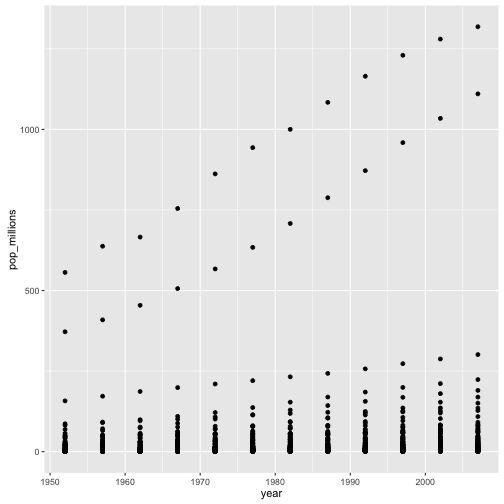

> ## Learning objectives {.objectives}
>
> * To understand vectorised operations in R.
>

One of the nice features of R is that most of its functions are vectorised,
that is the function will operate on all elements of a vector without
needing to loop through and act on each element one at a time. This makes
writing code more concise, easy to read, and less error prone.

~~~{.r}
x <- 1:4
x * 2
~~~

~~~{.output}
[1] 2 4 6 8

~~~

The multiplication happened to each element of the vector.

We can also add two vectors together:

~~~{.r}
y <- 6:9
x + y
~~~

~~~{.output}
[1]  7  9 11 13

~~~

Each element of `x` was added to its corresponding element of `y`:

~~~{.r}
x:  1  2  3  4
    +  +  +  +
y:  6  7  8  9
---------------
    7  9 11 13
~~~

> #### Challenge 1 {.challenge}
>
> Let's try this on the `pop` column of the `gapminder` dataset.
>
> Make a new column in the `gapminder` data frame that
> contains population in units of millions of people.
> Check the head or tail of the data frame to make sure
> it worked.
>

> #### Challenge 2 {.challenge}
>
> Refresh your ggplot skills by plotting population in millions against year.
>

Comparison operators also apply element-wise, as we saw in the
subsetting lesson:

~~~{.r}
x > 2
~~~

~~~{.output}
[1] FALSE FALSE  TRUE  TRUE

~~~

Logical operations are also vectorised:

~~~{.r}
a <- x > 3
a
~~~

~~~{.output}
[1] FALSE FALSE FALSE  TRUE

~~~

> #### Tip: some useful functions for logical vectors {.callout}
>
> `any()` will return `TRUE` if any element of a vector is `TRUE`
> `all()` will return `TRUE` if *all* elements of a vector are `TRUE`
>

Many functions also operate on element-wise on vectors:

~~~{.r}
x <- 1:4
log(x)
~~~

~~~{.output}
[1] 0.0000000 0.6931472 1.0986123 1.3862944

~~~

Vectorised operations also work element wise on matrices:

~~~{.r}
m <- matrix(1:12, nrow=3, ncol=4)
m * -1
~~~

~~~{.output}
     [,1] [,2] [,3] [,4]
[1,]   -1   -4   -7  -10
[2,]   -2   -5   -8  -11
[3,]   -3   -6   -9  -12

~~~

> #### Tip: element-wise vs. matrix multiplication {.callout}
>
> Note that `*` gives you element-wise multiplication!
> To do matrix multiplication, we need to use the `%*%` operator:
>
> For more on matrix algebra, see the [Quick-R reference
> guide](http://www.statmethods.net/advstats/matrix.html)

> #### Challenge 3 {.challenge}
>
> Given the following matrix:
>
> 
> ~~~{.r}
> m <- matrix(1:12, nrow=3, ncol=4)
> m
> ~~~
> 
> 
> 
> ~~~{.output}
>      [,1] [,2] [,3] [,4]
> [1,]    1    4    7   10
> [2,]    2    5    8   11
> [3,]    3    6    9   12
> 
> ~~~
>
> Write down what you think will happen when you run:
>
> 1. `m ^ -1`
> 2. `m * c(1, 0, -1)`
> 3. `m > c(0, 20)`
>
> Did you get the output expected? If not, ask a helper!
>

> #### Bonus Challenge {.challenge}
>
> We're interested in looking at the sum of the
> following sequence of fractions:
>
> 
> ~~~{.r}
>  x = 1/(1^2) + 1/(2^2) + 1/(3^2) + ... + 1/(n^2)
> ~~~
>
> This would be tedious to type out, and impossible for
> high values of n.
> Can you use vectorisation to solve for x, when n=100?
> How about when n=10,000?
>

## Challenge solutions

> #### Solution to challenge 1 {.challenge}
>
> Let's try this on the `pop` column of the `gapminder` dataset.
>
> Make a new column in the `gapminder` data frame that
> contains population in units of millions of people.
> Check the head or tail of the data frame to make sure
> it worked.
>
> 
> ~~~{.r}
> gapminder$pop_millions <- gapminder$pop / 1e6
> head(gapminder)
> ~~~
> 
> 
> 
> ~~~{.output}
>       country year      pop continent lifeExp gdpPercap pop_millions
> 1 Afghanistan 1952  8425333      Asia  28.801  779.4453     8.425333
> 2 Afghanistan 1957  9240934      Asia  30.332  820.8530     9.240934
> 3 Afghanistan 1962 10267083      Asia  31.997  853.1007    10.267083
> 4 Afghanistan 1967 11537966      Asia  34.020  836.1971    11.537966
> 5 Afghanistan 1972 13079460      Asia  36.088  739.9811    13.079460
> 6 Afghanistan 1977 14880372      Asia  38.438  786.1134    14.880372
> 
> ~~~
>

> #### Solution to challenge 2 {.challenge}
>
> Refresh your ggplot skills by plotting population in millions against year.
>
> 
> ~~~{.r}
> ggplot(gapminder, aes(x = year, y = pop_millions)) + geom_point()
> ~~~
> 
> 
>

> #### Solution to challenge 3 {.challenge}
>
> Given the following matrix:
>
> 
> ~~~{.r}
> m <- matrix(1:12, nrow=3, ncol=4)
> m
> ~~~
> 
> 
> 
> ~~~{.output}
>      [,1] [,2] [,3] [,4]
> [1,]    1    4    7   10
> [2,]    2    5    8   11
> [3,]    3    6    9   12
> 
> ~~~
>
>
> Write down what you think will happen when you run:
>
> 1. `m ^ -1`
>
> 
> ~~~{.output}
>           [,1]      [,2]      [,3]       [,4]
> [1,] 1.0000000 0.2500000 0.1428571 0.10000000
> [2,] 0.5000000 0.2000000 0.1250000 0.09090909
> [3,] 0.3333333 0.1666667 0.1111111 0.08333333
> 
> ~~~
>
> 2. `m * c(1, 0, -1)`
>
> 
> ~~~{.output}
>      [,1] [,2] [,3] [,4]
> [1,]    1    4    7   10
> [2,]    0    0    0    0
> [3,]   -3   -6   -9  -12
> 
> ~~~
>
> 3. `m > c(0, 20)`
>
> 
> ~~~{.output}
>       [,1]  [,2]  [,3]  [,4]
> [1,]  TRUE FALSE  TRUE FALSE
> [2,] FALSE  TRUE FALSE  TRUE
> [3,]  TRUE FALSE  TRUE FALSE
> 
> ~~~
>

> #### Bonus Challenge {.challenge}
>
> We're interested in looking at the sum of the
> following sequence of fractions:
>
> 
> ~~~{.r}
>  x = 1/(1^2) + 1/(2^2) + 1/(3^2) + ... + 1/(n^2)
> ~~~
>
> This would be tedious to type out, and impossible for
> high values of n.
> Can you use vectorisation to solve for x, when n=100?
> How about when n=10,000?
>
> 
> ~~~{.r}
> inverse_sum_of_squares <- function(n) {
>   sequence <- 1:n
>   y <- 1/(sequence^2)
>   result <- sum(y)
>   return(result)
> }
> inverse_sum_of_squares(100)
> ~~~
> 
> 
> 
> ~~~{.output}
> [1] 1.634984
> 
> ~~~
> 
> 
> 
> ~~~{.r}
> inverse_sum_of_squares(10000)
> ~~~
> 
> 
> 
> ~~~{.output}
> [1] 1.644834
> 
> ~~~
>
