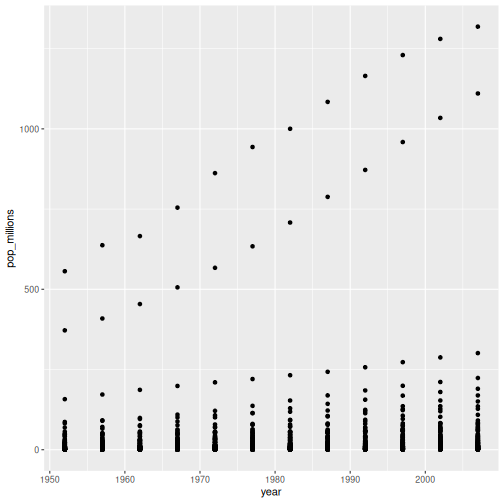
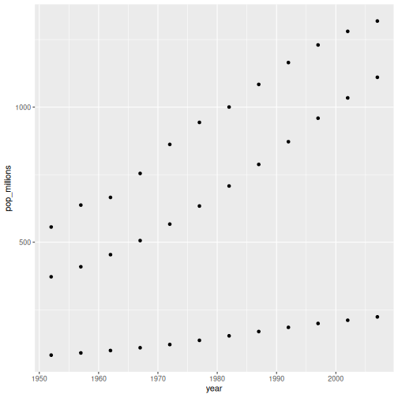

::::::::::::::::::::::::::::::::::::::: objectives

- To understand vectorized operations in R.

::::::::::::::::::::::::::::::::::::::::::::::::::

:::::::::::::::::::::::::::::::::::::::: questions

- How can I operate on all the elements of a vector at once?

::::::::::::::::::::::::::::::::::::::::::::::::::


Most of R's functions are vectorized, meaning that the function will
operate on all elements of a vector without needing to loop through
and act on each element one at a time. This makes writing code more
concise, easy to read, and less error prone.


``` r
x <- 1:4
x * 2
```

``` output
[1] 2 4 6 8
```

The multiplication happened to each element of the vector.

We can also add two vectors together:


``` r
y <- 6:9
x + y
```

``` output
[1]  7  9 11 13
```

Each element of `x` was added to its corresponding element of `y`:


``` r
x:  1  2  3  4
    +  +  +  +
y:  6  7  8  9
---------------
    7  9 11 13
```

Here is how we would add two vectors together using a for loop:


``` r
output_vector <- c()
for (i in 1:4) {
  output_vector[i] <- x[i] + y[i]
}
output_vector
```

``` output
[1]  7  9 11 13
```

Compare this to the output using vectorised operations.


``` r
sum_xy <- x + y
sum_xy
```

``` output
[1]  7  9 11 13
```

:::::::::::::::::::::::::::::::::::::::  challenge

## Challenge 1

Let's try this on the `pop` column of the `gapminder` dataset.

Make a new column in the `gapminder` data frame that
contains population in units of millions of people.
Check the head or tail of the data frame to make sure
it worked.

:::::::::::::::  solution

## Solution to challenge 1

Let's try this on the `pop` column of the `gapminder` dataset.

Make a new column in the `gapminder` data frame that
contains population in units of millions of people.
Check the head or tail of the data frame to make sure
it worked.


``` r
gapminder$pop_millions <- gapminder$pop / 1e6
head(gapminder)
```

``` output
      country year      pop continent lifeExp gdpPercap pop_millions
1 Afghanistan 1952  8425333      Asia  28.801  779.4453     8.425333
2 Afghanistan 1957  9240934      Asia  30.332  820.8530     9.240934
3 Afghanistan 1962 10267083      Asia  31.997  853.1007    10.267083
4 Afghanistan 1967 11537966      Asia  34.020  836.1971    11.537966
5 Afghanistan 1972 13079460      Asia  36.088  739.9811    13.079460
6 Afghanistan 1977 14880372      Asia  38.438  786.1134    14.880372
```

:::::::::::::::::::::::::

::::::::::::::::::::::::::::::::::::::::::::::::::

:::::::::::::::::::::::::::::::::::::::  challenge

## Challenge 2

On a single graph, plot population, in
millions, against year, for all countries. Do not worry about
identifying which country is which.

Repeat the exercise, graphing only for China, India, and
Indonesia. Again, do not worry about which is which.

:::::::::::::::  solution

## Solution to challenge 2

Refresh your plotting skills by plotting population in millions against year.


``` r
ggplot(gapminder, aes(x = year, y = pop_millions)) +
 geom_point()
```



``` r
countryset <- c("China","India","Indonesia")
ggplot(gapminder[gapminder$country %in% countryset,],
       aes(x = year, y = pop_millions)) +
  geom_point()
```



:::::::::::::::::::::::::

::::::::::::::::::::::::::::::::::::::::::::::::::

Comparison operators, logical operators, and many functions are also
vectorized:

**Comparison operators**


``` r
x > 2
```

``` output
[1] FALSE FALSE  TRUE  TRUE
```

**Logical operators**


``` r
a <- x > 3  # or, for clarity, a <- (x > 3)
a
```

``` output
[1] FALSE FALSE FALSE  TRUE
```

:::::::::::::::::::::::::::::::::::::::::  callout

## Tip: some useful functions for logical vectors

`any()` will return `TRUE` if *any* element of a vector is `TRUE`.  
`all()` will return `TRUE` if *all* elements of a vector are `TRUE`.


::::::::::::::::::::::::::::::::::::::::::::::::::

Most functions also operate element-wise on vectors:

**Functions**


``` r
x <- 1:4
log(x)
```

``` output
[1] 0.0000000 0.6931472 1.0986123 1.3862944
```

Vectorized operations work element-wise on matrices:


``` r
m <- matrix(1:12, nrow=3, ncol=4)
m * -1
```

``` output
     [,1] [,2] [,3] [,4]
[1,]   -1   -4   -7  -10
[2,]   -2   -5   -8  -11
[3,]   -3   -6   -9  -12
```

:::::::::::::::::::::::::::::::::::::::::  callout

## Tip: element-wise vs. matrix multiplication

Very important: the operator `*` gives you element-wise multiplication!
To do matrix multiplication, we need to use the `%*%` operator:


``` r
m %*% matrix(1, nrow=4, ncol=1)
```

``` output
     [,1]
[1,]   22
[2,]   26
[3,]   30
```

``` r
matrix(1:4, nrow=1) %*% matrix(1:4, ncol=1)
```

``` output
     [,1]
[1,]   30
```

For more on matrix algebra, see the [Quick-R reference
guide](https://www.statmethods.net/advstats/matrix.html)


::::::::::::::::::::::::::::::::::::::::::::::::::

:::::::::::::::::::::::::::::::::::::::  challenge

## Challenge 3

Given the following matrix:


``` r
m <- matrix(1:12, nrow=3, ncol=4)
m
```

``` output
     [,1] [,2] [,3] [,4]
[1,]    1    4    7   10
[2,]    2    5    8   11
[3,]    3    6    9   12
```

Write down what you think will happen when you run:

1. `m ^ -1`
2. `m * c(1, 0, -1)`
3. `m > c(0, 20)`
4. `m * c(1, 0, -1, 2)`

Did you get the output you expected? If not, ask a helper!

:::::::::::::::  solution

## Solution to challenge 3

Given the following matrix:


``` r
m <- matrix(1:12, nrow=3, ncol=4)
m
```

``` output
     [,1] [,2] [,3] [,4]
[1,]    1    4    7   10
[2,]    2    5    8   11
[3,]    3    6    9   12
```

Write down what you think will happen when you run:

1. `m ^ -1`


``` output
          [,1]      [,2]      [,3]       [,4]
[1,] 1.0000000 0.2500000 0.1428571 0.10000000
[2,] 0.5000000 0.2000000 0.1250000 0.09090909
[3,] 0.3333333 0.1666667 0.1111111 0.08333333
```

2. `m * c(1, 0, -1)`


``` output
     [,1] [,2] [,3] [,4]
[1,]    1    4    7   10
[2,]    0    0    0    0
[3,]   -3   -6   -9  -12
```

3. `m > c(0, 20)`


``` output
      [,1]  [,2]  [,3]  [,4]
[1,]  TRUE FALSE  TRUE FALSE
[2,] FALSE  TRUE FALSE  TRUE
[3,]  TRUE FALSE  TRUE FALSE
```

:::::::::::::::::::::::::

::::::::::::::::::::::::::::::::::::::::::::::::::

:::::::::::::::::::::::::::::::::::::::  challenge

## Challenge 4

We're interested in looking at the sum of the
following sequence of fractions:


``` r
 x = 1/(1^2) + 1/(2^2) + 1/(3^2) + ... + 1/(n^2)
```

This would be tedious to type out, and impossible for high values of
n.  Use vectorisation to compute x when n=100. What is the sum when
n=10,000?

:::::::::::::::  solution

## Challenge 4

We're interested in looking at the sum of the
following sequence of fractions:


``` r
 x = 1/(1^2) + 1/(2^2) + 1/(3^2) + ... + 1/(n^2)
```

This would be tedious to type out, and impossible for
high values of n.
Can you use vectorisation to compute x, when n=100?
How about when n=10,000?


``` r
sum(1/(1:100)^2)
```

``` output
[1] 1.634984
```

``` r
sum(1/(1:1e04)^2)
```

``` output
[1] 1.644834
```

``` r
n <- 10000
sum(1/(1:n)^2)
```

``` output
[1] 1.644834
```

We can also obtain the same results using a function:


``` r
inverse_sum_of_squares <- function(n) {
  sum(1/(1:n)^2)
}
inverse_sum_of_squares(100)
```

``` output
[1] 1.634984
```

``` r
inverse_sum_of_squares(10000)
```

``` output
[1] 1.644834
```

``` r
n <- 10000
inverse_sum_of_squares(n)
```

``` output
[1] 1.644834
```

:::::::::::::::::::::::::

::::::::::::::::::::::::::::::::::::::::::::::::::

:::::::::::::::::::::::::::::::::::::::::  callout

## Tip: Operations on vectors of unequal length

Operations can also be performed on vectors of unequal length, through
a process known as *recycling*. This process automatically repeats the smaller vector
until it matches the length of the larger vector. R will provide a warning
if the larger vector is not a multiple of the smaller vector.


``` r
x <- c(1, 2, 3)
y <- c(1, 2, 3, 4, 5, 6, 7)
x + y
```

``` warning
Warning in x + y: longer object length is not a multiple of shorter object
length
```

``` output
[1] 2 4 6 5 7 9 8
```

Vector `x` was recycled to match the length of vector `y`


``` r
x:  1  2  3  1  2  3  1
    +  +  +  +  +  +  +
y:  1  2  3  4  5  6  7
-----------------------
    2  4  6  5  7  9  8
```

::::::::::::::::::::::::::::::::::::::::::::::::::

:::::::::::::::::::::::::::::::::::::::: keypoints

- Use vectorized operations instead of loops.

::::::::::::::::::::::::::::::::::::::::::::::::::


