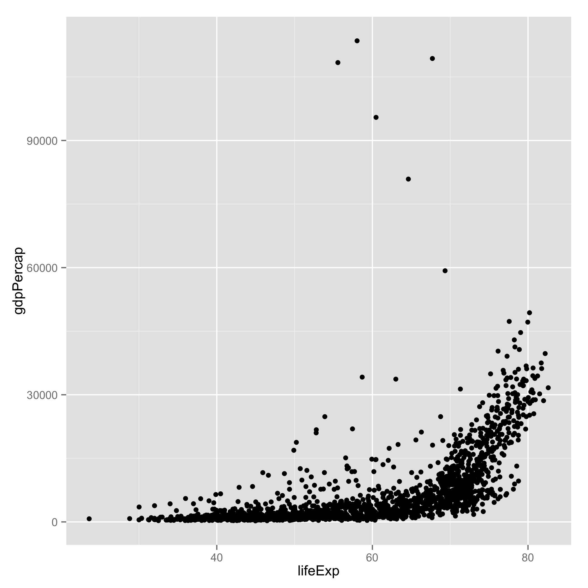
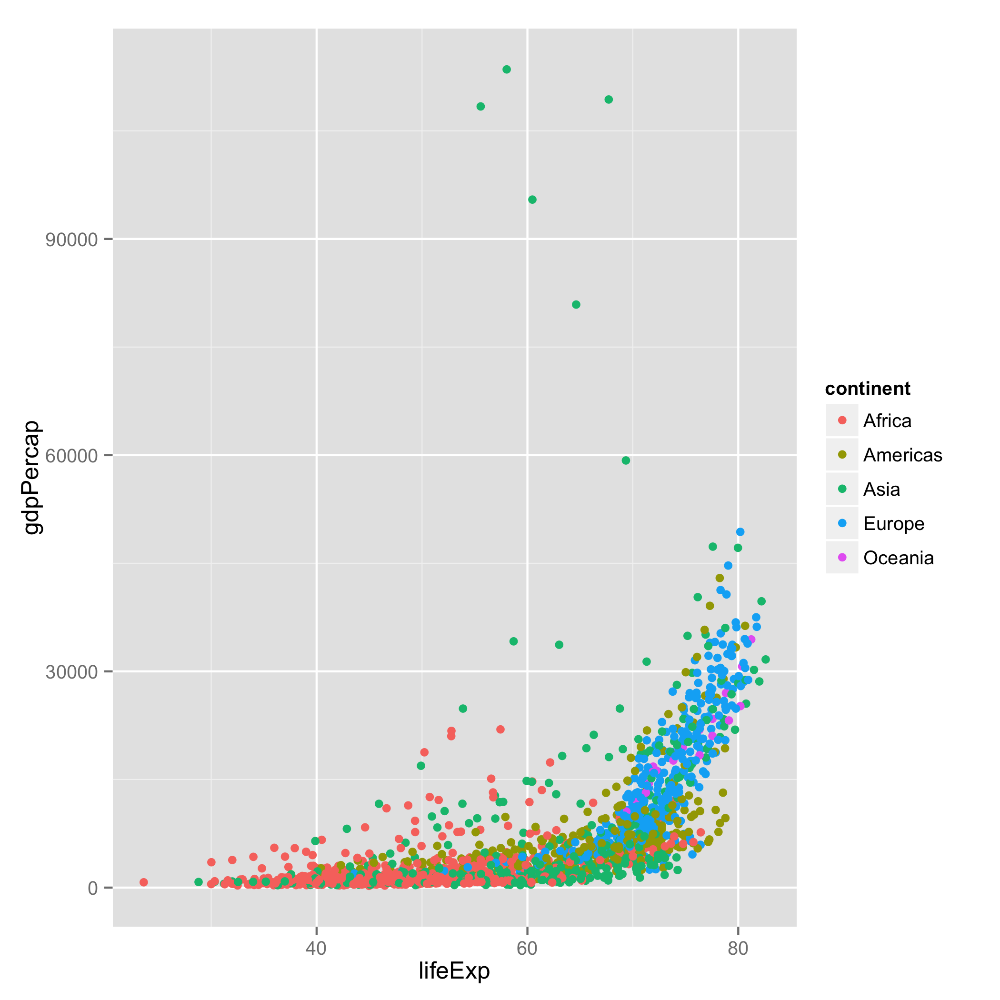
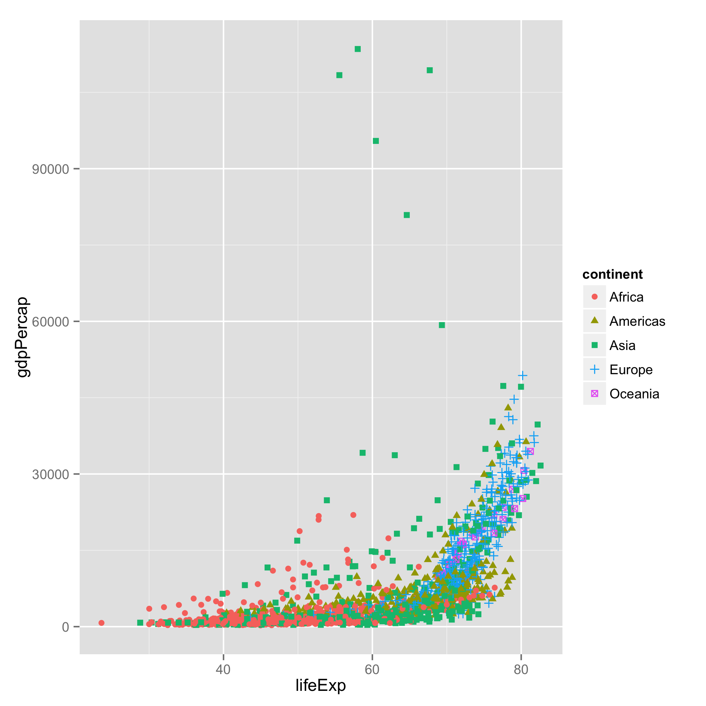
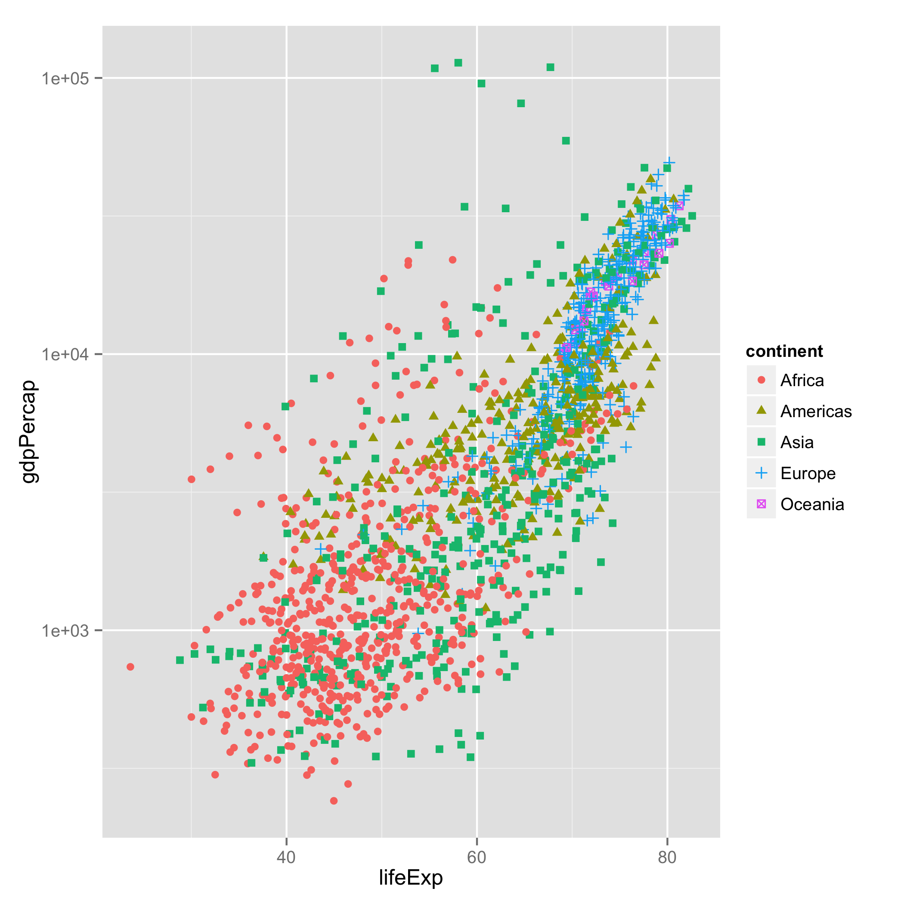
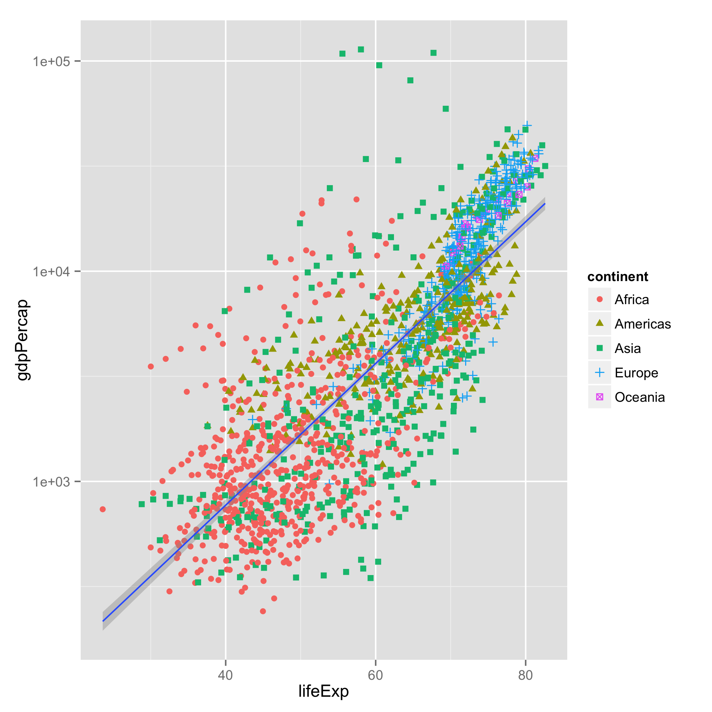
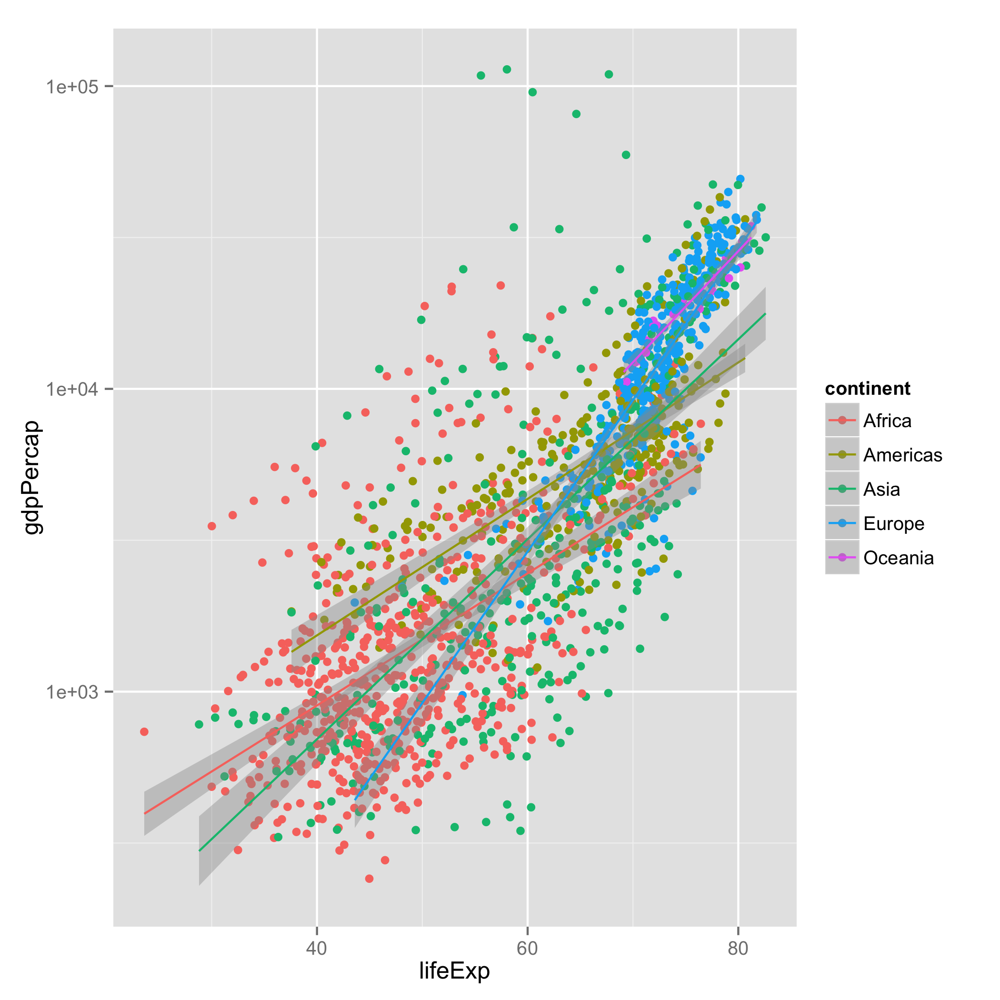
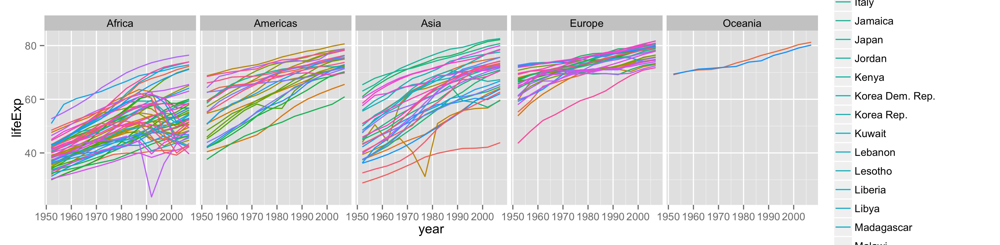
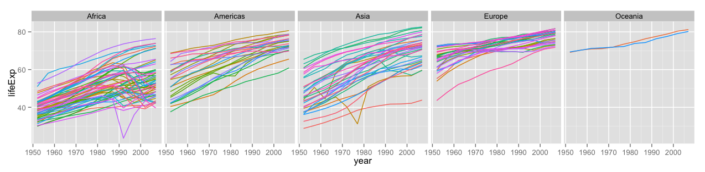

> # Learning Objectives {.objectives}
>
> * To be able to use ggplot2 to generate publication quality graphics
> * To understand the basics of the grammar of graphics:
>   - The aesthetics layer
>   - The geometry layer
>   - Adding statistics
>   - Transforming scales
>   - Coloring or panelling by groups.
>

Plotting our data is one of the best ways to
quickly explore it and the various relationships
between variables.

There are three main plotting systems in R,
the [base plotting system][base], the [lattice][lattice]
package, and the [ggplot2][ggplot2] package.

[base]: http://www.statmethods.net/graphs/
[lattice]: http://www.statmethods.net/advgraphs/trellis.html
[ggplot2]: http://www.statmethods.net/advgraphs/ggplot2.html

Today we'll be learning about the ggplot2 package, because
it is the most effective for creating publication quality
graphics.

Let's start off with an example:

~~~ {.r}
ggplot(data = gapminder, aes(x = lifeExp, y = gdpPercap)) +
  geom_point()
~~~

Ggplot is based on two principles:

 * a grammar of graphics: a set of terms to define the basic components
   of a plot that can be used to produce figures in a coherent, consistent,
   and flexible way
 * Layers: Different basic components can be logically separated into layers
   which can be overlaid on top of each other.

In the example, we told `ggplot` to use the gapminder dataset. As second argument
we gave it the `aes` function, which stands for *aesthetics*. The `aes` function
specifies how your data are represented visually: which variables to plot on 
each axis, as well as the color, size, shape, and transparency, which we'll change
soon. We then used the `+` operator to add a *geometry* layer,
specified by a function starting with `geom`,
in this case, a layer of points. 

This is a general rule.
Anything we specify inside the first function, `ggplot`, becomes a global setting for
the figure. Anything that we add with `+` is built up in layers (consecutively).

Next, lets color the points by continent:

~~~ {.r}
ggplot(data = gapminder, aes(x = lifeExp, y = gdpPercap)) +
  geom_point(aes(color=continent))
~~~

Here, we've specified that we want change the color *aesthetic* for the points layer.
We've told it to color the points based on the continents column. We can also change
the shape fo the points:

~~~ {.r}
ggplot(data = gapminder, aes(x = lifeExp, y = gdpPercap)) +
  geom_point(aes(color=continent, shape=continent))
~~~

Currently it's hard to see the relationship between the points due to some strong
outliers in GDP per capita.

We can change the scale of units on the y axis using the *scale* functions. These 
control the mapping between the data and the aesthetics:

~~~ {.r}
ggplot(data = gapminder, aes(x = lifeExp, y = gdpPercap)) +
  geom_point(aes(color=continent, shape=continent)) +
  scale_y_log10()
~~~

We can also add statistical transformations and data summarisations to our plots. We'll 
add the fits of linear models for each group by adding the `geom_smooth` geometry layer:

~~~ {.r}
ggplot(data = gapminder, aes(x = lifeExp, y = gdpPercap)) +
  geom_point(aes(color=continent, shape=continent)) +
  scale_y_log10() + geom_smooth(method="lm")
~~~

Whoops that didn't quite do what we wanted. That's because the grouping has only been
applied to the `geom_point` layer. Let's change that so it's a global option:

~~~ {.r}
ggplot(data = gapminder, aes(x = lifeExp, y = gdpPercap, color=continent)) +
  geom_point() + scale_y_log10() + geom_smooth(method="lm")
~~~

It's still hard to see what's going on, That's because we're currently plotting all
years of collection. Another useful thing we can do with ggplot is *facet* our data:
create panels based on different groups. 

Let's take a look at how life expectancy has changed over time for each country,
and create a panel, or facet, for each continent:

~~~ {.r}
ggplot(data= gapminder, aes(x=year, y=lifeExp, color=country)) +
  geom_line() + facet_grid(. ~ continent)
~~~

We can see nice upward trends across all countries across all continents, with a 
few unfortunate downward spikes corresponding to wars.

The `facet_grid` layer took a formula as its argument, the `.` corresponds to 
"all variables in the data", and by putting "continent" on the right of the 
formular, we told ggplot to arrange the panels along the x axis. If we put
"continent" in the y-position of the formula, the panels would have been 
arranged along the y-axis.

Currently, there are too many different countries for the legend to render 
properly. Since we don't care so much about the particulars of each country,
lets turn the legend off:

~~~ {.r}
ggplot(data= gapminder, aes(x=year, y=lifeExp, color=country)) +
  geom_line() + facet_grid(. ~ continent) + theme(legend.position="none")
~~~

To save an image, we can either use the save button inside of RStudio,
or from the interactive console (or script) using the `ggsave` function:

~~~ {.r}
ggsave("lifeExp-vs-time.pdf")
~~~

This is just a taste of what you can do with `ggplot2`. A more detailed tutorial
can be found [here](ggplot.pdf). Once you get a handle of the different layers
and the grammar of graphics, the [reference list of functions][ref] will be 
useful.

[ref]: http://docs.ggplot2.org/current/

> #### Challenge 1 {.challenge}
>
> Create density plots of GDP per capita, colored by continent.
> Hints:
>  - Use `ggplot` to set up the basic plot.
>  - Use `aes` to tell ggplot what the axes of the plot are (you will only need the x-axis).
>  - Use `aes` to specify the color grouping.
>  - The geometry layer for density plots is `geom_density`.
> 
> Advanced:
>  - The `fill` aesthetic will color the area under the curve.
>  - Transform the scale of the x-axis to more easily visualise the difference 
>    between continents
>

> #### Challenge 2 {.challenge}
>
> Add a facet layer to panel the density plots by year. Hint: [facet_wrap][fw]
> will be more useful than `facet_grid`.
>

[fw]: http://docs.ggplot2.org/current/facet_wrap.html

