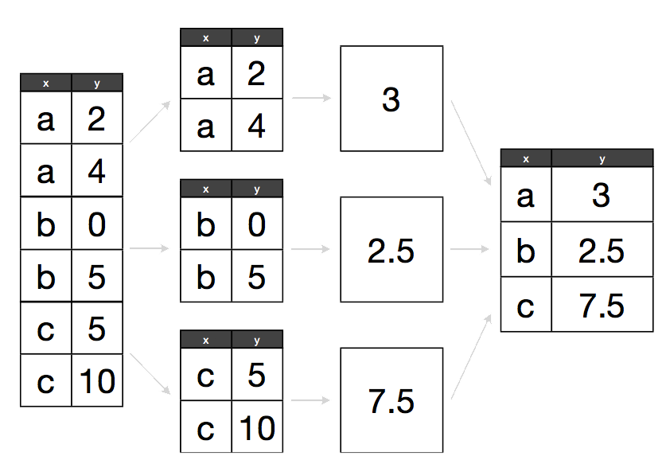

```{r, include=FALSE}
source("tools/chunk-options.R")
opts_chunk$set(fig.path = "fig/12-plyr-")
# Silently load in the data so the rest of the lesson works
gapminder <- read.csv("data/gapminder-FiveYearData.csv", header=TRUE)
```

> ## Learning Objectives {.objectives}
>
> * To be able to use the split-apply-combine strategy for data analysis
>

Previously we looked at how you can use functions to simplify your code.
We defined the `calcGDP` function, which takes the gapminder dataset,
and multiplies the population and GDP per capita column. We also defined
additional arguments so we could filter by `year` and `country`:

```{r}
# Takes a dataset and multiplies the population column
# with the GDP per capita column.
calcGDP <- function(dat, year=NULL, country=NULL) {
  if(!is.null(year)) {
    dat <- dat[dat$year %in% year, ] 
  }
  if (!is.null(country)) {
    dat <- dat[dat$country %in% country,]
  }
  gdp <- dat$pop * dat$gdpPercap

  new <- cbind(dat, gdp=gdp)   
  return(new)
}
```

A common task you'll encounter when working with data, is that you'll want to
run calculations on different groups within the data. In the above, we were
simply calculating the GDP by multiplying two columns together. But what if
we wanted to calculated the mean GDP per continent?

We could run `calcGPD` and then take the mean of each continent:

```{r}
withGDP <- calcGDP(gapminder)
mean(withGDP[withGDP$continent == "Africa", "gdp"]) 
mean(withGDP[withGDP$continent == "Americas", "gdp"]) 
mean(withGDP[withGDP$continent == "Asia", "gdp"]) 
```

But this isn't very *nice*. Yes, by using a function, you have reduced a
substantial amount of repetition. That **is** nice. But there is still
repetition. Repeating yourself will cost you time, both now and later, and
potentially introduce some nasty bugs. 

We could write a new function that is flexible like `calcGDP`, but this
also takes a substantial amount of effort and testing to get right.

The abstract problem we're encountering here is know as "split-apply-combine":



We want to *split* our data into groups, in this case continents, *apply*
some calculations on that group, then optionally *combine* the results 
together afterwards.

#### The `plyr` package

For those of you who have used R before, you might be familiar with the 
`apply` family of functions. While R's built in functions do work, we're
going to introduce you to another method for solving the "split-apply-combine"
probelm. The [plyr](http://had.co.nz/plyr/) package provides a set of 
functions that we find more user friendly for solving this problem.

We installed this package in an earlier challenge. Let's load it now:

```{r}
library(plyr)
```

Plyr has functions for operating on `lists`, `data.frames` and `arrays`
(matrices, or n-dimensional vectors). Each function performs:

1. A **split**ting operation
2. **Apply** a function on each split in turn.
3. Re**combine** output data as a single data object.

The functions are named based on the data structure they expect as input,
and the data structure you want returned as output: [a]rray, [l]ist, or
[d]ata.frame. The first letter corresponds to the input data structure,
the second letter to the output data structure, and then the rest of the
function is named "ply".

This gives us 9 core functions **ply.  There are an additional three functions
which will only perform the split and apply steps, and not any combine step.
They're named by their input data type and represent null output by a `_` (see
table)

Note here that plyr's use of "array" is different to R's,
an array in ply can include a vector or matrix.


Each of the xxply functions (`daply`, `ddply`, `llply`, `laply`, ...) has the
same structure and has 4 key features and structure:

```{r, eval=FALSE}
xxply(.data, .variables, .fun)
```

* The first letter of the function name gives the input type and the second gives the output type.
* .data - gives the data object to be processed
* .variables - identifies the splitting variables
* .fun - gives the function to be called on each piece

Now we can quickly calculate the mean GDP per continent:

``` {r}
ddply(
 .data = calcGDP(gapminder),
 .variables = "continent",
 .fun = function(x) mean(x$gdp)
)
```

Let's walk through what just happened:

- The `ddply` function feeds in a `data.frame` (function starts with **d**) and
returns another `data.frame` (2nd letter is a **d**) i
- the first argument we gave was the data.frame we wanted to operate on: in this
  case the gapminder data. We called `calcGDP` on it first so that it would have
  the additional `gdp` column added to it.
- The second argument indicated our split criteria: in this case the "continent"
  column. Note that we just gave the name of the column, not the actual column
  itself like we've done previously with subsetting. Plyr takes care of these
  implementation details for you.
- The third argument is the function we want to apply to each grouping of the 
  data. We had to define our own short function here: each subset of the data
  gets stored in `x`, the first argument of our function. This is an anonymous
  function: we haven't defined it elsewhere, and it has no name. It only exists
  in the scope of our call to `ddply`.  

What if we want a different type of output data structure?:

```{r}
dlply(
 .data = calcGDP(gapminder),
 .variables = "continent",
 .fun = function(x) mean(x$gdp)
)
```

We called the same function again, but changed the second letter to an `l`, so
the output was returned as a list.

We can specify multiple columns to group by:

``` {r}
ddply(
 .data = calcGDP(gapminder),
 .variables = c("continent", "year"),
 .fun = function(x) mean(x$gdp)
)
```

```{r}
daply(
 .data = calcGDP(gapminder),
 .variables = c("continent", "year"),
 .fun = function(x) mean(x$gdp)
)
```

You can use these functions in place of `for` loops (and its usually faster to
do so): just write the body of the for loop in the anonymous function:

```{r}
d_ply(
  .data=gapminder,
  .variables = "continent",
  .fun = function(x) {
    meanGDPperCap <- mean(x$gdpPercap)
    print(paste(
      "The mean GDP per capita for", unique(x$continent),
      "is", format(meanGDPperCap, big.mark=",")
   ))
  }
)
```

> #### Tip: printing numbers {.callout}
>
> The `format` function can be used to make numeric
> values "pretty" for printing out in messages.
>


> #### Challenge 1 {.challenge}
>
> Calculate the average life expectancy per continent. Which has the longest?
> Which had the shortest?
>

> #### Challenge 2 {.challenge}
> 
> Calculate the average life expectancy per continent and year. Which had the
> longest and shortest in 2007? Which had the greatest change in between 1952
> and 2007?
>

> #### Advanced Challenge {.challenge}
>
> Calculate the difference in mean life expectancy between
> the years 1952 and 2007 from the output of challenge 2
> using one of the `plyr` functions.
>

> #### Alternate Challenge if class seems lost {.challenge}
>
> Without running them, which of the following will calculate the average
> life expectancy per continent:
>
> 1.
> ~~~ {.r}
> ddply(
>   .data = gapminder,
>   .variables = gapminder$continent,
>   .fun = function(dataGroup) {
>      mean(dataGroup$lifeExp)
>   }
> )
> ~~~
>
> 2.
> ~~~ {.r}
> ddply(
>   .data = gapminder,
>   .variables = "continent",
>   .fun = mean(dataGroup$lifeExp)
> )
> ~~~
>
> 3.
> ~~~ {.r}
> ddply(
>   .data = gapminder,
>   .variables = "continent",
>   .fun = function(dataGroup) {
>      mean(dataGroup$lifeExp)
>   }
> )
> ~~~
>
> 4.
> ~~~ {.r}
> adply(
>   .data = gapminder,
>   .variables = "continent",
>   .fun = function(dataGroup) {
>      mean(dataGroup$lifeExp)
>   }
> )
> ~~~
>
