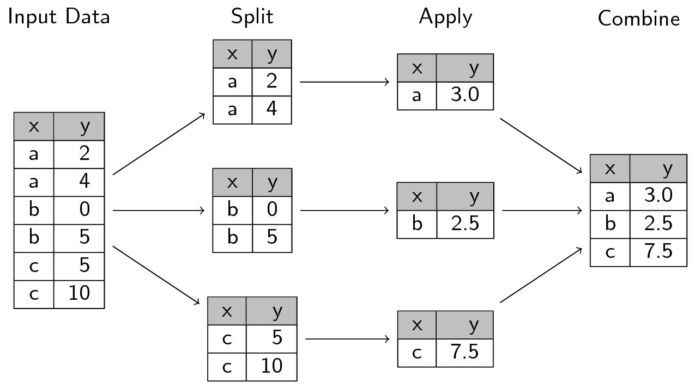
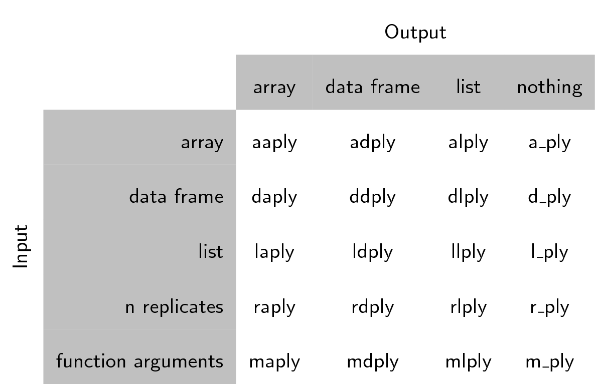

::::::::::::::::::::::::::::::::::::::: objectives

- To be able to use the split-apply-combine strategy for data analysis.

::::::::::::::::::::::::::::::::::::::::::::::::::

:::::::::::::::::::::::::::::::::::::::: questions

- How can I do different calculations on different sets of data?

::::::::::::::::::::::::::::::::::::::::::::::::::


Previously we looked at how you can use functions to simplify your code.
We defined the `calcGDP` function, which takes the gapminder dataset,
and multiplies the population and GDP per capita column. We also defined
additional arguments so we could filter by `year` and `country`:


```r
# Takes a dataset and multiplies the population column
# with the GDP per capita column.
calcGDP <- function(dat, year=NULL, country=NULL) {
  if(!is.null(year)) {
    dat <- dat[dat$year %in% year, ]
  }
  if (!is.null(country)) {
    dat <- dat[dat$country %in% country,]
  }
  gdp <- dat$pop * dat$gdpPercap

  new <- cbind(dat, gdp=gdp)
  return(new)
}
```

A common task you'll encounter when working with data, is that you'll want to
run calculations on different groups within the data. In the above, we were
calculating the GDP by multiplying two columns together. But what if we wanted
to calculated the mean GDP per continent?

We could run `calcGDP` and then take the mean of each continent:


```r
withGDP <- calcGDP(gapminder)
mean(withGDP[withGDP$continent == "Africa", "gdp"])
```

```{.output}
[1] 20904782844
```

```r
mean(withGDP[withGDP$continent == "Americas", "gdp"])
```

```{.output}
[1] 379262350210
```

```r
mean(withGDP[withGDP$continent == "Asia", "gdp"])
```

```{.output}
[1] 227233738153
```

But this isn't very *nice*. Yes, by using a function, you have reduced a
substantial amount of repetition. That **is** nice. But there is still
repetition. Repeating yourself will cost you time, both now and later, and
potentially introduce some nasty bugs.

We could write a new function that is flexible like `calcGDP`, but this
also takes a substantial amount of effort and testing to get right.

The abstract problem we're encountering here is know as "split-apply-combine":

{alt='Split apply combine'}

We want to *split* our data into groups, in this case continents, *apply*
some calculations on that group, then optionally *combine* the results
together afterwards.

## The `plyr` package

For those of you who have used R before, you might be familiar with the
`apply` family of functions. While R's built in functions do work, we're
going to introduce you to another method for solving the "split-apply-combine"
problem. The [plyr](https://had.co.nz/plyr/) package provides a set of
functions that we find more user friendly for solving this problem.

We installed this package in an earlier challenge. Let us load it now:


```r
library("plyr")
```

Plyr has functions for operating on `lists`, `data.frames` and `arrays`
(matrices, or n-dimensional vectors). Each function performs:

1. A **split**ting operation
2. **Apply** a function on each split in turn.
3. Re**combine** output data as a single data object.

The functions are named based on the data structure they expect as input,
and the data structure you want returned as output: [a]rray, [l]ist, or
[d]ata.frame. The first letter corresponds to the input data structure,
the second letter to the output data structure, and then the rest of the
function is named "ply".

This gives us 9 core functions \*\*ply.  There are an additional three functions
which will only perform the split and apply steps, and not any combine step.
They're named by their input data type and represent null output by a `_` (see
table)

Note here that plyr's use of "array" is different to R's,
an array in ply can include a vector or matrix.

{alt='Full apply suite'}

Each of the xxply functions (`daply`, `ddply`, `llply`, `laply`, ...) has the
same structure and has 4 key features and structure:


```r
xxply(.data, .variables, .fun)
```

- The first letter of the function name gives the input type and the second gives the output type.
- .data - gives the data object to be processed
- .variables - identifies the splitting variables
- .fun - gives the function to be called on each piece

Now we can quickly calculate the mean GDP per continent:


```r
ddply(
 .data = calcGDP(gapminder),
 .variables = "continent",
 .fun = function(x) mean(x$gdp)
)
```

```{.output}
  continent           V1
1    Africa  20904782844
2  Americas 379262350210
3      Asia 227233738153
4    Europe 269442085301
5   Oceania 188187105354
```

Let us walk through the previous code:

- The `ddply` function feeds in a `data.frame` (function starts with **d**) and
  returns another `data.frame` (2nd letter is a **d**)
- the first argument we gave was the data.frame we wanted to operate on: in this
  case the gapminder data. We called `calcGDP` on it first so that it would have
  the additional `gdp` column added to it.
- The second argument indicated our split criteria: in this case the "continent"
  column. Note that we gave the name of the column, not the values of the column like we had done previously with subsetting. Plyr takes care of these
  implementation details for you.
- The third argument is the function we want to apply to each grouping of the
  data. We had to define our own short function here: each subset of the data
  gets stored in `x`, the first argument of our function. This is an anonymous
  function: we haven't defined it elsewhere, and it has no name. It only exists
  in the scope of our call to `ddply`.

:::::::::::::::::::::::::::::::::::::::  challenge

## Challenge 1

Calculate the average life expectancy per continent. Which has the longest?
Which had the shortest?

:::::::::::::::  solution

## Solution to Challenge 1


```r
ddply(
 .data = gapminder,
 .variables = "continent",
 .fun = function(x) mean(x$lifeExp)
)
```

Oceania has the longest and Africa the shortest.


:::::::::::::::::::::::::

::::::::::::::::::::::::::::::::::::::::::::::::::

What if we want a different type of output data structure?:


```r
dlply(
 .data = calcGDP(gapminder),
 .variables = "continent",
 .fun = function(x) mean(x$gdp)
)
```

```{.output}
$Africa
[1] 20904782844

$Americas
[1] 379262350210

$Asia
[1] 227233738153

$Europe
[1] 269442085301

$Oceania
[1] 188187105354

attr(,"split_type")
[1] "data.frame"
attr(,"split_labels")
  continent
1    Africa
2  Americas
3      Asia
4    Europe
5   Oceania
```

We called the same function again, but changed the second letter to an `l`, so
the output was returned as a list.

We can specify multiple columns to group by:


```r
ddply(
 .data = calcGDP(gapminder),
 .variables = c("continent", "year"),
 .fun = function(x) mean(x$gdp)
)
```

```{.output}
   continent year           V1
1     Africa 1952   5992294608
2     Africa 1957   7359188796
3     Africa 1962   8784876958
4     Africa 1967  11443994101
5     Africa 1972  15072241974
6     Africa 1977  18694898732
7     Africa 1982  22040401045
8     Africa 1987  24107264108
9     Africa 1992  26256977719
10    Africa 1997  30023173824
11    Africa 2002  35303511424
12    Africa 2007  45778570846
13  Americas 1952 117738997171
14  Americas 1957 140817061264
15  Americas 1962 169153069442
16  Americas 1967 217867530844
17  Americas 1972 268159178814
18  Americas 1977 324085389022
19  Americas 1982 363314008350
20  Americas 1987 439447790357
21  Americas 1992 489899820623
22  Americas 1997 582693307146
23  Americas 2002 661248623419
24  Americas 2007 776723426068
25      Asia 1952  34095762661
26      Asia 1957  47267432088
27      Asia 1962  60136869012
28      Asia 1967  84648519224
29      Asia 1972 124385747313
30      Asia 1977 159802590186
31      Asia 1982 194429049919
32      Asia 1987 241784763369
33      Asia 1992 307100497486
34      Asia 1997 387597655323
35      Asia 2002 458042336179
36      Asia 2007 627513635079
37    Europe 1952  84971341466
38    Europe 1957 109989505140
39    Europe 1962 138984693095
40    Europe 1967 173366641137
41    Europe 1972 218691462733
42    Europe 1977 255367522034
43    Europe 1982 279484077072
44    Europe 1987 316507473546
45    Europe 1992 342703247405
46    Europe 1997 383606933833
47    Europe 2002 436448815097
48    Europe 2007 493183311052
49   Oceania 1952  54157223944
50   Oceania 1957  66826828013
51   Oceania 1962  82336453245
52   Oceania 1967 105958863585
53   Oceania 1972 134112109227
54   Oceania 1977 154707711162
55   Oceania 1982 176177151380
56   Oceania 1987 209451563998
57   Oceania 1992 236319179826
58   Oceania 1997 289304255183
59   Oceania 2002 345236880176
60   Oceania 2007 403657044512
```


```r
daply(
 .data = calcGDP(gapminder),
 .variables = c("continent", "year"),
 .fun = function(x) mean(x$gdp)
)
```

```{.output}
          year
continent          1952         1957         1962         1967         1972
  Africa     5992294608   7359188796   8784876958  11443994101  15072241974
  Americas 117738997171 140817061264 169153069442 217867530844 268159178814
  Asia      34095762661  47267432088  60136869012  84648519224 124385747313
  Europe    84971341466 109989505140 138984693095 173366641137 218691462733
  Oceania   54157223944  66826828013  82336453245 105958863585 134112109227
          year
continent          1977         1982         1987         1992         1997
  Africa    18694898732  22040401045  24107264108  26256977719  30023173824
  Americas 324085389022 363314008350 439447790357 489899820623 582693307146
  Asia     159802590186 194429049919 241784763369 307100497486 387597655323
  Europe   255367522034 279484077072 316507473546 342703247405 383606933833
  Oceania  154707711162 176177151380 209451563998 236319179826 289304255183
          year
continent          2002         2007
  Africa    35303511424  45778570846
  Americas 661248623419 776723426068
  Asia     458042336179 627513635079
  Europe   436448815097 493183311052
  Oceania  345236880176 403657044512
```

You can use these functions in place of `for` loops (and it is usually faster to
do so).
To replace a for loop, put the code that was in the body of the `for` loop inside an anonymous function.


```r
d_ply(
  .data=gapminder,
  .variables = "continent",
  .fun = function(x) {
    meanGDPperCap <- mean(x$gdpPercap)
    print(paste(
      "The mean GDP per capita for", unique(x$continent),
      "is", format(meanGDPperCap, big.mark=",")
   ))
  }
)
```

```{.output}
[1] "The mean GDP per capita for Africa is 2,193.755"
[1] "The mean GDP per capita for Americas is 7,136.11"
[1] "The mean GDP per capita for Asia is 7,902.15"
[1] "The mean GDP per capita for Europe is 14,469.48"
[1] "The mean GDP per capita for Oceania is 18,621.61"
```

:::::::::::::::::::::::::::::::::::::::::  callout

## Tip: printing numbers

The `format` function can be used to make numeric
values "pretty" for printing out in messages.


::::::::::::::::::::::::::::::::::::::::::::::::::

:::::::::::::::::::::::::::::::::::::::  challenge

## Challenge 2

Calculate the average life expectancy per continent and year. Which had the
longest and shortest in 2007? Which had the greatest change in between 1952
and 2007?

:::::::::::::::  solution

## Solution to Challenge 2


```r
solution <- ddply(
 .data = gapminder,
 .variables = c("continent", "year"),
 .fun = function(x) mean(x$lifeExp)
)
solution_2007 <- solution[solution$year == 2007, ]
solution_2007
```

Oceania had the longest average life expectancy in 2007 and Africa the lowest.


```r
solution_1952_2007 <- cbind(solution[solution$year == 1952, ], solution_2007)
difference_1952_2007 <- data.frame(continent = solution_1952_2007$continent,
                                   year_1957 = solution_1952_2007[[3]],
                                   year_2007 = solution_1952_2007[[6]],
                                   difference = solution_1952_2007[[6]] - solution_1952_2007[[3]])
difference_1952_2007
```

Asia had the greatest difference, and Oceania the least.


:::::::::::::::::::::::::

::::::::::::::::::::::::::::::::::::::::::::::::::

:::::::::::::::::::::::::::::::::::::::  challenge

## Alternate Challenge

Without running them, which of the following will calculate the average
life expectancy per continent:

1. 

```r
ddply(
  .data = gapminder,
  .variables = gapminder$continent,
  .fun = function(dataGroup) {
     mean(dataGroup$lifeExp)
  }
)
```

2. 

```r
ddply(
  .data = gapminder,
  .variables = "continent",
  .fun = mean(dataGroup$lifeExp)
)
```

3. 

```r
ddply(
  .data = gapminder,
  .variables = "continent",
  .fun = function(dataGroup) {
     mean(dataGroup$lifeExp)
  }
)
```

4. 

```r
adply(
  .data = gapminder,
  .variables = "continent",
  .fun = function(dataGroup) {
     mean(dataGroup$lifeExp)
  }
)
```

:::::::::::::::  solution

## Solution to Alternative Challenge

Answer 3 will calculate the average life expectancy per continent.


:::::::::::::::::::::::::

::::::::::::::::::::::::::::::::::::::::::::::::::

:::::::::::::::::::::::::::::::::::::::: keypoints

- Use the `plyr` package to split data, apply functions to subsets, and combine the results.

::::::::::::::::::::::::::::::::::::::::::::::::::


