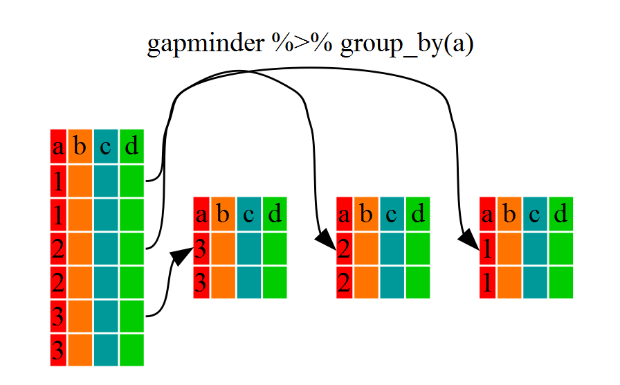
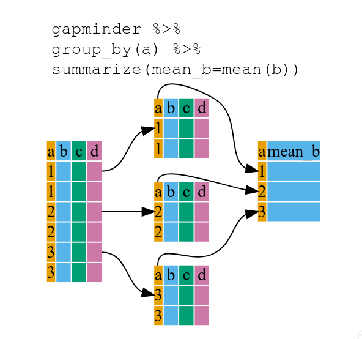

::::::::::::::::::::::::::::::::::::::: objectives

- To be able to use the six main data frame manipulation 'verbs' with pipes in  `dplyr`.
- To understand how `group_by()` and `summarize()` can be combined to summarize datasets.
- Be able to analyze a subset of data using logical filtering.

::::::::::::::::::::::::::::::::::::::::::::::::::

:::::::::::::::::::::::::::::::::::::::: questions

- How can I manipulate data frames without repeating myself?

::::::::::::::::::::::::::::::::::::::::::::::::::


Manipulation of data frames means many things to many researchers, we often
select certain observations (rows) or variables (columns), we often group the
data by a certain variable(s), or we even calculate summary statistics. We can
do these operations using the normal base R operations:


```r
mean(gapminder[gapminder$continent == "Africa", "gdpPercap"])
```

```{.output}
[1] 2193.755
```

```r
mean(gapminder[gapminder$continent == "Americas", "gdpPercap"])
```

```{.output}
[1] 7136.11
```

```r
mean(gapminder[gapminder$continent == "Asia", "gdpPercap"])
```

```{.output}
[1] 7902.15
```

But this isn't very *nice* because there is a fair bit of repetition. Repeating
yourself will cost you time, both now and later, and potentially introduce some
nasty bugs.

## The `dplyr` package

Luckily, the [`dplyr`](https://cran.r-project.org/package=dplyr)
package provides a number of very useful functions for manipulating data frames
in a way that will reduce the above repetition, reduce the probability of making
errors, and probably even save you some typing. As an added bonus, you might
even find the `dplyr` grammar easier to read.

:::::::::::::::::::::::::::::::::::::::::  callout

## Tip: Tidyverse

`dplyr` package belongs to a broader family of opinionated R packages
designed for data science called the "Tidyverse". These
packages are specifically designed to work harmoniously together.
Some of these packages will be covered along this course, but you can find more
complete information here: [https://www.tidyverse.org/](https://www.tidyverse.org/).

::::::::::::::::::::::::::::::::::::::::::::::::::

Here we're going to cover 5 of the most commonly used functions as well as using
pipes (`%>%`) to combine them.

1. `select()`
2. `filter()`
3. `group_by()`
4. `summarize()`
5. `mutate()`

If you have have not installed this package earlier, please do so:


```r
install.packages('dplyr')
```

Now let's load the package:


```r
library("dplyr")
```

## Using select()

If, for example, we wanted to move forward with only a few of the variables in
our data frame we could use the `select()` function. This will keep only the
variables you select.


```r
year_country_gdp <- select(gapminder, year, country, gdpPercap)
```

{alt='Diagram illustrating use of select function to select two columns of a data frame'}
If we want to remove one column only from the `gapminder` data, for example,
removing the `continent` column.


```r
smaller_gapminder_data <- select(gapminder, -continent)
```

If we open up `year_country_gdp` we'll see that it only contains the year,
country and gdpPercap. Above we used 'normal' grammar, but the strengths of
`dplyr` lie in combining several functions using pipes. Since the pipes grammar
is unlike anything we've seen in R before, let's repeat what we've done above
using pipes.


```r
year_country_gdp <- gapminder %>% select(year, country, gdpPercap)
```

To help you understand why we wrote that in that way, let's walk through it step
by step. First we summon the gapminder data frame and pass it on, using the pipe
symbol `%>%`, to the next step, which is the `select()` function. In this case
we don't specify which data object we use in the `select()` function since in
gets that from the previous pipe. **Fun Fact**: There is a good chance you have
encountered pipes before in the shell. In R, a pipe symbol is `%>%` while in the
shell it is `|` but the concept is the same!

:::::::::::::::::::::::::::::::::::::::::  callout

## Tip: Renaming data frame columns in dplyr

In Chapter 4 we covered how you can rename columns with base R by assigning a value to the output of the `names()` function.
Just like select, this is a bit cumbersome, but thankfully dplyr has a `rename()` function.

Within a pipeline, the syntax is `rename(new_name = old_name)`.
For example, we may want to rename the gdpPercap column name from our `select()` statement above.


```r
tidy_gdp <- year_country_gdp %>% rename(gdp_per_capita = gdpPercap)

head(tidy_gdp)
```

```{.output}
  year     country gdp_per_capita
1 1952 Afghanistan       779.4453
2 1957 Afghanistan       820.8530
3 1962 Afghanistan       853.1007
4 1967 Afghanistan       836.1971
5 1972 Afghanistan       739.9811
6 1977 Afghanistan       786.1134
```

::::::::::::::::::::::::::::::::::::::::::::::::::

## Using filter()

If we now want to move forward with the above, but only with European
countries, we can combine `select` and `filter`


```r
year_country_gdp_euro <- gapminder %>%
    filter(continent == "Europe") %>%
    select(year, country, gdpPercap)
```

If we now want to show life expectancy of European countries but only
for a specific year (e.g., 2007), we can do as below.


```r
europe_lifeExp_2007 <- gapminder %>%
  filter(continent == "Europe", year == 2007) %>%
  select(country, lifeExp)
```

:::::::::::::::::::::::::::::::::::::::  challenge

## Challenge 1

Write a single command (which can span multiple lines and includes pipes) that
will produce a data frame that has the African values for `lifeExp`, `country`
and `year`, but not for other Continents.  How many rows does your data frame
have and why?

:::::::::::::::  solution

## Solution to Challenge 1


```r
year_country_lifeExp_Africa <- gapminder %>%
                           filter(continent == "Africa") %>%
                           select(year, country, lifeExp)
```

:::::::::::::::::::::::::

::::::::::::::::::::::::::::::::::::::::::::::::::

As with last time, first we pass the gapminder data frame to the `filter()`
function, then we pass the filtered version of the gapminder data frame to the
`select()` function. **Note:** The order of operations is very important in this
case. If we used 'select' first, filter would not be able to find the variable
continent since we would have removed it in the previous step.

## Using group\_by()

Now, we were supposed to be reducing the error prone repetitiveness of what can
be done with base R, but up to now we haven't done that since we would have to
repeat the above for each continent. Instead of `filter()`, which will only pass
observations that meet your criteria (in the above: `continent=="Europe"`), we
can use `group_by()`, which will essentially use every unique criteria that you
could have used in filter.


```r
str(gapminder)
```

```{.output}
'data.frame':	1704 obs. of  6 variables:
 $ country  : chr  "Afghanistan" "Afghanistan" "Afghanistan" "Afghanistan" ...
 $ year     : int  1952 1957 1962 1967 1972 1977 1982 1987 1992 1997 ...
 $ pop      : num  8425333 9240934 10267083 11537966 13079460 ...
 $ continent: chr  "Asia" "Asia" "Asia" "Asia" ...
 $ lifeExp  : num  28.8 30.3 32 34 36.1 ...
 $ gdpPercap: num  779 821 853 836 740 ...
```

```r
str(gapminder %>% group_by(continent))
```

```{.output}
gropd_df [1,704 × 6] (S3: grouped_df/tbl_df/tbl/data.frame)
 $ country  : chr [1:1704] "Afghanistan" "Afghanistan" "Afghanistan" "Afghanistan" ...
 $ year     : int [1:1704] 1952 1957 1962 1967 1972 1977 1982 1987 1992 1997 ...
 $ pop      : num [1:1704] 8425333 9240934 10267083 11537966 13079460 ...
 $ continent: chr [1:1704] "Asia" "Asia" "Asia" "Asia" ...
 $ lifeExp  : num [1:1704] 28.8 30.3 32 34 36.1 ...
 $ gdpPercap: num [1:1704] 779 821 853 836 740 ...
 - attr(*, "groups")= tibble [5 × 2] (S3: tbl_df/tbl/data.frame)
  ..$ continent: chr [1:5] "Africa" "Americas" "Asia" "Europe" ...
  ..$ .rows    : list<int> [1:5] 
  .. ..$ : int [1:624] 25 26 27 28 29 30 31 32 33 34 ...
  .. ..$ : int [1:300] 49 50 51 52 53 54 55 56 57 58 ...
  .. ..$ : int [1:396] 1 2 3 4 5 6 7 8 9 10 ...
  .. ..$ : int [1:360] 13 14 15 16 17 18 19 20 21 22 ...
  .. ..$ : int [1:24] 61 62 63 64 65 66 67 68 69 70 ...
  .. ..@ ptype: int(0) 
  ..- attr(*, ".drop")= logi TRUE
```

You will notice that the structure of the data frame where we used `group_by()`
(`grouped_df`) is not the same as the original `gapminder` (`data.frame`). A
`grouped_df` can be thought of as a `list` where each item in the `list`is a
`data.frame` which contains only the rows that correspond to the a particular
value `continent` (at least in the example above).

{alt='Diagram illustrating how the group by function oraganizes a data frame into groups'}

## Using summarize()

The above was a bit on the uneventful side but `group_by()` is much more
exciting in conjunction with `summarize()`. This will allow us to create new
variable(s) by using functions that repeat for each of the continent-specific
data frames. That is to say, using the `group_by()` function, we split our
original data frame into multiple pieces, then we can run functions
(e.g. `mean()` or `sd()`) within `summarize()`.


```r
gdp_bycontinents <- gapminder %>%
    group_by(continent) %>%
    summarize(mean_gdpPercap = mean(gdpPercap))
```

{alt='Diagram illustrating the use of group by and summarize together to create a new variable'}


```r
continent mean_gdpPercap
     <fctr>          <dbl>
1    Africa       2193.755
2  Americas       7136.110
3      Asia       7902.150
4    Europe      14469.476
5   Oceania      18621.609
```

That allowed us to calculate the mean gdpPercap for each continent, but it gets
even better.

:::::::::::::::::::::::::::::::::::::::  challenge

## Challenge 2

Calculate the average life expectancy per country. Which has the longest average life
expectancy and which has the shortest average life expectancy?

:::::::::::::::  solution

## Solution to Challenge 2


```r
lifeExp_bycountry <- gapminder %>%
   group_by(country) %>%
   summarize(mean_lifeExp = mean(lifeExp))
lifeExp_bycountry %>%
   filter(mean_lifeExp == min(mean_lifeExp) | mean_lifeExp == max(mean_lifeExp))
```

```{.output}
# A tibble: 2 × 2
  country      mean_lifeExp
  <chr>               <dbl>
1 Iceland              76.5
2 Sierra Leone         36.8
```

Another way to do this is to use the `dplyr` function `arrange()`, which
arranges the rows in a data frame according to the order of one or more
variables from the data frame.  It has similar syntax to other functions from
the `dplyr` package. You can use `desc()` inside `arrange()` to sort in
descending order.


```r
lifeExp_bycountry %>%
   arrange(mean_lifeExp) %>%
   head(1)
```

```{.output}
# A tibble: 1 × 2
  country      mean_lifeExp
  <chr>               <dbl>
1 Sierra Leone         36.8
```

```r
lifeExp_bycountry %>%
   arrange(desc(mean_lifeExp)) %>%
   head(1)
```

```{.output}
# A tibble: 1 × 2
  country mean_lifeExp
  <chr>          <dbl>
1 Iceland         76.5
```

Alphabetical order works too


```r
lifeExp_bycountry %>%
   arrange(desc(country)) %>%
   head(1)
```

```{.output}
# A tibble: 1 × 2
  country  mean_lifeExp
  <chr>           <dbl>
1 Zimbabwe         52.7
```

::::::::::::::::::::::::::::::::::::::::::::::::::

:::::::::::::::::::::::::

The function `group_by()` allows us to group by multiple variables. Let's group by `year` and `continent`.


```r
gdp_bycontinents_byyear <- gapminder %>%
    group_by(continent, year) %>%
    summarize(mean_gdpPercap = mean(gdpPercap))
```

```{.output}
`summarise()` has grouped output by 'continent'. You can override using the
`.groups` argument.
```

That is already quite powerful, but it gets even better! You're not limited to defining 1 new variable in `summarize()`.


```r
gdp_pop_bycontinents_byyear <- gapminder %>%
    group_by(continent, year) %>%
    summarize(mean_gdpPercap = mean(gdpPercap),
              sd_gdpPercap = sd(gdpPercap),
              mean_pop = mean(pop),
              sd_pop = sd(pop))
```

```{.output}
`summarise()` has grouped output by 'continent'. You can override using the
`.groups` argument.
```

## count() and n()

A very common operation is to count the number of observations for each
group. The `dplyr` package comes with two related functions that help with this.

For instance, if we wanted to check the number of countries included in the
dataset for the year 2002, we can use the `count()` function. It takes the name
of one or more columns that contain the groups we are interested in, and we can
optionally sort the results in descending order by adding `sort=TRUE`:


```r
gapminder %>%
    filter(year == 2002) %>%
    count(continent, sort = TRUE)
```

```{.output}
  continent  n
1    Africa 52
2      Asia 33
3    Europe 30
4  Americas 25
5   Oceania  2
```

If we need to use the number of observations in calculations, the `n()` function
is useful. It will return the total number of observations in the current group rather than counting the number of observations in each group within a specific column. For instance, if we wanted to get the standard error of the life expectency per continent:


```r
gapminder %>%
    group_by(continent) %>%
    summarize(se_le = sd(lifeExp)/sqrt(n()))
```

```{.output}
# A tibble: 5 × 2
  continent se_le
  <chr>     <dbl>
1 Africa    0.366
2 Americas  0.540
3 Asia      0.596
4 Europe    0.286
5 Oceania   0.775
```

You can also chain together several summary operations; in this case calculating the `minimum`, `maximum`, `mean` and `se` of each continent's per-country life-expectancy:


```r
gapminder %>%
    group_by(continent) %>%
    summarize(
      mean_le = mean(lifeExp),
      min_le = min(lifeExp),
      max_le = max(lifeExp),
      se_le = sd(lifeExp)/sqrt(n()))
```

```{.output}
# A tibble: 5 × 5
  continent mean_le min_le max_le se_le
  <chr>       <dbl>  <dbl>  <dbl> <dbl>
1 Africa       48.9   23.6   76.4 0.366
2 Americas     64.7   37.6   80.7 0.540
3 Asia         60.1   28.8   82.6 0.596
4 Europe       71.9   43.6   81.8 0.286
5 Oceania      74.3   69.1   81.2 0.775
```

## Using mutate()

We can also create new variables prior to (or even after) summarizing information using `mutate()`.


```r
gdp_pop_bycontinents_byyear <- gapminder %>%
    mutate(gdp_billion = gdpPercap*pop/10^9) %>%
    group_by(continent,year) %>%
    summarize(mean_gdpPercap = mean(gdpPercap),
              sd_gdpPercap = sd(gdpPercap),
              mean_pop = mean(pop),
              sd_pop = sd(pop),
              mean_gdp_billion = mean(gdp_billion),
              sd_gdp_billion = sd(gdp_billion))
```

```{.output}
`summarise()` has grouped output by 'continent'. You can override using the
`.groups` argument.
```

## Connect mutate with logical filtering: ifelse

When creating new variables, we can hook this with a logical condition. A simple combination of
`mutate()` and `ifelse()` facilitates filtering right where it is needed: in the moment of creating something new.
This easy-to-read statement is a fast and powerful way of discarding certain data (even though the overall dimension
of the data frame will not change) or for updating values depending on this given condition.


```r
## keeping all data but "filtering" after a certain condition
# calculate GDP only for people with a life expectation above 25
gdp_pop_bycontinents_byyear_above25 <- gapminder %>%
    mutate(gdp_billion = ifelse(lifeExp > 25, gdpPercap * pop / 10^9, NA)) %>%
    group_by(continent, year) %>%
    summarize(mean_gdpPercap = mean(gdpPercap),
              sd_gdpPercap = sd(gdpPercap),
              mean_pop = mean(pop),
              sd_pop = sd(pop),
              mean_gdp_billion = mean(gdp_billion),
              sd_gdp_billion = sd(gdp_billion))
```

```{.output}
`summarise()` has grouped output by 'continent'. You can override using the
`.groups` argument.
```

```r
## updating only if certain condition is fullfilled
# for life expectations above 40 years, the gpd to be expected in the future is scaled
gdp_future_bycontinents_byyear_high_lifeExp <- gapminder %>%
    mutate(gdp_futureExpectation = ifelse(lifeExp > 40, gdpPercap * 1.5, gdpPercap)) %>%
    group_by(continent, year) %>%
    summarize(mean_gdpPercap = mean(gdpPercap),
              mean_gdpPercap_expected = mean(gdp_futureExpectation))
```

```{.output}
`summarise()` has grouped output by 'continent'. You can override using the
`.groups` argument.
```

## Combining `dplyr` and `ggplot2`

First install and load ggplot2:


```r
install.packages('ggplot2')
```


```r
library("ggplot2")
```

In the plotting lesson we looked at how to make a multi-panel figure by adding
a layer of facet panels using `ggplot2`. Here is the code we used (with some
extra comments):


```r
# Filter countries located in the Americas
americas <- gapminder[gapminder$continent == "Americas", ]
# Make the plot
ggplot(data = americas, mapping = aes(x = year, y = lifeExp)) +
  geom_line() +
  facet_wrap( ~ country) +
  theme(axis.text.x = element_text(angle = 45))
```


This code makes the right plot but it also creates an intermediate variable
(`americas`) that we might not have any other uses for. Just as we used
`%>%` to pipe data along a chain of `dplyr` functions we can use it to pass data
to `ggplot()`. Because `%>%` replaces the first argument in a function we don't
need to specify the `data =` argument in the `ggplot()` function. By combining
`dplyr` and `ggplot2` functions we can make the same figure without creating any
new variables or modifying the data.


```r
gapminder %>%
  # Filter countries located in the Americas
  filter(continent == "Americas") %>%
  # Make the plot
  ggplot(mapping = aes(x = year, y = lifeExp)) +
  geom_line() +
  facet_wrap( ~ country) +
  theme(axis.text.x = element_text(angle = 45))
```


More examples of using the function `mutate()` and the `ggplot2` package.


```r
gapminder %>%
  # extract first letter of country name into new column
  mutate(startsWith = substr(country, 1, 1)) %>%
  # only keep countries starting with A or Z
  filter(startsWith %in% c("A", "Z")) %>%
  # plot lifeExp into facets
  ggplot(aes(x = year, y = lifeExp, colour = continent)) +
  geom_line() +
  facet_wrap(vars(country)) +
  theme_minimal()
```


:::::::::::::::::::::::::::::::::::::::  challenge

## Advanced Challenge

Calculate the average life expectancy in 2002 of 2 randomly selected countries
for each continent. Then arrange the continent names in reverse order.
**Hint:** Use the `dplyr` functions `arrange()` and `sample_n()`, they have
similar syntax to other dplyr functions.

:::::::::::::::  solution

## Solution to Advanced Challenge


```r
lifeExp_2countries_bycontinents <- gapminder %>%
   filter(year==2002) %>%
   group_by(continent) %>%
   sample_n(2) %>%
   summarize(mean_lifeExp=mean(lifeExp)) %>%
   arrange(desc(mean_lifeExp))
```

:::::::::::::::::::::::::

::::::::::::::::::::::::::::::::::::::::::::::::::

## Other great resources

- [R for Data Science](https://r4ds.had.co.nz/)
- [Data Wrangling Cheat sheet](https://www.rstudio.com/wp-content/uploads/2015/02/data-wrangling-cheatsheet.pdf)
- [Introduction to dplyr](https://dplyr.tidyverse.org/)
- [Data wrangling with R and RStudio](https://www.rstudio.com/resources/webinars/data-wrangling-with-r-and-rstudio/)

:::::::::::::::::::::::::::::::::::::::: keypoints

- Use the `dplyr` package to manipulate data frames.
- Use `select()` to choose variables from a data frame.
- Use `filter()` to choose data based on values.
- Use `group_by()` and `summarize()` to work with subsets of data.
- Use `mutate()` to create new variables.

::::::::::::::::::::::::::::::::::::::::::::::::::


