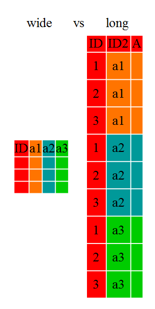
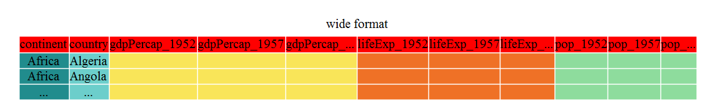
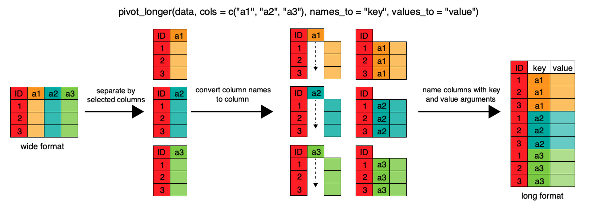
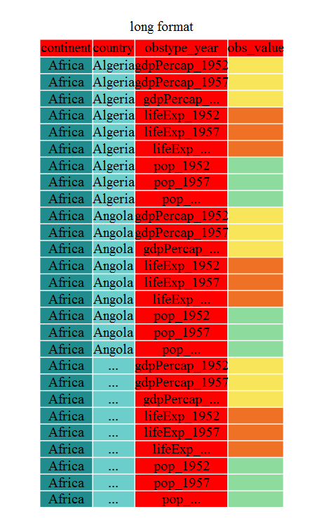

::::::::::::::::::::::::::::::::::::::: objectives

- To understand the concepts of 'longer' and 'wider' data frame formats and be able to convert between them with `tidyr`.

::::::::::::::::::::::::::::::::::::::::::::::::::

:::::::::::::::::::::::::::::::::::::::: questions

- How can I change the layout of a data frame?

::::::::::::::::::::::::::::::::::::::::::::::::::


Researchers often want to reshape their data frames from 'wide' to 'longer'
layouts, or vice-versa. The 'long' layout or format is where:

- each column is a variable
- each row is an observation

In the purely 'long' (or 'longest') format, you usually have 1 column for the observed variable and the other columns are ID variables.

For the 'wide' format each row is often a site/subject/patient and you have
multiple observation variables containing the same type of data. These can be
either repeated observations over time, or observation of multiple variables (or
a mix of both). You may find data input may be simpler or some other
applications may prefer the 'wide' format. However, many of `R`'s functions have
been designed assuming you have 'longer' formatted data. This tutorial will help you
efficiently transform your data shape regardless of original format.

{alt='Diagram illustrating the difference between a wide versus long layout of a data frame'}

Long and wide data frame layouts mainly affect readability. For humans, the wide format is often more intuitive since we can often see more of the data on the screen due
to its shape. However, the long format is more machine readable and is closer
to the formatting of databases. The ID variables in our data frames are similar to
the fields in a database and observed variables are like the database values.

## Getting started

First install the packages if you haven't already done so (you probably
installed dplyr in the previous lesson):


```r
#install.packages("tidyr")
#install.packages("dplyr")
```

Load the packages


```r
library("tidyr")
library("dplyr")
```

First, lets look at the structure of our original gapminder data frame:


```r
str(gapminder)
```

```{.output}
'data.frame':	1704 obs. of  6 variables:
 $ country  : chr  "Afghanistan" "Afghanistan" "Afghanistan" "Afghanistan" ...
 $ year     : int  1952 1957 1962 1967 1972 1977 1982 1987 1992 1997 ...
 $ pop      : num  8425333 9240934 10267083 11537966 13079460 ...
 $ continent: chr  "Asia" "Asia" "Asia" "Asia" ...
 $ lifeExp  : num  28.8 30.3 32 34 36.1 ...
 $ gdpPercap: num  779 821 853 836 740 ...
```

:::::::::::::::::::::::::::::::::::::::  challenge

## Challenge 1

Is gapminder a purely long, purely wide, or some intermediate format?

:::::::::::::::  solution

## Solution to Challenge 1

The original gapminder data.frame is in an intermediate format. It is not
purely long since it had multiple observation variables
(`pop`,`lifeExp`,`gdpPercap`).

:::::::::::::::::::::::::

::::::::::::::::::::::::::::::::::::::::::::::::::

Sometimes, as with the gapminder dataset, we have multiple types of observed
data. It is somewhere in between the purely 'long' and 'wide' data formats. We
have 3 "ID variables" (`continent`, `country`, `year`) and 3 "Observation
variables" (`pop`,`lifeExp`,`gdpPercap`). This intermediate format can be
preferred despite not having ALL observations in 1 column given that all 3
observation variables have different units. There are few operations that would
need us to make this data frame any longer (i.e. 4 ID variables and 1
Observation variable).

While using many of the functions in R, which are often vector based, you
usually do not want to do mathematical operations on values with different
units. For example, using the purely long format, a single mean for all of the
values of population, life expectancy, and GDP would not be meaningful since it
would return the mean of values with 3 incompatible units. The solution is that
we first manipulate the data either by grouping (see the lesson on `dplyr`), or
we change the structure of the data frame.  **Note:** Some plotting functions in
R actually work better in the wide format data.

## From wide to long format with pivot\_longer()

Until now, we've been using the nicely formatted original gapminder dataset, but
'real' data (i.e. our own research data) will never be so well organized. Here
let's start with the wide formatted version of the gapminder dataset.

> Download the wide version of the gapminder data from [here](data/gapminder_wide.csv)
> and save it in your data folder.

We'll load the data file and look at it. Note: we don't want our continent and
country columns to be factors, so we use the stringsAsFactors argument for
`read.csv()` to disable that.


```r
gap_wide <- read.csv("data/gapminder_wide.csv", stringsAsFactors = FALSE)
str(gap_wide)
```

```{.output}
'data.frame':	142 obs. of  38 variables:
 $ continent     : chr  "Africa" "Africa" "Africa" "Africa" ...
 $ country       : chr  "Algeria" "Angola" "Benin" "Botswana" ...
 $ gdpPercap_1952: num  2449 3521 1063 851 543 ...
 $ gdpPercap_1957: num  3014 3828 960 918 617 ...
 $ gdpPercap_1962: num  2551 4269 949 984 723 ...
 $ gdpPercap_1967: num  3247 5523 1036 1215 795 ...
 $ gdpPercap_1972: num  4183 5473 1086 2264 855 ...
 $ gdpPercap_1977: num  4910 3009 1029 3215 743 ...
 $ gdpPercap_1982: num  5745 2757 1278 4551 807 ...
 $ gdpPercap_1987: num  5681 2430 1226 6206 912 ...
 $ gdpPercap_1992: num  5023 2628 1191 7954 932 ...
 $ gdpPercap_1997: num  4797 2277 1233 8647 946 ...
 $ gdpPercap_2002: num  5288 2773 1373 11004 1038 ...
 $ gdpPercap_2007: num  6223 4797 1441 12570 1217 ...
 $ lifeExp_1952  : num  43.1 30 38.2 47.6 32 ...
 $ lifeExp_1957  : num  45.7 32 40.4 49.6 34.9 ...
 $ lifeExp_1962  : num  48.3 34 42.6 51.5 37.8 ...
 $ lifeExp_1967  : num  51.4 36 44.9 53.3 40.7 ...
 $ lifeExp_1972  : num  54.5 37.9 47 56 43.6 ...
 $ lifeExp_1977  : num  58 39.5 49.2 59.3 46.1 ...
 $ lifeExp_1982  : num  61.4 39.9 50.9 61.5 48.1 ...
 $ lifeExp_1987  : num  65.8 39.9 52.3 63.6 49.6 ...
 $ lifeExp_1992  : num  67.7 40.6 53.9 62.7 50.3 ...
 $ lifeExp_1997  : num  69.2 41 54.8 52.6 50.3 ...
 $ lifeExp_2002  : num  71 41 54.4 46.6 50.6 ...
 $ lifeExp_2007  : num  72.3 42.7 56.7 50.7 52.3 ...
 $ pop_1952      : num  9279525 4232095 1738315 442308 4469979 ...
 $ pop_1957      : num  10270856 4561361 1925173 474639 4713416 ...
 $ pop_1962      : num  11000948 4826015 2151895 512764 4919632 ...
 $ pop_1967      : num  12760499 5247469 2427334 553541 5127935 ...
 $ pop_1972      : num  14760787 5894858 2761407 619351 5433886 ...
 $ pop_1977      : num  17152804 6162675 3168267 781472 5889574 ...
 $ pop_1982      : num  20033753 7016384 3641603 970347 6634596 ...
 $ pop_1987      : num  23254956 7874230 4243788 1151184 7586551 ...
 $ pop_1992      : num  26298373 8735988 4981671 1342614 8878303 ...
 $ pop_1997      : num  29072015 9875024 6066080 1536536 10352843 ...
 $ pop_2002      : int  31287142 10866106 7026113 1630347 12251209 7021078 15929988 4048013 8835739 614382 ...
 $ pop_2007      : int  33333216 12420476 8078314 1639131 14326203 8390505 17696293 4369038 10238807 710960 ...
```

{alt='Diagram illustrating the wide format of the gapminder data frame'}

To change this very wide data frame layout back to our nice, intermediate (or longer) layout, we will use one of the two available `pivot`  functions from the `tidyr` package. To convert from wide to a longer format, we will use the `pivot_longer()` function. `pivot_longer()` makes datasets longer by increasing the number of rows and decreasing the number of columns, or 'lengthening' your observation variables into a single variable.

{alt='Diagram illustrating how pivot longer reorganizes a data frame from a wide to long format'}


```r
gap_long <- gap_wide %>%
  pivot_longer(
    cols = c(starts_with('pop'), starts_with('lifeExp'), starts_with('gdpPercap')),
    names_to = "obstype_year", values_to = "obs_values"
  )
str(gap_long)
```

```{.output}
tibble [5,112 × 4] (S3: tbl_df/tbl/data.frame)
 $ continent   : chr [1:5112] "Africa" "Africa" "Africa" "Africa" ...
 $ country     : chr [1:5112] "Algeria" "Algeria" "Algeria" "Algeria" ...
 $ obstype_year: chr [1:5112] "pop_1952" "pop_1957" "pop_1962" "pop_1967" ...
 $ obs_values  : num [1:5112] 9279525 10270856 11000948 12760499 14760787 ...
```

Here we have used piping syntax which is similar to what we were doing in the
previous lesson with dplyr. In fact, these are compatible and you can use a mix
of tidyr and dplyr functions by piping them together.

We first provide to `pivot_longer()` a vector of column names that will be
pivoted into longer format. We could type out all the observation variables, but
as in the `select()` function (see `dplyr` lesson), we can use the `starts_with()`
argument to select all variables that start with the desired character string.
`pivot_longer()` also allows the alternative syntax of using the `-` symbol to
identify which variables are not to be pivoted (i.e. ID variables).

The next arguments to `pivot_longer()` are `names_to` for naming the column that
will contain the new ID variable (`obstype_year`) and `values_to` for naming the
new amalgamated observation variable (`obs_value`). We supply these new column
names as strings.

{alt='Diagram illustrating the long format of the gapminder data'}


```r
gap_long <- gap_wide %>%
  pivot_longer(
    cols = c(-continent, -country),
    names_to = "obstype_year", values_to = "obs_values"
  )
str(gap_long)
```

```{.output}
tibble [5,112 × 4] (S3: tbl_df/tbl/data.frame)
 $ continent   : chr [1:5112] "Africa" "Africa" "Africa" "Africa" ...
 $ country     : chr [1:5112] "Algeria" "Algeria" "Algeria" "Algeria" ...
 $ obstype_year: chr [1:5112] "gdpPercap_1952" "gdpPercap_1957" "gdpPercap_1962" "gdpPercap_1967" ...
 $ obs_values  : num [1:5112] 2449 3014 2551 3247 4183 ...
```

That may seem trivial with this particular data frame, but sometimes you have 1
ID variable and 40 observation variables with irregular variable names. The
flexibility is a huge time saver!

Now `obstype_year` actually contains 2 pieces of information, the observation
type (`pop`,`lifeExp`, or `gdpPercap`) and the `year`. We can use the
`separate()` function to split the character strings into multiple variables


```r
gap_long <- gap_long %>% separate(obstype_year, into = c('obs_type', 'year'), sep = "_")
gap_long$year <- as.integer(gap_long$year)
```

:::::::::::::::::::::::::::::::::::::::  challenge

## Challenge 2

Using `gap_long`, calculate the mean life expectancy, population, and gdpPercap for each continent.
**Hint:** use the `group_by()` and `summarize()` functions we learned in the `dplyr` lesson

:::::::::::::::  solution

## Solution to Challenge 2


```r
gap_long %>% group_by(continent, obs_type) %>%
   summarize(means=mean(obs_values))
```

```{.output}
`summarise()` has grouped output by 'continent'. You can override using the
`.groups` argument.
```

```{.output}
# A tibble: 15 × 3
# Groups:   continent [5]
   continent obs_type       means
   <chr>     <chr>          <dbl>
 1 Africa    gdpPercap     2194. 
 2 Africa    lifeExp         48.9
 3 Africa    pop        9916003. 
 4 Americas  gdpPercap     7136. 
 5 Americas  lifeExp         64.7
 6 Americas  pop       24504795. 
 7 Asia      gdpPercap     7902. 
 8 Asia      lifeExp         60.1
 9 Asia      pop       77038722. 
10 Europe    gdpPercap    14469. 
11 Europe    lifeExp         71.9
12 Europe    pop       17169765. 
13 Oceania   gdpPercap    18622. 
14 Oceania   lifeExp         74.3
15 Oceania   pop        8874672. 
```

:::::::::::::::::::::::::

::::::::::::::::::::::::::::::::::::::::::::::::::

## From long to intermediate format with pivot\_wider()

It is always good to check work. So, let's use the second `pivot` function, `pivot_wider()`, to 'widen' our observation variables back out.  `pivot_wider()` is the opposite of `pivot_longer()`, making a dataset wider by increasing the number of columns and decreasing the number of rows. We can use `pivot_wider()` to pivot or reshape our `gap_long` to the original intermediate format or the widest format. Let's start with the intermediate format.

The `pivot_wider()` function takes `names_from` and `values_from` arguments.

To `names_from` we supply the column name whose contents will be pivoted into new
output columns in the widened data frame. The corresponding values will be added
from the column named in the `values_from` argument.


```r
gap_normal <- gap_long %>%
  pivot_wider(names_from = obs_type, values_from = obs_values)
dim(gap_normal)
```

```{.output}
[1] 1704    6
```

```r
dim(gapminder)
```

```{.output}
[1] 1704    6
```

```r
names(gap_normal)
```

```{.output}
[1] "continent" "country"   "year"      "gdpPercap" "lifeExp"   "pop"      
```

```r
names(gapminder)
```

```{.output}
[1] "country"   "year"      "pop"       "continent" "lifeExp"   "gdpPercap"
```

Now we've got an intermediate data frame `gap_normal` with the same dimensions as
the original `gapminder`, but the order of the variables is different. Let's fix
that before checking if they are `all.equal()`.


```r
gap_normal <- gap_normal[, names(gapminder)]
all.equal(gap_normal, gapminder)
```

```{.output}
[1] "Attributes: < Component \"class\": Lengths (3, 1) differ (string compare on first 1) >"
[2] "Attributes: < Component \"class\": 1 string mismatch >"                                
[3] "Component \"country\": 1704 string mismatches"                                         
[4] "Component \"pop\": Mean relative difference: 1.634504"                                 
[5] "Component \"continent\": 1212 string mismatches"                                       
[6] "Component \"lifeExp\": Mean relative difference: 0.203822"                             
[7] "Component \"gdpPercap\": Mean relative difference: 1.162302"                           
```

```r
head(gap_normal)
```

```{.output}
# A tibble: 6 × 6
  country  year      pop continent lifeExp gdpPercap
  <chr>   <int>    <dbl> <chr>       <dbl>     <dbl>
1 Algeria  1952  9279525 Africa       43.1     2449.
2 Algeria  1957 10270856 Africa       45.7     3014.
3 Algeria  1962 11000948 Africa       48.3     2551.
4 Algeria  1967 12760499 Africa       51.4     3247.
5 Algeria  1972 14760787 Africa       54.5     4183.
6 Algeria  1977 17152804 Africa       58.0     4910.
```

```r
head(gapminder)
```

```{.output}
      country year      pop continent lifeExp gdpPercap
1 Afghanistan 1952  8425333      Asia  28.801  779.4453
2 Afghanistan 1957  9240934      Asia  30.332  820.8530
3 Afghanistan 1962 10267083      Asia  31.997  853.1007
4 Afghanistan 1967 11537966      Asia  34.020  836.1971
5 Afghanistan 1972 13079460      Asia  36.088  739.9811
6 Afghanistan 1977 14880372      Asia  38.438  786.1134
```

We're almost there, the original was sorted by `country`, then
`year`.


```r
gap_normal <- gap_normal %>% arrange(country, year)
all.equal(gap_normal, gapminder)
```

```{.output}
[1] "Attributes: < Component \"class\": Lengths (3, 1) differ (string compare on first 1) >"
[2] "Attributes: < Component \"class\": 1 string mismatch >"                                
```

That's great! We've gone from the longest format back to the intermediate and we
didn't introduce any errors in our code.

Now let's convert the long all the way back to the wide. In the wide format, we
will keep country and continent as ID variables and pivot the observations
across the 3 metrics (`pop`,`lifeExp`,`gdpPercap`) and time (`year`). First we
need to create appropriate labels for all our new variables (time\*metric
combinations) and we also need to unify our ID variables to simplify the process
of defining `gap_wide`.


```r
gap_temp <- gap_long %>% unite(var_ID, continent, country, sep = "_")
str(gap_temp)
```

```{.output}
tibble [5,112 × 4] (S3: tbl_df/tbl/data.frame)
 $ var_ID    : chr [1:5112] "Africa_Algeria" "Africa_Algeria" "Africa_Algeria" "Africa_Algeria" ...
 $ obs_type  : chr [1:5112] "gdpPercap" "gdpPercap" "gdpPercap" "gdpPercap" ...
 $ year      : int [1:5112] 1952 1957 1962 1967 1972 1977 1982 1987 1992 1997 ...
 $ obs_values: num [1:5112] 2449 3014 2551 3247 4183 ...
```

```r
gap_temp <- gap_long %>%
    unite(ID_var, continent, country, sep = "_") %>%
    unite(var_names, obs_type, year, sep = "_")
str(gap_temp)
```

```{.output}
tibble [5,112 × 3] (S3: tbl_df/tbl/data.frame)
 $ ID_var    : chr [1:5112] "Africa_Algeria" "Africa_Algeria" "Africa_Algeria" "Africa_Algeria" ...
 $ var_names : chr [1:5112] "gdpPercap_1952" "gdpPercap_1957" "gdpPercap_1962" "gdpPercap_1967" ...
 $ obs_values: num [1:5112] 2449 3014 2551 3247 4183 ...
```

Using `unite()` we now have a single ID variable which is a combination of
`continent`,`country`,and we have defined variable names. We're now ready to
pipe in `pivot_wider()`


```r
gap_wide_new <- gap_long %>%
  unite(ID_var, continent, country, sep = "_") %>%
  unite(var_names, obs_type, year, sep = "_") %>%
  pivot_wider(names_from = var_names, values_from = obs_values)
str(gap_wide_new)
```

```{.output}
tibble [142 × 37] (S3: tbl_df/tbl/data.frame)
 $ ID_var        : chr [1:142] "Africa_Algeria" "Africa_Angola" "Africa_Benin" "Africa_Botswana" ...
 $ gdpPercap_1952: num [1:142] 2449 3521 1063 851 543 ...
 $ gdpPercap_1957: num [1:142] 3014 3828 960 918 617 ...
 $ gdpPercap_1962: num [1:142] 2551 4269 949 984 723 ...
 $ gdpPercap_1967: num [1:142] 3247 5523 1036 1215 795 ...
 $ gdpPercap_1972: num [1:142] 4183 5473 1086 2264 855 ...
 $ gdpPercap_1977: num [1:142] 4910 3009 1029 3215 743 ...
 $ gdpPercap_1982: num [1:142] 5745 2757 1278 4551 807 ...
 $ gdpPercap_1987: num [1:142] 5681 2430 1226 6206 912 ...
 $ gdpPercap_1992: num [1:142] 5023 2628 1191 7954 932 ...
 $ gdpPercap_1997: num [1:142] 4797 2277 1233 8647 946 ...
 $ gdpPercap_2002: num [1:142] 5288 2773 1373 11004 1038 ...
 $ gdpPercap_2007: num [1:142] 6223 4797 1441 12570 1217 ...
 $ lifeExp_1952  : num [1:142] 43.1 30 38.2 47.6 32 ...
 $ lifeExp_1957  : num [1:142] 45.7 32 40.4 49.6 34.9 ...
 $ lifeExp_1962  : num [1:142] 48.3 34 42.6 51.5 37.8 ...
 $ lifeExp_1967  : num [1:142] 51.4 36 44.9 53.3 40.7 ...
 $ lifeExp_1972  : num [1:142] 54.5 37.9 47 56 43.6 ...
 $ lifeExp_1977  : num [1:142] 58 39.5 49.2 59.3 46.1 ...
 $ lifeExp_1982  : num [1:142] 61.4 39.9 50.9 61.5 48.1 ...
 $ lifeExp_1987  : num [1:142] 65.8 39.9 52.3 63.6 49.6 ...
 $ lifeExp_1992  : num [1:142] 67.7 40.6 53.9 62.7 50.3 ...
 $ lifeExp_1997  : num [1:142] 69.2 41 54.8 52.6 50.3 ...
 $ lifeExp_2002  : num [1:142] 71 41 54.4 46.6 50.6 ...
 $ lifeExp_2007  : num [1:142] 72.3 42.7 56.7 50.7 52.3 ...
 $ pop_1952      : num [1:142] 9279525 4232095 1738315 442308 4469979 ...
 $ pop_1957      : num [1:142] 10270856 4561361 1925173 474639 4713416 ...
 $ pop_1962      : num [1:142] 11000948 4826015 2151895 512764 4919632 ...
 $ pop_1967      : num [1:142] 12760499 5247469 2427334 553541 5127935 ...
 $ pop_1972      : num [1:142] 14760787 5894858 2761407 619351 5433886 ...
 $ pop_1977      : num [1:142] 17152804 6162675 3168267 781472 5889574 ...
 $ pop_1982      : num [1:142] 20033753 7016384 3641603 970347 6634596 ...
 $ pop_1987      : num [1:142] 23254956 7874230 4243788 1151184 7586551 ...
 $ pop_1992      : num [1:142] 26298373 8735988 4981671 1342614 8878303 ...
 $ pop_1997      : num [1:142] 29072015 9875024 6066080 1536536 10352843 ...
 $ pop_2002      : num [1:142] 31287142 10866106 7026113 1630347 12251209 ...
 $ pop_2007      : num [1:142] 33333216 12420476 8078314 1639131 14326203 ...
```

:::::::::::::::::::::::::::::::::::::::  challenge

## Challenge 3

Take this 1 step further and create a `gap_ludicrously_wide` format data by pivoting over countries, year and the 3 metrics?
**Hint** this new data frame should only have 5 rows.

:::::::::::::::  solution

## Solution to Challenge 3


```r
gap_ludicrously_wide <- gap_long %>%
   unite(var_names, obs_type, year, country, sep = "_") %>%
   pivot_wider(names_from = var_names, values_from = obs_values)
```

:::::::::::::::::::::::::

::::::::::::::::::::::::::::::::::::::::::::::::::

Now we have a great 'wide' format data frame, but the `ID_var` could be more
usable, let's separate it into 2 variables with `separate()`


```r
gap_wide_betterID <- separate(gap_wide_new, ID_var, c("continent", "country"), sep="_")
gap_wide_betterID <- gap_long %>%
    unite(ID_var, continent, country, sep = "_") %>%
    unite(var_names, obs_type, year, sep = "_") %>%
    pivot_wider(names_from = var_names, values_from = obs_values) %>%
    separate(ID_var, c("continent","country"), sep = "_")
str(gap_wide_betterID)
```

```{.output}
tibble [142 × 38] (S3: tbl_df/tbl/data.frame)
 $ continent     : chr [1:142] "Africa" "Africa" "Africa" "Africa" ...
 $ country       : chr [1:142] "Algeria" "Angola" "Benin" "Botswana" ...
 $ gdpPercap_1952: num [1:142] 2449 3521 1063 851 543 ...
 $ gdpPercap_1957: num [1:142] 3014 3828 960 918 617 ...
 $ gdpPercap_1962: num [1:142] 2551 4269 949 984 723 ...
 $ gdpPercap_1967: num [1:142] 3247 5523 1036 1215 795 ...
 $ gdpPercap_1972: num [1:142] 4183 5473 1086 2264 855 ...
 $ gdpPercap_1977: num [1:142] 4910 3009 1029 3215 743 ...
 $ gdpPercap_1982: num [1:142] 5745 2757 1278 4551 807 ...
 $ gdpPercap_1987: num [1:142] 5681 2430 1226 6206 912 ...
 $ gdpPercap_1992: num [1:142] 5023 2628 1191 7954 932 ...
 $ gdpPercap_1997: num [1:142] 4797 2277 1233 8647 946 ...
 $ gdpPercap_2002: num [1:142] 5288 2773 1373 11004 1038 ...
 $ gdpPercap_2007: num [1:142] 6223 4797 1441 12570 1217 ...
 $ lifeExp_1952  : num [1:142] 43.1 30 38.2 47.6 32 ...
 $ lifeExp_1957  : num [1:142] 45.7 32 40.4 49.6 34.9 ...
 $ lifeExp_1962  : num [1:142] 48.3 34 42.6 51.5 37.8 ...
 $ lifeExp_1967  : num [1:142] 51.4 36 44.9 53.3 40.7 ...
 $ lifeExp_1972  : num [1:142] 54.5 37.9 47 56 43.6 ...
 $ lifeExp_1977  : num [1:142] 58 39.5 49.2 59.3 46.1 ...
 $ lifeExp_1982  : num [1:142] 61.4 39.9 50.9 61.5 48.1 ...
 $ lifeExp_1987  : num [1:142] 65.8 39.9 52.3 63.6 49.6 ...
 $ lifeExp_1992  : num [1:142] 67.7 40.6 53.9 62.7 50.3 ...
 $ lifeExp_1997  : num [1:142] 69.2 41 54.8 52.6 50.3 ...
 $ lifeExp_2002  : num [1:142] 71 41 54.4 46.6 50.6 ...
 $ lifeExp_2007  : num [1:142] 72.3 42.7 56.7 50.7 52.3 ...
 $ pop_1952      : num [1:142] 9279525 4232095 1738315 442308 4469979 ...
 $ pop_1957      : num [1:142] 10270856 4561361 1925173 474639 4713416 ...
 $ pop_1962      : num [1:142] 11000948 4826015 2151895 512764 4919632 ...
 $ pop_1967      : num [1:142] 12760499 5247469 2427334 553541 5127935 ...
 $ pop_1972      : num [1:142] 14760787 5894858 2761407 619351 5433886 ...
 $ pop_1977      : num [1:142] 17152804 6162675 3168267 781472 5889574 ...
 $ pop_1982      : num [1:142] 20033753 7016384 3641603 970347 6634596 ...
 $ pop_1987      : num [1:142] 23254956 7874230 4243788 1151184 7586551 ...
 $ pop_1992      : num [1:142] 26298373 8735988 4981671 1342614 8878303 ...
 $ pop_1997      : num [1:142] 29072015 9875024 6066080 1536536 10352843 ...
 $ pop_2002      : num [1:142] 31287142 10866106 7026113 1630347 12251209 ...
 $ pop_2007      : num [1:142] 33333216 12420476 8078314 1639131 14326203 ...
```

```r
all.equal(gap_wide, gap_wide_betterID)
```

```{.output}
[1] "Attributes: < Component \"class\": Lengths (1, 3) differ (string compare on first 1) >"
[2] "Attributes: < Component \"class\": 1 string mismatch >"                                
```

There and back again!

## Other great resources

- [R for Data Science](https://r4ds.had.co.nz/index.html)
- [Data Wrangling Cheat sheet](https://www.rstudio.com/wp-content/uploads/2015/02/data-wrangling-cheatsheet.pdf)
- [Introduction to tidyr](https://cran.r-project.org/web/packages/tidyr/vignettes/tidy-data.html)
- [Data wrangling with R and RStudio](https://www.rstudio.com/resources/webinars/data-wrangling-with-r-and-rstudio/)

:::::::::::::::::::::::::::::::::::::::: keypoints

- Use the `tidyr` package to change the layout of data frames.
- Use `pivot_longer()` to go from wide to longer layout.
- Use `pivot_wider()` to go from long to wider layout.

::::::::::::::::::::::::::::::::::::::::::::::::::


