Graficar nuestros datos es una de las mejores maneras
para explorarlos y para observar las relaciones que existen entre las variables.

En R existen tres sistemas principales encargados de hacer gráficos,
el sistema [base plotting system][base], el paqute [lattice][lattice]
 y el paquete [ggplot2][ggplot2].

[base]: http://www.statmethods.net/graphs/
[lattice]: http://www.statmethods.net/advgraphs/trellis.html
[ggplot2]: http://www.statmethods.net/advgraphs/ggplot2.html

Hoy aprenderemos un poco acerca del paquete ggplot2, este sistema es el
más efectivo para crear gráficas con calidad para publicación.

ggplot2 se contruyó basado en la gramática de gráficos, es decir,
en la idea de que cualquier gráfico puede expresarse a partir del mismo set de componentes:
un set de **datos**, un **sistema coordinado**, y un set de **geoms** -- que corresponden a la representación visual de cada dato

La clave para entender ggplot2 es pensar en una figura como un conjunto de capas.
Esta idea podría resultarte familiar si has usado un programa de edición de imágenes como 
Photoshop, Illustrator, o Inkscape.

Comencemos con un ejemplo:

~~~
library("ggplot2")
ggplot(data = gapminder, aes(x = gdpPercap, y = lifeExp)) +
  geom_point()
~~~
{: .r}

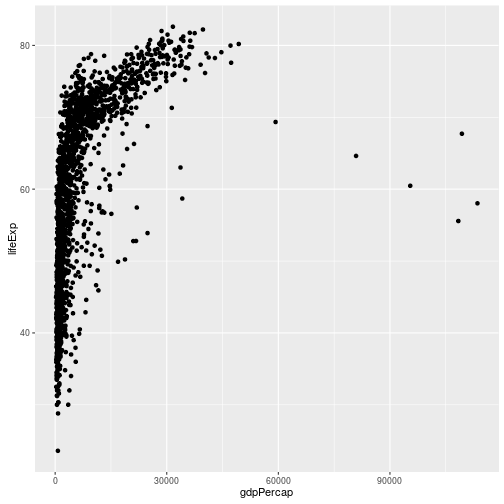

La primer cosa que hacemos es llamar a la función `ggplot`. Esta función
le dice a R que estamos creando una nueva gráfica, todos los argumentos
que le pasemos a la función `ggplot` serán considerado como opciones *globales* en nuestra gráfica:
lo cual significa que estas opciones son válidas para todas las capas de la gráfica.

En este ejemplo, le hemos pasado dos argumentos a `ggplot`. Primero, le decimos a `ggplot`
cuáles son los datos que queremos mostrar en nuestra figura, en este ejemplo usaremos los datos
de gapminder que cargamos anteriormente. Como segundo argumento, le pasamos la función `aes`,
la cual le dice a `ggplot` como es que cada una de las variables en los **datos** se relacionan con las propiedades
**aesthetic** (estéticas) de la figura, en este caso los valores que tomarán **x** y **y**. En este ejemplo, le dijimos a 
`ggplot` que queremos graficar la columna "gdpPercap" del dataframe gapminder en el eje X, y la columna
"lifeExp" en el eje Y. Nota que no necesitamos indicar explícitamente estas columnas en la función `aes` 
(e.g. `x = gapminder[, "gdpPercap"]`), ¡esto es debido a que `ggplot` es suficientemente listo para 
buscar esa columna en los **datos**!

Por sí mismo, llamar a la función `ggplot` no es suficiente para dibujar una figura:

~~~
ggplot(data = gapminder, aes(x = gdpPercap, y = lifeExp))
~~~
{: .r}

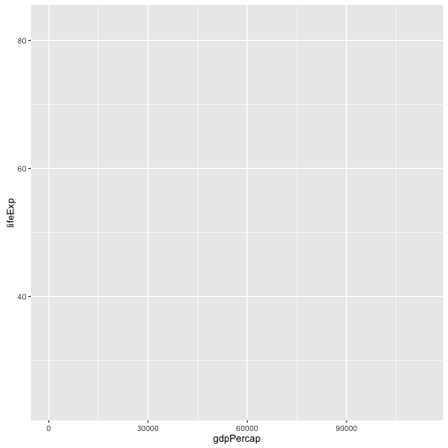

Necesitamos decirle a `ggplot` como queremos representar visualmente los datos, 
esto lo hacemos al agregar una nueva capa **geom**. En nuestro ejemplo, usamos `geom_point`,
la cual le indica a `ggplot` que queremos representar visualmente la relación entre **x** y **y**
como un gráfico de dispersión de los puntos (scatterplot) .

~~~
ggplot(data = gapminder, aes(x = gdpPercap, y = lifeExp)) +
  geom_point()
~~~
{: .r}

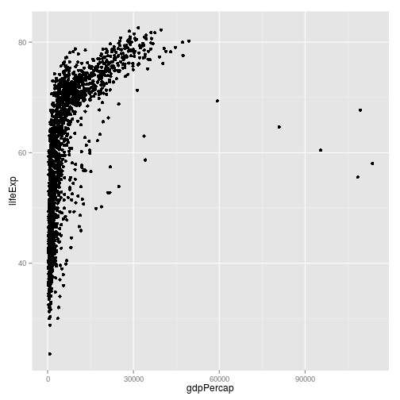

> ## Desafío 1
>
> Modifica el ejemplo anterior de manera que en la figura se muestre
> como la esperanza de vida ha cambiado a través del tiempo:
>
> ~~~
> ggplot(data = gapminder, aes(x = gdpPercap, y = lifeExp)) + geom_point()
> ~~~
> {: .r}
>
>
> Pista: El dataset gapminder tiene una columna llamada "year", la cual
> debe aparecer en el eje X.
>
> > ## Solución al desafío 1
> > Modifica el ejemplo de manera que en la figura se muestre
> > como la esperanza de vida ha cambiado a través del tiempo:
> >
> > Esta es una posible solución:
> >
> > ~~~
> > ggplot(data = gapminder, aes(x = year, y = lifeExp)) + geom_point()
> > ~~~
> > {: .r}
> > 
> > 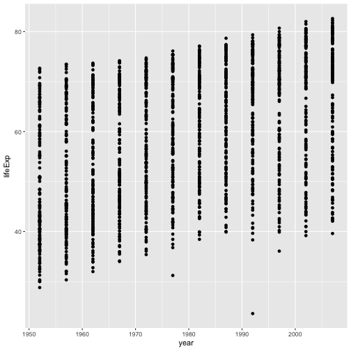
> >
> {: .solution}
{: .challenge}

>
>
> ## Desafío 2
>
> En los ejemplos y desafíos anteriores hemos usado la función `aes` para decirle al `geom_point`
> cuáles serán las posiciones **x** y **y** para cada punto. Otra propiedad **aesthetic** que podemos modificar
> es el *color*. Modifica el código del desafío anterior para **colorear** los puntos de acuerdo a la columna
> "continent". ¿Qué tendencias observas en los datos? ¿Son lo que esperabas?
>
> > ## Solución al desafío 2
> > En los ejemplos y desafios anteriores hemos usado la función `aes` para decirle al `geom_point`
> > cuáles serán las posiciones **x** y **y** para cada punto. Otra propiedad **aesthetic** que podemos modificar
> > es el *color*. Modifica el código del desafío anterior para **colorear** los puntos de acuerdo a la columna
> > "continent". ¿Qué tendencias observas en los datos? ¿Son lo que esperabas?
> > 
> > ~~~
> > ggplot(data = gapminder, aes(x = year, y = lifeExp, color=continent)) +
> >   geom_point()
> > ~~~
> > {: .r}
> > 
> > 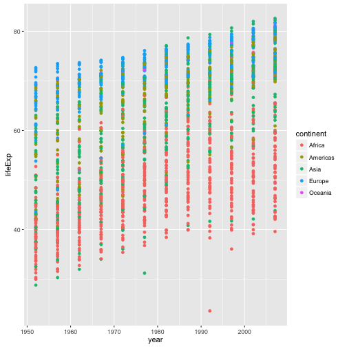
> >
> {: .solution}
{: .challenge}

## Capas

Un gráfico de dispersión probablemente no es la mejor manera de visualizar el cambio a través del tiempo.
En vez de eso, vamos a decirle a `ggplot` que queremos visualizar los datos como un diagrama de línea (line plot):

~~~
ggplot(data = gapminder, aes(x=year, y=lifeExp, by=country, color=continent)) +
  geom_line()
~~~
{: .r}

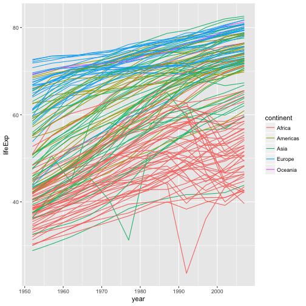

En vez de agregar una capa `geom_point`, hemos agregado una capa `geom_line`.
Además, hemos agregado el **aesthetic** **by**, el cual le dice a `ggplot` que
debe dibujar una línea para cada país.

Pero, ¿qué pasa si queremos visualizar ambos, puntos y líneas en la misma gráfica?
Simplemente podemos agregar otra capa a la gráfica:

~~~
ggplot(data = gapminder, aes(x=year, y=lifeExp, by=country, color=continent)) +
  geom_line() + geom_point()
~~~
{: .r}

Es importante notar que cada capa se dibuja encima de la capa anterior. En este ejemplo, 
los puntos se han dibujado *sobre* las líneas. A continuación observamos una demostración:

~~~
ggplot(data = gapminder, aes(x=year, y=lifeExp, by=country)) +
  geom_line(aes(color=continent)) + geom_point()
~~~
{: .r}

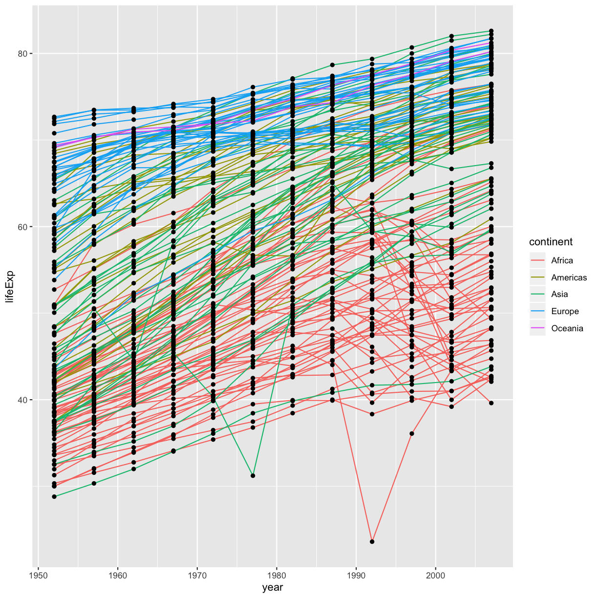

En este ejemplo, el mapeo **aesthetic** de **color** se ha movido de las opciones globales de la gráfica en 
`ggplot` a la capa `geom_line` y, por lo tanto, ya no es válido para los puntos. 
Ahora podemos ver claramente que los puntos se dibujan sobre las líneas.

> ## Sugerencia: Asignando un **aesthetic** a un valor en vez de a un mapeo 
>
> Hasta ahora,hemos visto como usar un **aesthetic** (como **color**) como un *mapeo* sobre una variable de los datos. 
> Por ejemplo, cuando usamos `geom_line(aes(color=continent))`, ggplot le asignará un color diferente a cada continente.
> Pero, ¿qué tal si queremos cambiar el color de todas las líneas a azul? Podrías pensar que
> `geom_line(aes(color="blue"))` debería funcionar, pero no es así. Dado que no queremos crear un mapeo hacia una variable
> específica, simplemente debemos cambiar la especificacion de color afuera de la función `aes()`, de esta manera:
> `geom_line(color="blue")`.
{: .callout}

> ## Desafío 3
>
> Intercambia el orden de las capas de los puntos y líneas del ejemplo anterior. ¿Qué sucede?
>
> > ## Solución a desafío 3
> >
> > Intercambia el orden de las capas de los puntos y líneas del ejemplo anterior. ¿Qué sucede?
> >
> > ~~~
> > ggplot(data = gapminder, aes(x=year, y=lifeExp, by=country)) +
> >  geom_point() + geom_line(aes(color=continent))
> > ~~~
> > {: .r}
> > 
> > 
> >
> > ¡Las líneas ahora son dibujadas sobre los puntos!
> >
> {: .solution}
{: .challenge}

## Transformaciones y estadísticas

Ggplot también facilita sobreponer modelos estadísticos a los datos. 
Para demostrarlo regresaremos a nuestro primer ejemplo:

~~~
ggplot(data = gapminder, aes(x = gdpPercap, y = lifeExp, color=continent)) +
  geom_point()
~~~
{: .r}

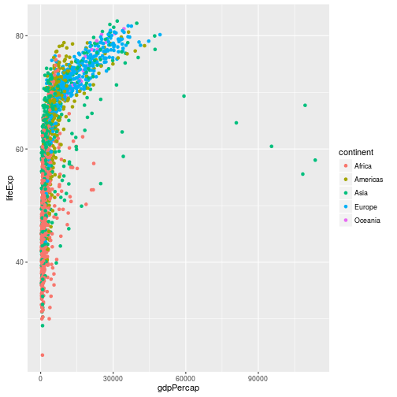

En este momento es difícil ver las relaciones entre los puntos debido a algunos 
valores altamente atípicos en GDP per capita. Podemos cambiar la escala de unidades del eje X
usando las funciones de **escala**. Estas funcionaes controlan el mapeo entre los valores 
de los datos y los valores visuales de un **aesthetic**. También podemos modificar la transparencia
de los puntos, usando la función *alpha*, la cual es especialmente útil cuando tienes una
gran cantidad de datos fuertemente conglomerados.

~~~
ggplot(data = gapminder, aes(x = gdpPercap, y = lifeExp)) +
  geom_point(alpha = 0.5) + scale_x_log10()
~~~
{: .r}

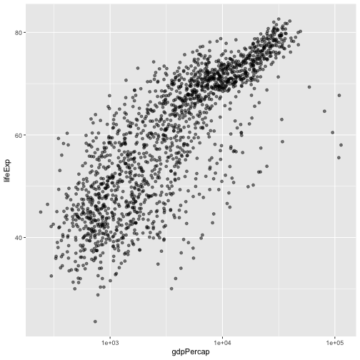

La función `log10` aplica una transformación sobre los valores de la columna gdpPercap
antes de presentarlos en la gráfica, de manera que cada múltiplo de 10 ahora
corresponde a un incremento de 1 en la escala transformada, e.g. un GDP per capita de 1,000
es ahora 3 en el eje Y, un valor de 10,000 corresponde a un valor de 4 en el eje Y, y así suciesivamente.
Esto facilita visualizar la dispersión de los datos sobre el eje X

> ## Sugerencia Recordatorio: Asignando un **aesthetic** a un valor en vez de a un mapeo 
>
> Nota que usamos `geom_point(alpha = 0.5)`. Como la sugerencia anterior mencionaba, 
> cambiar una especificación afuera de la función  `aes()` causará que este valor sea usado
> para todos los puntos, que es exactamente lo que queremos en este caso.  Sin embargo, como cualquier otra
> especificación **aesthetic**, *alpha* puede ser mapeado hacia una variable de los datos. Por ejemplo, 
> podemos asignar una transparencia diferente a cada continente usando `geom_point(aes(alpha = continent))`.
{: .callout}

Podemos ajustar una relación simple a los datos agregando otra capa,
`geom_smooth`:

~~~
ggplot(data = gapminder, aes(x = gdpPercap, y = lifeExp)) +
  geom_point() + scale_x_log10() + geom_smooth(method="lm")
~~~
{: .r}

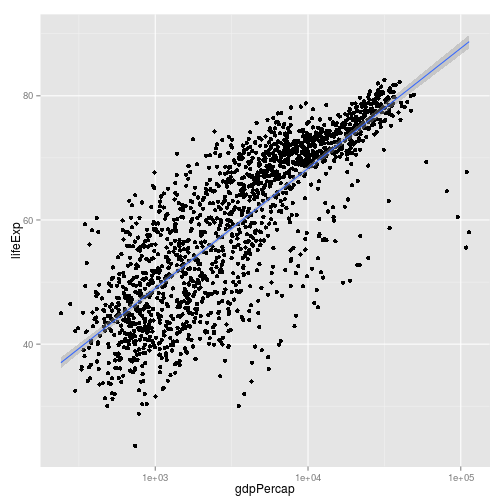

Podemos hacer la línea más gruesa *configurando* el **aesthetic** **tamaño** en la capa `geom_smooth`:

~~~
ggplot(data = gapminder, aes(x = gdpPercap, y = lifeExp)) +
  geom_point() + scale_x_log10() + geom_smooth(method="lm", size=1.5)
~~~
{: .r}

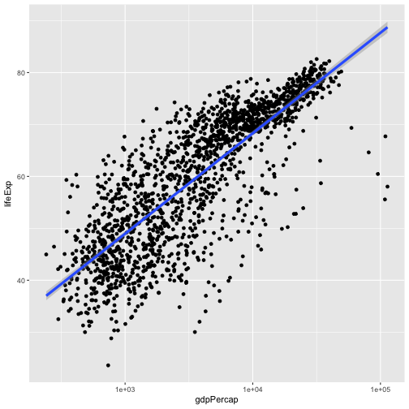

Existen dos formas en las que un *aesthetic* puede ser especificado. Aquí *configuramos* el 
**aesthetic** **tamaño** pasándolo como un argumento a `geom_smooth`. Previamente en la lección
habíamos usado la función `aes` para definir un *mapeo* entre alguna variable de los datos y su representación visual.

> ## Desafío 4a
>
> Modifica el color y el tamaño de los puntos en la capa puntos en el ejemplo anterior
>
> Pista: No uses la función `aes`.
>
> > ## Solución al desafío 4a
> >
> > Modifica el color y el tamaño de los puntos en la capa puntos en el ejemplo anterior
> >
> > Pista: No uses la función `aes`.
> >
> > 
> > ~~~
> > ggplot(data = gapminder, aes(x = gdpPercap, y = lifeExp)) +
> >  geom_point(size=3, color="orange") + scale_x_log10() +
> >  geom_smooth(method="lm", size=1.5)
> > ~~~
> > {: .r}
> > 
> > 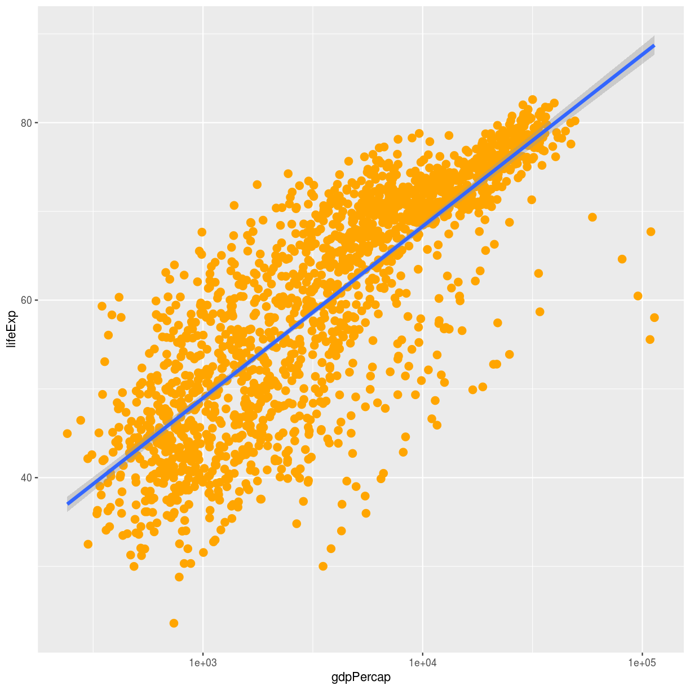
> {: .solution}
{: .challenge}

> ## Challenge 4b
>
> Modifica tu solución al Desafío 4a de manera que ahora los puntos
> tengan una forma diferente y estén coloreados de acuerdo al continente
> incluyendo líneas de tendencia.
>
> Pista: El argumento color puede ser usado dentro de **aesthetic**
>
> > ## Solución al desafío 4b
> >
> > Modifica tu solución al Desafío 4a de manera que ahora los puntos
> > tengan una forma diferente y estén coloreados de acuerdo al continente
> > incluyendo líneas de tendencia.
> > 
> > Pista: El argumento color puede ser usado dentro de **aesthetic**
> >
> >
> >~~~
> > ggplot(data = gapminder, aes(x = gdpPercap, y = lifeExp, color = continent)) +
> > geom_point(size=3, shape=17) + scale_x_log10() +
> > geom_smooth(method="lm", size=1.5)
> >~~~
> >{: .r}
> >
> >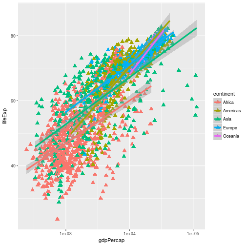
> {: .solution}
{: .challenge}

## Figuras Multi-panel 

Anteriormente visualizamos el cambio en la esperanza de vida a lo largo del tiempo para cada uno de los países 
en una sola gráfica. Como una alternativa, podemos dividir esta gráfica en múltiples paneles al agregar una capa **facet**.
Enfocándonos únicamente en aquéllos países con nombres que empiezan con la letra "A" o "Z".

> ## Pista
>
> Empezamos por subdividir los datos. Usamos la función `substr` para extraer una parte de una cadena de caracteres; 
> Exytrayendo las letras que ocurran de la posición `start` hasta `stop`, inclusivo, del vector `gapminder$country`.
> El operador `%in%` nos permite hacer múltiples comparaciones y evita que tengamos que escribir
> una condición muy larga para subdividir los datos (en este caso, `starts.with %in% c("A", "Z")`
> es equivalente a `starts.with == "A" | starts.with == "Z"`)
{: .callout}

~~~
starts.with <- substr(gapminder$country, start = 1, stop = 1)
az.countries <- gapminder[starts.with %in% c("A", "Z"), ]
ggplot(data = az.countries, aes(x = year, y = lifeExp, color=continent)) +
  geom_line() + facet_wrap( ~ country)
~~~
{: .r}

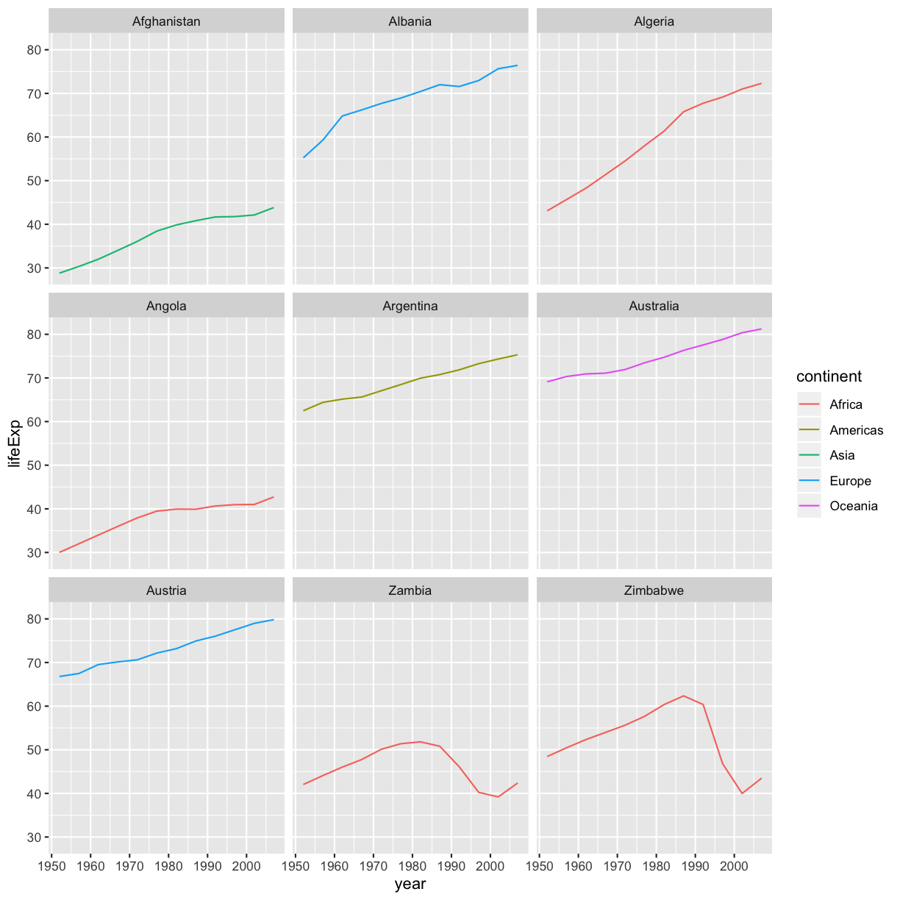

La capa `facet_wrap` tomó una "fórmula" como argumento, indicado por la tilde (~).
Esto le indica a R que debe dibujar un panel para cada valor único en la columna "country" 
del dataset gapminder.

## Modificando texto 

Para limpiar esta figura y alistarla para publicación necesitamos cambiar algunos de los elementos de texto.
El eje X está demasiado saturado, y el nombre del eje Y debería ser "Esperanza de vida", 
en vez del nombre de esa columna en el dataframe.

Podemos hacer todo lo anterios agregando un par de capas. La capa **theme** controla el texto de los ejes, 
y el tamaño del texto. Las etiquetas de los ejes, el título de la gráfica y cualquier
legenda pueden ser configurados utilizando la función `labs`. Los títulos de las leyendas son configurados
utilizando los mismos nombres que utilizamos en la especificación `aes`. Entonces, en el siguiente ejemplo
el título de la legenda de los colores se define utilizando `color = "Continent"`, mientras que el título
de la legenda del relleno se definiría utilizando `fill = "MyTitle"`.

~~~
ggplot(data = az.countries, aes(x = year, y = lifeExp, color=continent)) +
  geom_line() + facet_wrap( ~ country) +
  labs(
    x = "Year",              # x axis title
    y = "Life expectancy",   # y axis title
    title = "Figure 1",      # main title of figure
    color = "Continent"      # title of legend
  ) +
  theme(axis.text.x=element_blank(), axis.ticks.x=element_blank())
~~~
{: .r}

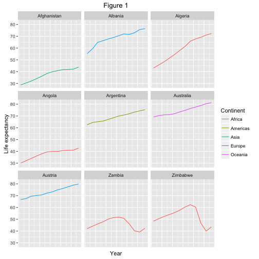

Esta es una prueba de loq ue puedes hacer utilizando `ggplot2`. RStudio proporciona
una [cheat sheet][cheat] realmente útil de las diferentes capas disponibles,
una documentación más extensiva se encuentra dispoinible en el [ggplot2 website][ggplot-doc].
Finalmente, si no tienen idea de cómo cambiar algún detalle, una búsqueda rápida en Google 
usualmente te guiará a un pregunta y respuesta relevantes en Stack Overflow con ¡código reusable que puedes modificar!

[cheat]: http://www.rstudio.com/wp-content/uploads/2015/03/ggplot2-cheatsheet.pdf
[ggplot-doc]: http://docs.ggplot2.org/current/

> ## Desafío 5
>
> Crea una gráfica de densidad de GDP per capita, rellenado por continente
>
> Avanzado:
> - Transforma el eje X para visulaizar mejor la dispersión de los datos
> - Agrega una capa **facet** para generar gráficas de densidad divididas para cada año 
>
> > ## Solución al desafío 5
> >
> > Crea una gráfica de densidad de GDP per capita, rellenado por continente
> >
> > Avanzado:
> > - Transforma el eje X para visulaizar mejor la dispersión de los datos
> > - Agrega una capa **facet** para generar gráficas de densidad divididas para cada año 
> >
> > 
> > ~~~
> > ggplot(data = gapminder, aes(x = gdpPercap, fill=continent)) +
> >  geom_density(alpha=0.6) + facet_wrap( ~ year) + scale_x_log10()
> > ~~~
> > {: .r}
> > 
> > 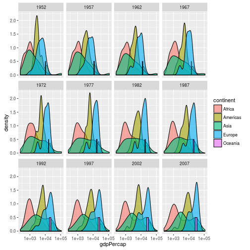
> {: .solution}
{: .challenge}
