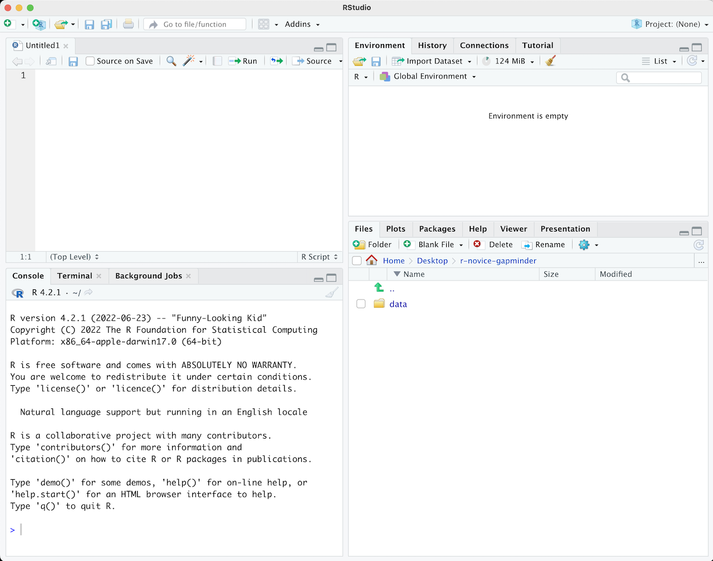

## Motivation

Science is a multi-step process: once you've designed an experiment and collected
data, the real fun begins! This lesson will teach you how to start this process using
R and RStudio. We will begin with raw data, perform exploratory analyses, and learn
how to plot results graphically. This example starts with a dataset from
[gapminder.org](https://www.gapminder.org) containing population information for many
countries through time. Can you read the data into R? Can you plot the population for
Senegal? Can you calculate the average income for countries on the continent of Asia?
By the end of these lessons you will be able to do things like plot the populations
for all of these countries in under a minute!

## Before Starting The Workshop

Please ensure you have the latest version of R and RStudio installed on your machine. This is important, as some packages used in the workshop may not install correctly (or at all) if R is not up to date.

[Download and install the latest version of R here](https://www.r-project.org/)
[Download and install RStudio here](https://www.rstudio.com/)

## Introduction to RStudio

Welcome to the R portion of the Software Carpentry workshop.

Throughout this lesson, we're going to teach you some of the fundamentals of
the R language as well as some best practices for organizing code for
scientific projects that will make your life easier.

We'll be using RStudio: a free, open source R integrated development
environment. It provides a built in editor, works on all platforms (including
on servers) and provides many advantages such as integration with version
control and project management.

**Basic layout**

When you first open RStudio, you will be greeted by three panels:

  * The interactive R console (entire left)
  * Environment/History (tabbed in upper right)
  * Files/Plots/Packages/Help/Viewer (tabbed in lower right)

Once you open files, such as R scripts, an editor panel will also open
in the top left.

## Work flow within RStudio
There are two main ways one can work within RStudio.

1. Test and play within the interactive R console then copy code into
a .R file to run later.
   *  This works well when doing small tests and initially starting off.
   *  It quickly becomes laborious
2. Start writing in an .R file and use RStudio's short cut keys for the Run command
to push the current line, selected lines or modified lines to the
interactive R console.
   * This is a great way to start; all your code is saved for later
   * You will be able to run the file you create from within RStudio
   or using R's `source()`  function.

> ## Tip: Running segments of your code
>
> RStudio offers you great flexibility in running code from within the editor
> window. There are buttons, menu choices, and keyboard shortcuts. To run the
> current line, you can 1. click on the `Run` button above the editor panel,
> or 2. select "Run Lines" from the "Code" menu, or 3. hit
> <kbd>Ctrl</kbd>+<kbd>Return</kbd> in Windows or Linux or
> <kbd>&#8984;</kbd>+<kbd>Return</kbd> on OS X. (This shortcut can also 
> be seen by hovering
> the mouse over the button). To run a block of code, select it and then `Run`.
> If you have modified a line of code within a block of code you have just run,
> there is no need to reselct the section and `Run`, you can use the next button
> along, `Re-run the previous region`. This will run the previous code block
> including the modifications you have made.
{: .callout}

## Introduction to R

Much of your time in R will be spent in the R interactive
console. This is where you will run all of your code, and can be a
useful environment to try out ideas before adding them to an R script
file. This console in RStudio is the same as the one you would get if
you typed in `R` in your command-line environment.

The first thing you will see in the R interactive session is a bunch
of information, followed by a ">" and a blinking cursor. In many ways
this is similar to the shell environment you learned about during the
shell lessons: it operates on the same idea of a "Read, evaluate,
print loop": you type in commands, R tries to execute them, and then
returns a result.

## Using R as a calculator

The simplest thing you could do with R is do arithmetic:

~~~
1 + 100
~~~
{: .language-r}

~~~
[1] 101
~~~
{: .output}

And R will print out the answer, with a preceding "[1]". Don't worry about this
for now, we'll explain that later. For now think of it as indicating output.

Like bash, if you type in an incomplete command, R will wait for you to
complete it:

~~~
> 1 +
~~~
{: .r}

~~~
+
~~~
{: .output}

Any time you hit return and the R session shows a "+" instead of a ">", it
means it's waiting for you to complete the command. If you want to cancel
a command you can simply hit "Esc" and RStudio will give you back the ">"
prompt.

> ## Tip: Cancelling commands
>
> If you're using R from the commandline instead of from within RStudio,
> you need to use <kbd>Ctrl</kbd>+<kbd>C</kbd> instead of <kbd>Esc</kbd>
> to cancel the command. This applies to Mac users as well!
>
> Cancelling a command isn't only useful for killing incomplete commands:
> you can also use it to tell R to stop running code (for example if it's
> taking much longer than you expect), or to get rid of the code you're
> currently writing.
>
{: .callout}

When using R as a calculator, the order of operations is the same as you
would have learned back in school.

From highest to lowest precedence:

 * Parentheses: `(`, `)`
 * Exponents: `^` or `**`
 * Divide: `/`
 * Multiply: `*`
 * Add: `+`
 * Subtract: `-`

~~~
3 + 5 * 2
~~~
{: .language-r}

~~~
[1] 13
~~~
{: .output}

Use parentheses to group operations in order to force the order of
evaluation if it differs from the default, or to make clear what you
intend.

~~~
(3 + 5) * 2
~~~
{: .language-r}

~~~
[1] 16
~~~
{: .output}

This can get unwieldy when not needed, but  clarifies your intentions.
Remember that others may later read your code.

~~~
(3 + (5 * (2 ^ 2))) # hard to read
3 + 5 * 2 ^ 2       # clear, if you remember the rules
3 + 5 * (2 ^ 2)     # if you forget some rules, this might help
~~~
{: .language-r}

The text after each line of code is called a
"comment". Anything that follows after the hash (or octothorpe) symbol
`#` is ignored by R when it executes code.

Really small or large numbers get a scientific notation:

~~~
2/10000
~~~
{: .language-r}

~~~
[1] 2e-04
~~~
{: .output}

Which is shorthand for "multiplied by `10^XX`". So `2e-4`
is shorthand for `2 * 10^(-4)`.

You can write numbers in scientific notation too:

~~~
5e3  # Note the lack of minus here
~~~
{: .language-r}

~~~
[1] 5000
~~~
{: .output}

## Mathematical functions

R has many built in mathematical functions. To call a function,
we simply type its name, followed by  open and closing parentheses.
Anything we type inside the parentheses is called the function's
arguments:

~~~
sin(1)  # trigonometry functions
~~~
{: .language-r}

~~~
[1] 0.841471
~~~
{: .output}

~~~
log(1)  # natural logarithm
~~~
{: .language-r}

~~~
[1] 0
~~~
{: .output}

~~~
log10(10) # base-10 logarithm
~~~
{: .language-r}

~~~
[1] 1
~~~
{: .output}

~~~
exp(0.5) # e^(1/2)
~~~
{: .language-r}

~~~
[1] 1.648721
~~~
{: .output}

Don't worry about trying to remember every function in R. You
can simply look them up on Google, or if you can remember the
start of the function's name, use the tab completion in RStudio.

This is one advantage that RStudio has over R on its own, it
has auto-completion abilities that allow you to more easily
look up functions, their arguments, and the values that they
take.

Typing a `?` before the name of a command will open the help page
for that command. As well as providing a detailed description of
the command and how it works, scrolling to the bottom of the
help page will usually show a collection of code examples which
illustrate command usage. We'll go through an example later.

## Comparing things

We can also do comparison in R:

~~~
1 == 1  # equality (note two equals signs, read as "is equal to")
~~~
{: .language-r}

~~~
[1] TRUE
~~~
{: .output}

~~~
1 != 2  # inequality (read as "is not equal to")
~~~
{: .language-r}

~~~
[1] TRUE
~~~
{: .output}

~~~
1 < 2  # less than
~~~
{: .language-r}

~~~
[1] TRUE
~~~
{: .output}

~~~
1 <= 1  # less than or equal to
~~~
{: .language-r}

~~~
[1] TRUE
~~~
{: .output}

~~~
1 > 0  # greater than
~~~
{: .language-r}

~~~
[1] TRUE
~~~
{: .output}

~~~
1 >= -9 # greater than or equal to
~~~
{: .language-r}

~~~
[1] TRUE
~~~
{: .output}

> ## Tip: Comparing Numbers
>
> A word of warning about comparing numbers: you should
> never use `==` to compare two numbers unless they are
> integers (a data type which can specifically represent
> only whole numbers).
>
> Computers may only represent decimal numbers with a
> certain degree of precision, so two numbers which look
> the same when printed out by R, may actually have
> different underlying representations and therefore be
> different by a small margin of error (called Machine
> numeric tolerance).
>
> Instead you should use the `all.equal` function.
>
> Further reading: [http://floating-point-gui.de/](http://floating-point-gui.de/)
>
{: .callout}

## Variables and assignment

We can store values in variables using the assignment operator `<-`, like this:

~~~
x <- 1/40
~~~
{: .language-r}

Notice that assignment does not print a value. Instead, we stored it for later
in something called a **variable**. `x` now contains the **value** `0.025`:

~~~
x
~~~
{: .language-r}

~~~
[1] 0.025
~~~
{: .output}

More precisely, the stored value is a *decimal approximation* of
this fraction called a [floating point number](http://en.wikipedia.org/wiki/Floating_point).

Look for the `Environment` tab in one of the panes of RStudio, and you will see that `x` and its value
have appeared. Our variable `x` can be used in place of a number in any calculation that expects a number:

~~~
log(x)
~~~
{: .language-r}

~~~
[1] -3.688879
~~~
{: .output}

Notice also that variables can be reassigned:

~~~
x <- 100
~~~
{: .language-r}

`x` used to contain the value 0.025 and and now it has the value 100.

Assignment values can contain the variable being assigned to:

~~~
x <- x + 1 #notice how RStudio updates its description of x on the top right tab
y <- x * 2
~~~
{: .language-r}

The right hand side of the assignment can be any valid R expression.
The right hand side is *fully evaluated* before the assignment occurs.

Variable names can contain letters, numbers, underscores and periods. They
cannot start with a number nor contain spaces at all. Different people use
different conventions for long variable names, these include

  * periods.between.words
  * underscores\_between_words
  * camelCaseToSeparateWords

What you use is up to you, but **be consistent**.

It is also possible to use the `=` operator for assignment:

~~~
x = 1/40
~~~
{: .language-r}

But this is much less common among R users.  The most important thing is to
**be consistent** with the operator you use. There are occasionally places
where it is less confusing to use `<-` than `=`, and it is the most common
symbol used in the community. So the recommendation is to use `<-`.

> ## Challenge 1
>
> Which of the following are valid R variable names?
> 
> ~~~
> min_height
> max.height
> _age
> .mass
> MaxLength
> min-length
> 2widths
> celsius2kelvin
> ~~~
> {: .language-r}
>
> > ## Solution to challenge 1
> >
> > The following can be used as R variables:
> > 
> > ~~~
> > min_height
> > max.height
> > MaxLength
> > celsius2kelvin
> > ~~~
> > {: .language-r}
> >
> > The following creates a hidden variable:
> > 
> > ~~~
> > .mass
> > ~~~
> > {: .language-r}
> >
> > The following will not be able to be used to create a variable
> > 
> > ~~~
> > _age
> > min-length
> > 2widths
> > ~~~
> > {: .language-r}
> {: .solution}
{: .challenge}

## Vectorization

One final thing to be aware of is that R is *vectorized*, meaning that
variables and functions can have vectors as values. For example

~~~
1:5
~~~
{: .language-r}

~~~
[1] 1 2 3 4 5
~~~
{: .output}

~~~
2^(1:5)
~~~
{: .language-r}

~~~
[1]  2  4  8 16 32
~~~
{: .output}

~~~
x <- 1:5
2^x
~~~
{: .language-r}

~~~
[1]  2  4  8 16 32
~~~
{: .output}

This is incredibly powerful; we will discuss this further in an
upcoming lesson.

## Managing your environment

There are a few useful commands you can use to interact with the R session.

`ls` will list all of the variables and functions stored in the global environment
(your working R session):

~~~
ls()
~~~
{: .language-r}

~~~
[1] "x" "y"
~~~
{: .output}

> ## Tip: hidden objects
>
> Like in the shell, `ls` will hide any variables or functions starting
> with a "." by default. To list all objects, type `ls(all.names=TRUE)`
> instead
>
{: .callout}

Note here that we didn't give any arguments to `ls`, but we still
needed to give the parentheses to tell R to call the function.

If we type `ls` by itself, R will print out the source code for that function!

~~~
ls
~~~
{: .language-r}

~~~
function (name, pos = -1L, envir = as.environment(pos), all.names = FALSE, 
    pattern, sorted = TRUE) 
{
    if (!missing(name)) {
        pos <- tryCatch(name, error = function(e) e)
        if (inherits(pos, "error")) {
            name <- substitute(name)
            if (!is.character(name)) 
                name <- deparse(name)
            warning(gettextf("%s converted to character string", 
                sQuote(name)), domain = NA)
            pos <- name
        }
    }
    all.names <- .Internal(ls(envir, all.names, sorted))
    if (!missing(pattern)) {
        if ((ll <- length(grep("[", pattern, fixed = TRUE))) && 
            ll != length(grep("]", pattern, fixed = TRUE))) {
            if (pattern == "[") {
                pattern <- "\\["
                warning("replaced regular expression pattern '[' by  '\\\\['")
            }
            else if (length(grep("[^\\\\]\\[<-", pattern))) {
                pattern <- sub("\\[<-", "\\\\\\[<-", pattern)
                warning("replaced '[<-' by '\\\\[<-' in regular expression pattern")
            }
        }
        grep(pattern, all.names, value = TRUE)
    }
    else all.names
}
<bytecode: 0x7fa4eb461878>
<environment: namespace:base>
~~~
{: .output}

You can use `rm` to delete objects you no longer need:

~~~
rm(x)
~~~
{: .language-r}

If you have lots of things in your environment and want to delete all of them,
you can pass the results of `ls` to the `rm` function:

~~~
rm(list = ls())
~~~
{: .language-r}

In this case we've combined the two. Like the order of operations, anything
inside the innermost parentheses is evaluated first, and so on.

In this case we've specified that the results of `ls` should be used for the
`list` argument in `rm`. When assigning values to arguments by name, you *must*
use the `=` operator!!

If instead we use `<-`, there will be unintended side effects, or you may get an error message:

~~~
rm(list <- ls())
~~~
{: .language-r}

~~~
Error in rm(list <- ls()): ... must contain names or character strings
~~~
{: .error}

> ## Tip: Warnings vs. Errors
>
> Pay attention when R does something unexpected! Errors, like above,
> are thrown when R cannot proceed with a calculation. Warnings on the
> other hand usually mean that the function has run, but it probably
> hasn't worked as expected.
>
> In both cases, the message that R prints out usually give you clues
> how to fix a problem.
>
{: .callout}

## R Packages

It is possible to add functions to R by writing a package, or by
obtaining a package written by someone else. As of this writing, there
are over 10,000 packages available on CRAN (the comprehensive R archive
network). R and RStudio have functionality for managing packages:

* You can see what packages are installed by typing
  `installed.packages()`
* You can install packages by typing `install.packages("packagename")`,
  where `packagename` is the package name, in quotes.
* You can update installed packages by typing `update.packages()`
* You can remove a package with `remove.packages("packagename")`
* You can make a package available for use with `library(packagename)`

> ## Challenge 2
>
> What will be the value of each  variable  after each
> statement in the following program?
>
> 
> ~~~
> mass <- 47.5
> age <- 122
> mass <- mass * 2.3
> age <- age - 20
> ~~~
> {: .language-r}
>
> > ## Solution to challenge 2
> >
> > 
> > ~~~
> > mass <- 47.5
> > ~~~
> > {: .language-r}
> > This will give a value of 47.5 for the variable mass
> >
> > 
> > ~~~
> > age <- 122
> > ~~~
> > {: .language-r}
> > This will give a value of 122 for the variable age
> >
> > 
> > ~~~
> > mass <- mass * 2.3
> > ~~~
> > {: .language-r}
> > This will multiply the existing value of 47.5 by 2.3 to give a new value of
> > 109.25 to the variable mass.
> >
> > 
> > ~~~
> > age <- age - 20
> > ~~~
> > {: .language-r}
> > This will subtract 20 from the existing value of 122 to give a new value
> > of 102 to the variable age.
> {: .solution}
{: .challenge}

> ## Challenge 3
>
> Run the code from the previous challenge, and write a command to
> compare mass to age. Is mass larger than age?
>
> > ## Solution to challenge 3
> >
> > One way of answering this question in R is to use the `>` to set up the following:
> > 
> > ~~~
> > mass > age
> > ~~~
> > {: .language-r}
> > 
> > 
> > 
> > ~~~
> > [1] TRUE
> > ~~~
> > {: .output}
> > This should yield a boolean value of TRUE since 109.25 is greater than 102.
> {: .solution}
{: .challenge}

> ## Challenge 4
>
> Clean up your working environment by deleting the mass and age
> variables.
>
> > ## Solution to challenge 4
> >
> > We can use the `rm` command to accomplish this task
> > 
> > ~~~
> > rm(age, mass)
> > ~~~
> > {: .language-r}
> {: .solution}
{: .challenge}

> ## Challenge 5
>
> Install the following packages: `ggplot2`, `plyr`, `gapminder`
>
> > ## Solution to challenge 5
> >
> > We can use the `install.packages()` command to install the required packages.
> > 
> > ~~~
> > install.packages("ggplot2")
> > install.packages("plyr")
> > install.packages("gapminder")
> > ~~~
> > {: .language-r}
> {: .solution}
{: .challenge}
