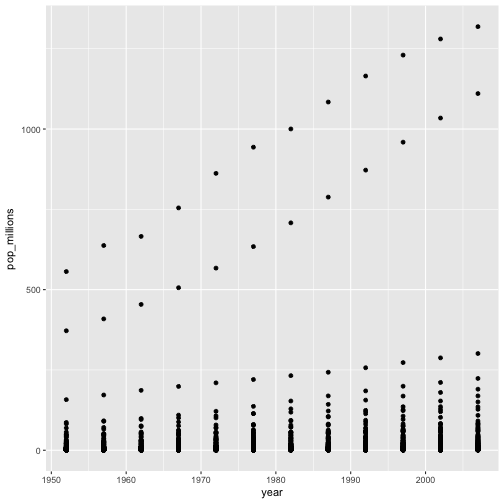
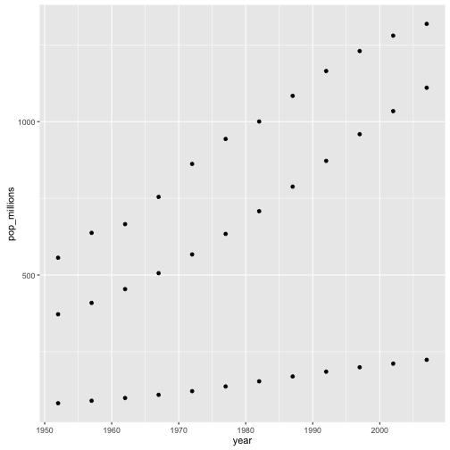

---
# Please do not edit this file directly; it is auto generated.
# Instead, please edit 09-vectorization.md in _episodes_rmd/
title: Vectorization
teaching: 10
exercises: 15
questions:
- "How can I operate on all the elements of a vector at once?"
objectives:
- "To understand vectorized operations in R."
keypoints:
- "Use vectorized operations instead of loops."
source: Rmd
---

Most of R's functions are vectorized, meaning that the function will
operate on all elements of a vector without needing to loop through
and act on each element one at a time. This makes writing code more
concise, easy to read, and less error prone.

~~~
x <- 1:4
x * 2
~~~
{: .language-r}

~~~
[1] 2 4 6 8
~~~
{: .output}

The multiplication happened to each element of the vector.

We can also add two vectors together:

~~~
y <- 6:9
x + y
~~~
{: .language-r}

~~~
[1]  7  9 11 13
~~~
{: .output}

Each element of `x` was added to its corresponding element of `y`:

~~~
x:  1  2  3  4
    +  +  +  +
y:  6  7  8  9
---------------
    7  9 11 13
~~~
{: .language-r}

> ## Challenge 1
>
> Let's try this on the `pop` column of the `gapminder` dataset.
>
> Make a new column in the `gapminder` data frame that
> contains population in units of millions of people.
> Check the head or tail of the data frame to make sure
> it worked.
>
> > ## Solution to challenge 1
> >
> > Let's try this on the `pop` column of the `gapminder` dataset.
> >
> > Make a new column in the `gapminder` data frame that
> > contains population in units of millions of people.
> > Check the head or tail of the data frame to make sure
> > it worked.
> >
> > 
> > ~~~
> > gapminder$pop_millions <- gapminder$pop / 1e6
> > head(gapminder)
> > ~~~
> > {: .language-r}
> > 
> > 
> > 
> > ~~~
> >       country year      pop continent lifeExp gdpPercap pop_millions
> > 1 Afghanistan 1952  8425333      Asia  28.801  779.4453     8.425333
> > 2 Afghanistan 1957  9240934      Asia  30.332  820.8530     9.240934
> > 3 Afghanistan 1962 10267083      Asia  31.997  853.1007    10.267083
> > 4 Afghanistan 1967 11537966      Asia  34.020  836.1971    11.537966
> > 5 Afghanistan 1972 13079460      Asia  36.088  739.9811    13.079460
> > 6 Afghanistan 1977 14880372      Asia  38.438  786.1134    14.880372
> > ~~~
> > {: .output}
> {: .solution}
{: .challenge}

> ## Challenge 2
>
> On a single graph, plot population, in
> millions, against year, for all countries. Don't worry about
>identifying which country is which.
>
> Repeat the exercise, graphing only for China, India, and
>Indonesia. Again, don't worry about which is which.
>
> > ## Solution to challenge 2
> >
> > Refresh your plotting skills by plotting population in millions against year.
> >
> > 
> > ~~~
> > ggplot(gapminder, aes(x = year, y = pop_millions)) +
> >  geom_point()
> > ~~~
> > {: .language-r}
> > 
> > 
> > 
> > ~~~
> > countryset <- c("China","India","Indonesia")
> > ggplot(gapminder[gapminder$country %in% countryset,],
> >        aes(x = year, y = pop_millions)) +
> >   geom_point()
> > ~~~
> > {: .language-r}
> > 
> > 
> {: .solution}
{: .challenge}

Comparison operators, logical operators, and many functions are also
vectorized:

**Comparison operators**

~~~
x > 2
~~~
{: .language-r}

~~~
[1] FALSE FALSE  TRUE  TRUE
~~~
{: .output}

**Logical operators**

~~~
a <- x > 3  # or, for clarity, a <- (x > 3)
a
~~~
{: .language-r}

~~~
[1] FALSE FALSE FALSE  TRUE
~~~
{: .output}

> ## Tip: some useful functions for logical vectors
>
> `any()` will return `TRUE` if *any* element of a vector is `TRUE`.  
> `all()` will return `TRUE` if *all* elements of a vector are `TRUE`.
{: .callout}

Most functions also operate element-wise on vectors:

**Functions**

~~~
x <- 1:4
log(x)
~~~
{: .language-r}

~~~
[1] 0.0000000 0.6931472 1.0986123 1.3862944
~~~
{: .output}

Vectorized operations work element-wise on matrices:

~~~
m <- matrix(1:12, nrow=3, ncol=4)
m * -1
~~~
{: .language-r}

~~~
     [,1] [,2] [,3] [,4]
[1,]   -1   -4   -7  -10
[2,]   -2   -5   -8  -11
[3,]   -3   -6   -9  -12
~~~
{: .output}

> ## Tip: element-wise vs. matrix multiplication
>
> Very important: the operator `*` gives you element-wise multiplication!
> To do matrix multiplication, we need to use the `%*%` operator:
>
> 
> ~~~
> m %*% matrix(1, nrow=4, ncol=1)
> ~~~
> {: .language-r}
> 
> 
> 
> ~~~
>      [,1]
> [1,]   22
> [2,]   26
> [3,]   30
> ~~~
> {: .output}
> 
> 
> 
> ~~~
> matrix(1:4, nrow=1) %*% matrix(1:4, ncol=1)
> ~~~
> {: .language-r}
> 
> 
> 
> ~~~
>      [,1]
> [1,]   30
> ~~~
> {: .output}
>
> For more on matrix algebra, see the [Quick-R reference
> guide](http://www.statmethods.net/advstats/matrix.html)
{: .callout}

> ## Challenge 3
>
> Given the following matrix:
>
> 
> ~~~
> m <- matrix(1:12, nrow=3, ncol=4)
> m
> ~~~
> {: .language-r}
> 
> 
> 
> ~~~
>      [,1] [,2] [,3] [,4]
> [1,]    1    4    7   10
> [2,]    2    5    8   11
> [3,]    3    6    9   12
> ~~~
> {: .output}
>
> Write down what you think will happen when you run:
>
> 1. `m ^ -1`
> 2. `m * c(1, 0, -1)`
> 3. `m > c(0, 20)`
> 4. `m * c(1, 0, -1, 2)`
>
> Did you get the output you expected? If not, ask a helper!
>
> > ## Solution to challenge 3
> >
> > Given the following matrix:
> >
> > 
> > ~~~
> > m <- matrix(1:12, nrow=3, ncol=4)
> > m
> > ~~~
> > {: .language-r}
> > 
> > 
> > 
> > ~~~
> >      [,1] [,2] [,3] [,4]
> > [1,]    1    4    7   10
> > [2,]    2    5    8   11
> > [3,]    3    6    9   12
> > ~~~
> > {: .output}
> >
> >
> > Write down what you think will happen when you run:
> >
> > 1. `m ^ -1`
> >
> > 
> > ~~~
> >           [,1]      [,2]      [,3]       [,4]
> > [1,] 1.0000000 0.2500000 0.1428571 0.10000000
> > [2,] 0.5000000 0.2000000 0.1250000 0.09090909
> > [3,] 0.3333333 0.1666667 0.1111111 0.08333333
> > ~~~
> > {: .output}
> >
> > 2. `m * c(1, 0, -1)`
> >
> > 
> > ~~~
> >      [,1] [,2] [,3] [,4]
> > [1,]    1    4    7   10
> > [2,]    0    0    0    0
> > [3,]   -3   -6   -9  -12
> > ~~~
> > {: .output}
> >
> > 3. `m > c(0, 20)`
> >
> > 
> > ~~~
> >       [,1]  [,2]  [,3]  [,4]
> > [1,]  TRUE FALSE  TRUE FALSE
> > [2,] FALSE  TRUE FALSE  TRUE
> > [3,]  TRUE FALSE  TRUE FALSE
> > ~~~
> > {: .output}
> >
> {: .solution}
{: .challenge}

> ## Challenge 4
>
> We're interested in looking at the sum of the
> following sequence of fractions:
>
> 
> ~~~
>  x = 1/(1^2) + 1/(2^2) + 1/(3^2) + ... + 1/(n^2)
> ~~~
> {: .language-r}
>
> This would be tedious to type out, and impossible for high values of
> n.  Use vectorisation to compute x when n=100. What is the sum when
> n=10,000?
>
> > ##  Challenge 4
> >
> > We're interested in looking at the sum of the
> > following sequence of fractions:
> >
> > 
> > ~~~
> >  x = 1/(1^2) + 1/(2^2) + 1/(3^2) + ... + 1/(n^2)
> > ~~~
> > {: .language-r}
> >
> > This would be tedious to type out, and impossible for
> > high values of n.
> > Can you use vectorisation to compute x, when n=100?
> > How about when n=10,000?
> >
> > 
> > ~~~
> > sum(1/(1:100)^2)
> > ~~~
> > {: .language-r}
> > 
> > 
> > 
> > ~~~
> > [1] 1.634984
> > ~~~
> > {: .output}
> > 
> > 
> > 
> > ~~~
> > sum(1/(1:1e04)^2)
> > ~~~
> > {: .language-r}
> > 
> > 
> > 
> > ~~~
> > [1] 1.644834
> > ~~~
> > {: .output}
> > 
> > 
> > 
> > ~~~
> > n <- 10000
> > sum(1/(1:n)^2)
> > ~~~
> > {: .language-r}
> > 
> > 
> > 
> > ~~~
> > [1] 1.644834
> > ~~~
> > {: .output}
> >
> > We can also obtain the same results using a function:
> > 
> > ~~~
> > inverse_sum_of_squares <- function(n) {
> >   sum(1/(1:n)^2)
> > }
> > inverse_sum_of_squares(100)
> > ~~~
> > {: .language-r}
> > 
> > 
> > 
> > ~~~
> > [1] 1.634984
> > ~~~
> > {: .output}
> > 
> > 
> > 
> > ~~~
> > inverse_sum_of_squares(10000)
> > ~~~
> > {: .language-r}
> > 
> > 
> > 
> > ~~~
> > [1] 1.644834
> > ~~~
> > {: .output}
> > 
> > 
> > 
> > ~~~
> > n <- 10000
> > inverse_sum_of_squares(n)
> > ~~~
> > {: .language-r}
> > 
> > 
> > 
> > ~~~
> > [1] 1.644834
> > ~~~
> > {: .output}
> >
> {: .solution}
{: .challenge}
