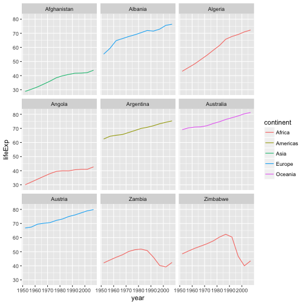
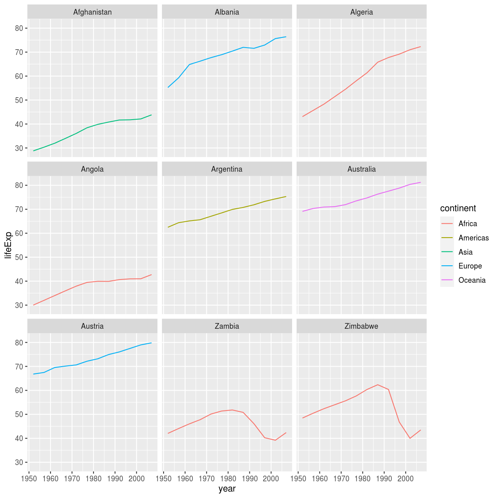

Manipulation of dataframes means many things to many researchers, we often
select certain observations (rows) or variables (columns), we often group the
data by a certain variable(s), or we even calculate summary statistics. We can
do these operations using the normal base R operations:

~~~
mean(gapminder[gapminder$continent == "Africa", "gdpPercap"])
~~~
{: .language-r}

~~~
[1] 2193.755
~~~
{: .output}

~~~
mean(gapminder[gapminder$continent == "Americas", "gdpPercap"])
~~~
{: .language-r}

~~~
[1] 7136.11
~~~
{: .output}

~~~
mean(gapminder[gapminder$continent == "Asia", "gdpPercap"])
~~~
{: .language-r}

~~~
[1] 7902.15
~~~
{: .output}

But this isn't very *nice* because there is a fair bit of repetition. Repeating
yourself will cost you time, both now and later, and potentially introduce some
nasty bugs.

## The `dplyr` package

Luckily, the [`dplyr`](https://cran.r-project.org/web/packages/dplyr/dplyr.pdf)
package provides a number of very useful functions for manipulating dataframes
in a way that will reduce the above repetition, reduce the probability of making
errors, and probably even save you some typing. As an added bonus, you might
even find the `dplyr` grammar easier to read.

Here we're going to cover 6 of the most commonly used functions as well as using
pipes (`%>%`) to combine them.

1. `select()`
2. `filter()`
3. `group_by()`
4. `summarize()`
5. `mutate()`

If you have have not installed this package earlier, please do so:

~~~
install.packages('dplyr')
~~~
{: .language-r}

Now let's load the package:

~~~
library("dplyr")
~~~
{: .language-r}

## Using select()

If, for example, we wanted to move forward with only a few of the variables in
our dataframe we could use the `select()` function. This will keep only the
variables you select.

~~~
year_country_gdp <- select(gapminder,year,country,gdpPercap)
~~~
{: .language-r}

If we open up `year_country_gdp` we'll see that it only contains the year,
country and gdpPercap. Above we used 'normal' grammar, but the strengths of
`dplyr` lie in combining several functions using pipes. Since the pipes grammar
is unlike anything we've seen in R before, let's repeat what we've done above
using pipes.

~~~
year_country_gdp <- gapminder %>% select(year,country,gdpPercap)
~~~
{: .language-r}

To help you understand why we wrote that in that way, let's walk through it step
by step. First we summon the gapminder dataframe and pass it on, using the pipe
symbol `%>%`, to the next step, which is the `select()` function. In this case
we don't specify which data object we use in the `select()` function since in
gets that from the previous pipe. **Fun Fact**: There is a good chance you have
encountered pipes before in the shell. In R, a pipe symbol is `%>%` while in the
shell it is `|` but the concept is the same!

## Using filter()

If we now wanted to move forward with the above, but only with European
countries, we can combine `select` and `filter`

~~~
year_country_gdp_euro <- gapminder %>%
    filter(continent=="Europe") %>%
    select(year,country,gdpPercap)
~~~
{: .language-r}

> ## Challenge 1
>
> Write a single command (which can span multiple lines and includes pipes) that
> will produce a dataframe that has the African values for `lifeExp`, `country`
> and `year`, but not for other Continents.  How many rows does your dataframe
> have and why?
>
> > ## Solution to Challenge 1
> >
> >~~~
> >year_country_lifeExp_Africa <- gapminder %>%
> >                            filter(continent=="Africa") %>%
> >                            select(year,country,lifeExp)
> >~~~
> >{: .language-r}
> {: .solution}
{: .challenge}

As with last time, first we pass the gapminder dataframe to the `filter()`
function, then we pass the filtered version of the gapminder dataframe to the
`select()` function. **Note:** The order of operations is very important in this
case. If we used 'select' first, filter would not be able to find the variable
continent since we would have removed it in the previous step.

## Using group_by() and summarize()

Now, we were supposed to be reducing the error prone repetitiveness of what can
be done with base R, but up to now we haven't done that since we would have to
repeat the above for each continent. Instead of `filter()`, which will only pass
observations that meet your criteria (in the above: `continent=="Europe"`), we
can use `group_by()`, which will essentially use every unique criteria that you
could have used in filter.

~~~
str(gapminder)
~~~
{: .language-r}

~~~
'data.frame':	1704 obs. of  6 variables:
 $ country  : Factor w/ 142 levels "Afghanistan",..: 1 1 1 1 1 1 1 1 1 1 ...
 $ year     : int  1952 1957 1962 1967 1972 1977 1982 1987 1992 1997 ...
 $ pop      : num  8425333 9240934 10267083 11537966 13079460 ...
 $ continent: Factor w/ 5 levels "Africa","Americas",..: 3 3 3 3 3 3 3 3 3 3 ...
 $ lifeExp  : num  28.8 30.3 32 34 36.1 ...
 $ gdpPercap: num  779 821 853 836 740 ...
~~~
{: .output}

~~~
str(gapminder %>% group_by(continent))
~~~
{: .language-r}

~~~
Classes 'grouped_df', 'tbl_df', 'tbl' and 'data.frame':	1704 obs. of  6 variables:
 $ country  : Factor w/ 142 levels "Afghanistan",..: 1 1 1 1 1 1 1 1 1 1 ...
 $ year     : int  1952 1957 1962 1967 1972 1977 1982 1987 1992 1997 ...
 $ pop      : num  8425333 9240934 10267083 11537966 13079460 ...
 $ continent: Factor w/ 5 levels "Africa","Americas",..: 3 3 3 3 3 3 3 3 3 3 ...
 $ lifeExp  : num  28.8 30.3 32 34 36.1 ...
 $ gdpPercap: num  779 821 853 836 740 ...
 - attr(*, "vars")= chr "continent"
 - attr(*, "drop")= logi TRUE
 - attr(*, "indices")=List of 5
  ..$ : int  24 25 26 27 28 29 30 31 32 33 ...
  ..$ : int  48 49 50 51 52 53 54 55 56 57 ...
  ..$ : int  0 1 2 3 4 5 6 7 8 9 ...
  ..$ : int  12 13 14 15 16 17 18 19 20 21 ...
  ..$ : int  60 61 62 63 64 65 66 67 68 69 ...
 - attr(*, "group_sizes")= int  624 300 396 360 24
 - attr(*, "biggest_group_size")= int 624
 - attr(*, "labels")='data.frame':	5 obs. of  1 variable:
  ..$ continent: Factor w/ 5 levels "Africa","Americas",..: 1 2 3 4 5
  ..- attr(*, "vars")= chr "continent"
  ..- attr(*, "drop")= logi TRUE
~~~
{: .output}
You will notice that the structure of the dataframe where we used `group_by()`
(`grouped_df`) is not the same as the original `gapminder` (`data.frame`). A
`grouped_df` can be thought of as a `list` where each item in the `list`is a
`data.frame` which contains only the rows that correspond to the a particular
value `continent` (at least in the example above).

## Using summarize()

The above was a bit on the uneventful side but `group_by()` is much more
exciting in conjunction with `summarize()`. This will allow us to create new
variable(s) by using functions that repeat for each of the continent-specific
data frames. That is to say, using the `group_by()` function, we split our
original dataframe into multiple pieces, then we can run functions
(e.g. `mean()` or `sd()`) within `summarize()`.

~~~
gdp_bycontinents <- gapminder %>%
    group_by(continent) %>%
    summarize(mean_gdpPercap=mean(gdpPercap))
~~~
{: .language-r}

~~~
continent mean_gdpPercap
     <fctr>          <dbl>
1    Africa       2193.755
2  Americas       7136.110
3      Asia       7902.150
4    Europe      14469.476
5   Oceania      18621.609
~~~
{: .language-r}

That allowed us to calculate the mean gdpPercap for each continent, but it gets
even better.

> ## Challenge 2
>
>
> Calculate the average life expectancy per country. Which has the longest average life
> expectancy and which has the shortest average life expectancy?
>
> > ## Solution to Challenge 2
> >
> >~~~
> >lifeExp_bycountry <- gapminder %>%
> >    group_by(country) %>%
> >    summarize(mean_lifeExp=mean(lifeExp))
> >lifeExp_bycountry %>%
> >    filter(mean_lifeExp == min(mean_lifeExp) | mean_lifeExp == max(mean_lifeExp))
> >~~~
> >{: .language-r}
> >
> >
> >
> >~~~
> ># A tibble: 2 x 2
> >  country      mean_lifeExp
> >  <fct>               <dbl>
> >1 Iceland              76.5
> >2 Sierra Leone         36.8
> >~~~
> >{: .output}
> Another way to do this is to use the `dplyr` function `arrange()`, which
> arranges the rows in a data frame according to the order of one or more
> variables from the data frame.  It has similar syntax to other functions from
> the `dplyr` package. You can use `desc()` inside `arrange()` to sort in
> descending order.
> >
> >~~~
> >lifeExp_bycountry %>%
> >    arrange(mean_lifeExp) %>%
> >    head(1)
> >~~~
> >{: .language-r}
> >
> >
> >
> >~~~
> ># A tibble: 1 x 2
> >  country      mean_lifeExp
> >  <fct>               <dbl>
> >1 Sierra Leone         36.8
> >~~~
> >{: .output}
> >
> >
> >
> >~~~
> >lifeExp_bycountry %>%
> >    arrange(desc(mean_lifeExp)) %>%
> >    head(1)
> >~~~
> >{: .language-r}
> >
> >
> >
> >~~~
> ># A tibble: 1 x 2
> >  country mean_lifeExp
> >  <fct>          <dbl>
> >1 Iceland         76.5
> >~~~
> >{: .output}
> {: .solution}
{: .challenge}

The function `group_by()` allows us to group by multiple variables. Let's group by `year` and `continent`.

~~~
gdp_bycontinents_byyear <- gapminder %>%
    group_by(continent,year) %>%
    summarize(mean_gdpPercap=mean(gdpPercap))
~~~
{: .language-r}

That is already quite powerful, but it gets even better! You're not limited to defining 1 new variable in `summarize()`.

~~~
gdp_pop_bycontinents_byyear <- gapminder %>%
    group_by(continent,year) %>%
    summarize(mean_gdpPercap=mean(gdpPercap),
              sd_gdpPercap=sd(gdpPercap),
              mean_pop=mean(pop),
              sd_pop=sd(pop))
~~~
{: .language-r}

## count() and n()

A very common operation is to count the number of observations for each
group. The `dplyr` package comes with two related functions that help with this.

For instance, if we wanted to check the number of countries included in the
dataset for the year 2002, we can use the `count()` function. It takes the name
of one or more columns that contain the groups we are interested in, and we can
optionally sort the results in descending order by adding `sort=TRUE`:

~~~
gapminder %>%
    filter(year == 2002) %>%
    count(continent, sort = TRUE)
~~~
{: .language-r}

~~~
# A tibble: 5 x 2
  continent     n
  <fct>     <int>
1 Africa       52
2 Asia         33
3 Europe       30
4 Americas     25
5 Oceania       2
~~~
{: .output}

If we need to use the number of observations in calculations, the `n()` function
is useful. For instance, if we wanted to get the standard error of the life
expectency per continent:

~~~
gapminder %>%
    group_by(continent) %>%
    summarize(se_pop = sd(lifeExp)/sqrt(n()))
~~~
{: .language-r}

~~~
# A tibble: 5 x 2
  continent se_pop
  <fct>      <dbl>
1 Africa     0.366
2 Americas   0.540
3 Asia       0.596
4 Europe     0.286
5 Oceania    0.775
~~~
{: .output}

You can also chain together several summary operations; in this case calculating the `minimum`, `maximum`, `mean` and `se` of each continent's per-country life-expectancy:

~~~
gapminder %>%
    group_by(continent) %>%
    summarize(
      mean_le = mean(lifeExp),
      min_le = min(lifeExp),
      max_le = max(lifeExp),
      se_le = sd(lifeExp)/sqrt(n()))
~~~
{: .language-r}

~~~
# A tibble: 5 x 5
  continent mean_le min_le max_le se_le
  <fct>       <dbl>  <dbl>  <dbl> <dbl>
1 Africa       48.9   23.6   76.4 0.366
2 Americas     64.7   37.6   80.7 0.540
3 Asia         60.1   28.8   82.6 0.596
4 Europe       71.9   43.6   81.8 0.286
5 Oceania      74.3   69.1   81.2 0.775
~~~
{: .output}

## Using mutate()

We can also create new variables prior to (or even after) summarizing information using `mutate()`.

~~~
gdp_pop_bycontinents_byyear <- gapminder %>%
    mutate(gdp_billion=gdpPercap*pop/10^9) %>%
    group_by(continent,year) %>%
    summarize(mean_gdpPercap=mean(gdpPercap),
              sd_gdpPercap=sd(gdpPercap),
              mean_pop=mean(pop),
              sd_pop=sd(pop),
              mean_gdp_billion=mean(gdp_billion),
              sd_gdp_billion=sd(gdp_billion))
~~~
{: .language-r}

## Connect mutate with logical filtering: ifelse

When creating new variables, we can hook this with a logical condition. A simple combination of
`mutate()` and `ifelse()` facilitates filtering right where it is needed: in the moment of creating something new.
This easy-to-read statement is a fast and powerful way of discarding certain data (even though the overall dimension
of the data frame will not change) or for updating values depending on this given condition.

~~~
## keeping all data but "filtering" after a certain condition
# calculate GDP only for people with a life expectation above 25
gdp_pop_bycontinents_byyear_above25 <- gapminder %>%
    mutate(gdp_billion = ifelse(lifeExp > 25, gdpPercap * pop / 10^9, NA)) %>%
    group_by(continent, year) %>%
    summarize(mean_gdpPercap = mean(gdpPercap),
              sd_gdpPercap = sd(gdpPercap),
              mean_pop = mean(pop),
              sd_pop = sd(pop),
              mean_gdp_billion = mean(gdp_billion),
              sd_gdp_billion = sd(gdp_billion))

## updating only if certain condition is fullfilled
# for life expectations above 40 years, the gpd to be expected in the future is scaled
gdp_future_bycontinents_byyear_high_lifeExp <- gapminder %>%
    mutate(gdp_futureExpectation = ifelse(lifeExp > 40, gdpPercap * 1.5, gdpPercap)) %>%
    group_by(continent, year) %>%
    summarize(mean_gdpPercap = mean(gdpPercap),
              mean_gdpPercap_expected = mean(gdp_futureExpectation))
~~~
{: .language-r}

## Combining `dplyr` and `ggplot2`

In the plotting lesson we looked at how to make a multi-panel figure by adding
a layer of facet panels using `ggplot2`. Here is the code we used (with some
extra comments):

~~~
# Get the start letter of each country
starts.with <- substr(gapminder$country, start = 1, stop = 1)
# Filter countries that start with "A" or "Z"
az.countries <- gapminder[starts.with %in% c("A", "Z"), ]
# Make the plot
ggplot(data = az.countries, aes(x = year, y = lifeExp, color = continent)) +
  geom_line() + facet_wrap( ~ country)
~~~
{: .language-r}

This code makes the right plot but it also creates some variables (`starts.with`
and `az.countries`) that we might not have any other uses for. Just as we used
`%>%` to pipe data along a chain of `dplyr` functions we can use it to pass data
to `ggplot()`. Because `%>%` replaces the first argument in a function we don't
need to specify the `data =` argument in the `ggplot()` function. By combining
`dplyr` and `ggplot2` functions we can make the same figure without creating any
new variables or modifying the data.

~~~
gapminder %>%
   # Get the start letter of each country
   mutate(startsWith = substr(country, start = 1, stop = 1)) %>%
   # Filter countries that start with "A" or "Z"
   filter(startsWith %in% c("A", "Z")) %>%
   # Make the plot
   ggplot(aes(x = year, y = lifeExp, color = continent)) +
   geom_line() +
   facet_wrap( ~ country)
~~~
{: .language-r}

Using `dplyr` functions also helps us simplify things, for example we could
combine the first two steps:

~~~
gapminder %>%
    # Filter countries that start with "A" or "Z"
	filter(substr(country, start = 1, stop = 1) %in% c("A", "Z")) %>%
	# Make the plot
	ggplot(aes(x = year, y = lifeExp, color = continent)) +
	geom_line() +
	facet_wrap( ~ country)
~~~
{: .language-r}

> ## Advanced Challenge
>
> Calculate the average life expectancy in 2002 of 2 randomly selected countries
> for each continent. Then arrange the continent names in reverse order.
> **Hint:** Use the `dplyr` functions `arrange()` and `sample_n()`, they have
> similar syntax to other dplyr functions.
>
> > ## Solution to Advanced Challenge
> >
> >~~~
> >lifeExp_2countries_bycontinents <- gapminder %>%
> >    filter(year==2002) %>%
> >    group_by(continent) %>%
> >    sample_n(2) %>%
> >    summarize(mean_lifeExp=mean(lifeExp)) %>%
> >    arrange(desc(mean_lifeExp))
> >~~~
> >{: .language-r}
> {: .solution}
{: .challenge}

## Other great resources

* [R for Data Science](http://r4ds.had.co.nz/)
* [Data Wrangling Cheat sheet](https://www.rstudio.com/wp-content/uploads/2015/02/data-wrangling-cheatsheet.pdf)
* [Introduction to dplyr](https://cran.rstudio.com/web/packages/dplyr/vignettes/introduction.html)
* [Data wrangling with R and RStudio](https://www.rstudio.com/resources/webinars/data-wrangling-with-r-and-rstudio/)
