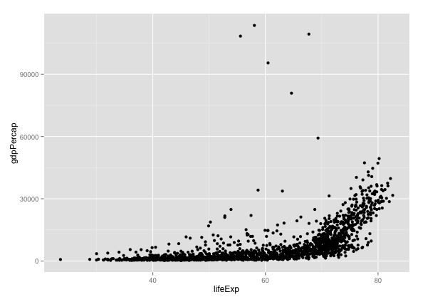
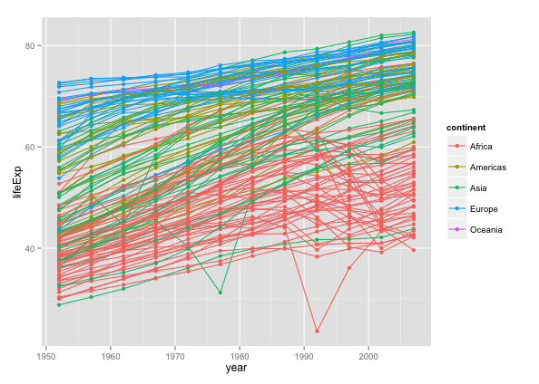

## Why R?

* Powerful statistical analysis
* and powerful visualisation
* integrated elegantly

## What We'll Accomplish

* Get to know R and RStudio
* Analyze a meaningful data set
* Extract insights and deliver them visually
* Leave ready to learn more R independently

## R loves ingesting data

```
gapminder <- read.csv(
  "data/gapminder-FiveYearData.csv",
  header=TRUE,
  sep=',')
```

## Data w/ column names

head(gapminder, 1) # Show me the first row

country year     pop continent lifeExp gdpPercap
1 Afghanistan 1952 8425333      Asia  28.801  779.4453

## Quickly graph ...
```
ggplot(
  data=gapminder,
  aes(x=lifeExp, y=gdpPercap)
) + geom_point()
```

## ... to see what we have


## Let's graph more factors
```
ggplot(
  data=gapminder,
  aes(x=year, y=lifeExp, by=country, colour=continent)
) + geom_line()
  + geom_point()
```

## Pretty!


## dyplr gives us ...

~~~{.r}
library(dplyr)
cors <- gapminder %>%
  group_by(year) %>%
  summarise(
    gdpPercap.lifeExp = cor(gdpPercap, lifeExp),
    gdpPercap.pop = cor(gdpPercap, pop),
    pop.lifeExp = cor(pop, lifeExp))
~~~

## ... pairwise correlations
```
head(cors, 1)
Source: local data frame [1 x 4]
year gdpPercap.lifeExp gdpPercap.pop  pop.lifeExp
1 1952         0.2780236   -0.02526041 -0.002724782
```

## Restructuring the table ...

~~~{.r}
library(tidyr)
tidy.cors <- cors %>% gather(
  variables, correlation,
  gdpPercap.lifeExp, gdpPercap.pop,
  pop.lifeExp)
~~~
## ... a subtle art ...
```
head(tidy.cors, 1)

Source: local data frame [1 x 3]
  year         variables   correlation
1 1952 gdpPercap.lifeExp   0.2780236
```

## ... produces great results

