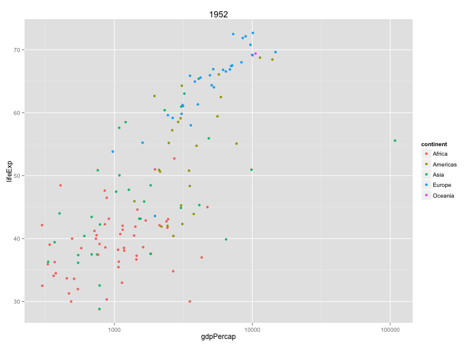

> ### Learning Objectives {.objectives}
>
> * Why write functions
> * How to define a function
> * Defining graphing functions
> * Scope and global variables
> * Conditional statements
> * `match.arg`


### Why?

There are two main reasons to write R functions.

- Avoid repeated code
- More readable code

As an example, consider this code to convert 65 degrees Fahrenheit to
Celsius.


~~~{.r}
cel <- (65 - 32)*5/9
~~~

If you then want to convert 100 degrees F, you'll have to retype all
of that. And the code itself doesn't really explain it's purpose.


~~~{.r}
f2c <- function(fahrenheit)
{
    celsius <- (fahrenheit - 32)*5/9
    return(celsius)
}
~~~

The definition of a function has three parts:

- `function()`, containing any _arguments_ (in other words, parameters or inputs) that the
  function takes
- The body of the function (the bit that is executed when the function
  is called)
- The assignment of the function to an object; in this case we've
  called it `f2c`

Having executed the above code, you'll note that there's now an object in
your R workspace called `f2c`. (Try `ls()`.)

You can use the function like any other R function:


~~~{.r}
f2c(65)
~~~


~~~{.output}
[1] 18.33333

~~~

Note that you can even give it a vector of Fahrenheit temperatures.


~~~{.r}
f2c(c(100, 212, 32, -40))
~~~


~~~{.output}
[1]  37.77778 100.00000   0.00000 -40.00000

~~~

### Implicit return value


The function definition could actually be simplified. In R functions,
an explicit `return` statement is not needed; the function will
_return_ the value of the last statement, so we could write:


~~~{.r}
f2c <- function(fahrenheit)
{
    (fahrenheit - 32)*5/9
}
~~~

And, actually, the curly braces aren't needed when the function has
just one statement. We could have written:


~~~{.r}
f2c <- function(fahrenheit)
    (fahrenheit - 32)*5/9
~~~


> ### Challenge {.challenge}
>
> Write the opposite function, for converting from Celsius to
> Fahrenheit. Test that it works.


### Functions for plotting

Functions are particularly useful when making graphs. You'll often
want to make the same sort of graph multiple times, for example, a
scatterplot of `lifeExp` vs `gdpPercap` for each of several different
years. Rather than repeat the code multiple times, write a function
that does the work and then call it several times.

Let's reload the `gapminder` data, as before.


~~~{.r}
gapminder <- read.csv("~/Desktop/gapminder.csv")
~~~


Here's a function to make a plot for a particular year.


~~~{.r}
plot_year <- function(year=2007, data=gapminder)
{
    library(dplyr)
    library(ggplot2)

    the_year <- year
    gm_year <- filter(data, year==the_year)

    ggplot(gm_year, aes(y=lifeExp, x=gdpPercap)) +
        geom_point() + scale_x_log10()
}
~~~

The function returns the ggplot object. You could add further
enhancements after the fact.


~~~{.r}
plot_year(1952) + aes(color=continent) + ggtitle(1952)
~~~



Note that I passed the data as an argument and gave each argument a
default value.

> ### Challenge {.challenge}
>
> Write a function that makes a plot of `lifeExp` vs `gdpPercap` across
> years, for a selected country.


~~~{.r}
plot_country <- function(country="China", data=gapminder)
{
    library(dplyr)
    library(ggplot2)

    the_country <- country
    gm_country <- filter(data, country==the_country)

    p <- ggplot(gm_country, aes(y=lifeExp, x=gdpPercap)) +
        geom_point()

    p
}
~~~


### Scope

Variables defined within a function are destroyed on exit.


~~~{.r}
f1 <- function(x)
{
    p <- 1
    x + p
}
f1(5)
~~~


~~~{.output}
[1] 6

~~~


~~~{.r}
p
~~~


~~~{.output}
Error in eval(expr, envir, enclos): object 'p' not found

~~~

The variable `p` exists within the function but doesn't exist
outside the function. It's created anew each time you run the
function.

The function _arguments_ (that is, the inputs) exist only within the
function, too. Continuing from the example above, note that `x`
doesn't exist:


~~~{.r}
f1(5)
~~~


~~~{.output}
[1] 6

~~~


~~~{.r}
x
~~~


~~~{.output}
Error in eval(expr, envir, enclos): object 'x' not found

~~~

How about if you refer to a variable that hasn't been defined in the
function?


~~~{.r}
f2 <- function(x)
{
    x + p
}
f2(5)
~~~


~~~{.output}
Error in f2(5): object 'p' not found

~~~


~~~{.r}
p <- 3
f2(5)
~~~


~~~{.output}
[1] 8

~~~

If you refer to a variable that you've not _created_ within the
function, R will look outside, to the "global environment".

You can use this to _change_ variables sitting in your workspace.


~~~{.r}
f3 <- function(x)
{
    p <- p + x
}
p <- 5
f3(5)
p
~~~


~~~{.output}
[1] 5

~~~

You might use this to avoid passing data into a function, but _please
don't_! The use of global variables can make your code unpredictable
and hard to read.

Anything that the function needs should be input as an
argument. Changes that the function makes should be through the
return value.


> ### Challenge {.challenge}
>
> Consider the following code.
>
> ```
> x <- 5
> g <- function(y)
> {
>     x <- 3
>     y + x
> }
> z <- g(5)
> ```
>
> What value will `x` have after this is executed?
>
> a. 3
> b. 8
> c. 5


### Conditional statements


Returning to functions to make graphs: often it's nice to include
some options in your function, for example, an argument that controls
whether or not to add a smooth curve to the plot.


~~~{.r}
plot_year <- function(year=2007, data=gapminder, add_curve=TRUE)
{
    library(dplyr)
    library(ggplot2)

    the_year <- year
    gm_year <- filter(data, year==the_year)

    p <- ggplot(gm_year, aes(y=lifeExp, x=gdpPercap)) +
        geom_point() + scale_x_log10()

    if(add_curve) {
        p <- p + geom_smooth(method="loess")
    }

    p
}
~~~

Here, we've add a _conditional statement_. If `add_curve` is `TRUE`,
the bit of code in the curly braces, `p <- p + geom_smooth(method="loess")`,
gets run. If `add_curve` is `FALSE`, it gets skipeed over.

The curly braces aren't needed here, since there is just one line
within the code block that is run, but some people recommend that you
always include them, for the sake of clarity.

Here's how you might use this:


~~~{.r}
plot_year(1952)
plot_year(1952, add_curve=FALSE)
~~~


> ### Challenge: {.challenge}
>
> Add an option to your `plot_country` function, to use `geom_line()`
> as well as `geom_point()`.


~~~{.r}
plot_country <- function(country="China", data=gapminder, add_line=FALSE)
{
    library(dplyr)
    library(ggplot2)

    the_country <- country
    gm_country <- filter(data, country==the_country)

    p <- ggplot(gm_country, aes(y=lifeExp, x=gdpPercap)) +
        geom_point()

    if(add_line) {
        p <- p + geom_line()
    }

    p
}
~~~


### Multiple-choice arguments

The `geom_smooth` function can take multiple arguments, for example,
we might use `"lm"` (which will give a straight line) rather than
`"loess"`.

We could add a `method` argument that is passed to `plot_year()`, like this:


~~~{.r}
plot_year <- function(year=2007, data=gapminder, add_curve=TRUE, method="loess")
{
    library(dplyr)
    library(ggplot2)

    the_year <- year
    gm_year <- filter(data, year==the_year)

    p <- ggplot(gm_year, aes(y=lifeExp, x=gdpPercap)) +
        geom_point() + scale_x_log10()

    if(add_curve)
        p <- p + geom_smooth(method=method)

    p
}
~~~

It can be helpful to give multiple choices. For example, we could drop
the `add_curve` argument and allow `method` to be either `"lm"`,
`"loess"`, or `"none"` (with no curve plotted in the latter place.

The function `match_arg()` is useful here. You give a vector of
choices as the default value for the argument, and `match_arg` will
ensure that the selected choice is among those allowed.


~~~{.r}
plot_year <- function(year=2007, data=gapminder, curve=c("none", "loess", "lm"))
{
    curve <- match.arg(curve)

    library(dplyr)
    library(ggplot2)

    the_year <- year
    gm_year <- filter(data, year==the_year)

    p <- ggplot(gm_year, aes(y=lifeExp, x=gdpPercap)) +
        geom_point() + scale_x_log10()

    if(curve != "none")
        p <- p + geom_smooth(method=curve)

    p
}
~~~

Here's how you might use this:


~~~{.r}
plot_year(1952, curve="none")
plot_year(1952, curve="lm")
~~~

> ### Challenge {.challenge}
>
> Modify your function to take an argument `type` with possible values
> `"points"`, `"lines"`, or `"both"`, indicating whether to use
> `geom_point()`, `geom_line()`, or both.


### The `...` argument

The `geom_smooth()` argument also has an argument `se` (taking values
`TRUE` or `FALSE`) that indicates whether the confidence bands should
be plotted or not. We might add this to _our_ function as an
argument. Or, we could include an argument `...` to cover any other
things that we might want to pass to `geom_smooth`


~~~{.r}
plot_year <- function(year=2007, data=gapminder, curve=c("none", "loess", "lm"), ...)
{
    curve <- match.arg(curve)

    library(dplyr)
    library(ggplot2)

    the_year <- year
    gm_year <- filter(data, year==the_year)

    p <- ggplot(gm_year, aes(y=lifeExp, x=gdpPercap)) +
        geom_point() + scale_x_log10()

    if(curve != "none")
        p <- p + geom_smooth(method="curve", ...)

    p
}
~~~

Here's how you might use this:


~~~{.r}
plot_year(1952, curve="loess")
plot_year(1952, curve="loess", se=FALSE)
~~~


### Resources

- See the
  [chapter on functions](http://adv-r.had.co.nz/Functions.html) in
  [Hadley Wickham](http://had.co.nz/)'s
  [Advanced R book](http://adv-r.had.co.nz/), also available on
  [paper](http://www.amazon.com/exec/obidos/ASIN/1466586966/7210-20).
