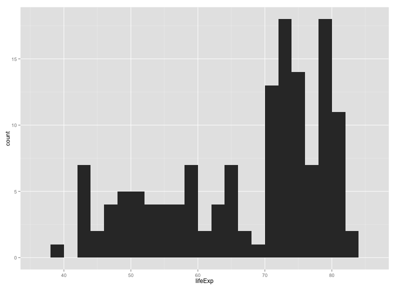

> ### Learning Objectives {.objectives}
>
> * Basics of ggplot2: aes vs geom
> * Making scatterplots
> * Layers and groups
> * Various one-dimensional summaries
> * Faceting
> * Saving plots to a file
> * Customizing axis limits and color choices
> * Applying themes

### Preparations

There are several different systems for creating data visualizations
in R. We will introduce [ggplot2](http://ggplot2.org), which is based
on Leland Wilkinson's
[Grammar of Graphics](http://www.amazon.com/exec/obidos/ASIN/0387245448/7210-20). The
learning curve is a bit steep, but ultimately you'll be able to
produce complex graphs more quickly and easily.

You first need to install the ggplot2 package:

~~~{.r}
install.packages("ggplot2")
~~~

You then need to load the package:

~~~{.r}
library(ggplot2)
~~~

We'll consider the gapminder data from the last lesson. If it's not
within your R workspace, load it again with `read.csv`.

~~~{.r}
gapminder <- read.csv("~/Desktop/gapminder.csv")
~~~

### A first plot

An initial bit of code, to make a scatterplot:

~~~{.r}
ggplot(gapminder, aes(x=gdpPercap, y=lifeExp)) + geom_point()
~~~

Two key concepts in the grammar of graphics: _aesthetics_ map
features of the data (for example, the `lifeExp` variable) to features
of the visualization (for example, the y-axis coordinate), and _geoms_
concern what actually gets plotted (here, each data point becomes a
point in the plot).

Another key aspect of ggplot2: the `ggplot()` function creates a
graphics object; additional controls are added with the `+`
operator. The actual plot is made when the object is printed.

The following is equivalent to the code above. The actual plot isn't
created until the `p2` object is printed. (When you type an object's
name at the R prompt, it gets printed, and that's the usual way that
these plots get created.)

~~~{.r}
p1 <- ggplot(gapminder, aes(x=gdpPercap, y=lifeExp))
p2 <- p1 + geom_point()
print(p2)
~~~

It's best to do the x-axis on a log scale.

~~~{.r}
ggplot(gapminder, aes(x=gdpPercap, y=lifeExp)) + geom_point() + scale_x_log10()
~~~

We could also have used the following:

~~~{.r}
p2 + scale_x_log10()
~~~

_Scales_ control the aesthetics (the mapping between a column in the
data and a feature on the plot). More on this later.

> ### Challenge {.challenge}
>
> Make a scatterplot of `lifeExp` vs `gdpPercap` with only for the data for
> China.

~~~{.r}
library(dplyr)
gm_china <- filter(gapminder, country=="China")
ggplot(gm_china, aes(x=gdpPercap, y=lifeExp)) + geom_point() + scale_x_log10()
~~~

### Other aesthetics

For a scatterplot, additional aesthetics include `shape`, `size`, and
`color`.

For example, we might make our scatterplot for all countries, with
data from 1952, and then color the points according to the continent.

~~~{.r}
gm_1952 <- filter(gapminder, year==1952)
ggplot(gm_1952, aes(x=gdpPercap, y=lifeExp)) +
    geom_point() + scale_x_log10() +
    aes(color=continent)
~~~

Note that we could have put `color=continent` within the call to
`ggplot()`: the following is equivalent to the above.

~~~{.r}
ggplot(gm_1952, aes(x=gdpPercap, y=lifeExp, color=continent)) +
    geom_point() + scale_x_log10()
~~~

> ### Challenge {.challenge}
>
> Try out the `size`, `shape`, and `color` aesthetics, both with
> categorical variables (such as `continent`) and numeric variables
> (such as `pop`).

### Layers

You can use `geom_line` to make a line plot, for example, for China:

~~~{.r}
p <- ggplot(filter(gapminder, country=="China"),
            aes(x=gdpPercap, y=lifeExp))
p + geom_line()
~~~

You can use _both_ `geom_line` and `geom_point` to make a line plot with
points at the data values.

~~~{.r}
p + geom_line() + geom_point()
~~~

This brings up another important concept with ggplot2: _layers_. A
given plot can have multiple layers of geometric objects, plotted one
on top of the other.

If you make the lines and points different colors, we can see that points are placed
_on top of_ the lines, since they are in the second layer.

~~~{.r}
p + geom_line(color="lightblue") + geom_point(color="violetred")
~~~

If we switch the order of `geom_point()` and `geom_line()`, we'll
reverse the layers.

~~~{.r}
p + geom_point(color="violetred") + geom_line(color="lightblue")
~~~

Note that aesthetics that are included in the call to `ggplot2()` (or
completely separately) are made to be the defaults for all layers, but
we can separately control the aesthetics for each layer. For example,
we could color the points by year:

~~~{.r}
p + geom_line() + geom_point(aes(color=year))
~~~

Compare that result to the following:

~~~{.r}
p + geom_line() + geom_point() + aes(color=year)
~~~

> ### Challenge {.challenge}
>
> Make a plot of `lifeExp` vs `gdpPercap` for China and India, with
> lines in black but points colored by country.

### Groups

One's first attempt at the previous challenge may look like this:

~~~{.r}
india_china <- filter(gapminder, country=="India" | country=="China")
p <- ggplot(india_china, aes(y=lifeExp, x=gdpPercap))
p + geom_line() + geom_point(aes(color=country))
~~~

The points get connected left-to-right, which is not what we want.

If we were to make the `color=country` aesthetic _global_, we wouldn't
have this problem.

~~~{.r}
p + aes(color=country) + geom_line() + geom_point()
~~~

Alternatively, we can use the `group` aesthetic, which indicates that
certain data points go together. This way the lines can be
a constant color.

~~~{.r}
p + geom_line(aes(group=country)) + geom_point(aes(color=country))
~~~

We could also make the group aesthetic global.

~~~{.r}
p + aes(group=country) + geom_line() + geom_point(aes(color=country))
~~~

### Univariate geoms

We've focused so far on scatterplots, but one can also create
one-dimensional summaries, such as histograms or boxplots.

For a histogram, you want only the `x` aesthetic, and then use
`geom_histogram()`, with `binwidth` to define the width of the bins.
Here's a histogram of `lifeExp` for 2007.

~~~{.r}
gm_2007 <- filter(gapminder, year==2007)
ggplot(gm_2007, aes(x=lifeExp)) + geom_histogram(binwidth=2)
~~~

If you want to compare the distributions for the different continents, you
might look at density estimates rather than
histograms. `alpha` indicates the _opacity_ (`alpha=1` is completely opaque).

~~~{.r}
ggplot(gm_2007, aes(x=lifeExp)) + geom_density(alpha=0.5) + aes(fill=continent)
~~~

Alternatively, we can look at boxplots, for which you need to define a
continuous variable for `y` and a categorical variable for `x`.

~~~{.r}
ggplot(gm_2007, aes(y=lifeExp, x=continent)) + geom_boxplot()
~~~

> ### Tip {.callout}
>
> What if we wanted these to be horizontal rather than vertical?
>
> If you [google "`ggplot2 rotate boxplot`"](https://www.google.com/webhp?sourceid=chrome-instant&ion=1&espv=2&ie=UTF-8#q=ggplot2+rotate+boxplot), the first result will get
> you to the [ggplot2 documentation for `coord_flip()`](http://docs.ggplot2.org/0.9.3.1/coord_flip.html).
>
> Try `last_plot() + coord_flip()`.

I actually prefer a scatterplot for these data:

~~~{.r}
ggplot(gm_2007, aes(y=lifeExp, x=continent)) + geom_point()
~~~

I think it's better to include a bit of horizontal jittering.

~~~{.r}
ggplot(gm_2007, aes(y=lifeExp, x=continent)) +
    geom_point(position=position_jitter(width=0.1, height=0))
~~~

> ### Challenge {.challenge}
>
> Explore the distribution of the population sizes of countries, by
> continent.

### Faceting

A particularly valuable feature of ggplot2 is _faceting_: the ability
to make a series of plots, conditional on the values of some selected
variables.

For example, rather than coloring points by continent, one might
separate the continents into separate panels. There are two functions
for this, `facet_grid()` and `facet_wrap()`.

Here's the data for 2007, separated by continent.

~~~{.r}
p <- ggplot(filter(gapminder, year==2007), aes(x=gdpPercap, y=lifeExp)) + geom_point() + scale_x_log10()
p + facet_grid(~ continent)
~~~

Or we could split vertically. Note the need for the dot.

~~~{.r}
p + facet_grid(continent ~ .)
~~~

Or we could "wrap"

~~~{.r}
p + facet_wrap(~ continent)
~~~

The `facet_wrap` function is particularly useful if you have a lot of
facets, for example, plotting by year.

~~~{.r}
p <- ggplot(gapminder, aes(x=gdpPercap, y=lifeExp)) + geom_point() + scale_x_log10()
p + aes(color=continent) + facet_wrap(~ year)
~~~

We could also facet by both year and continent.

~~~{.r}
p + facet_grid(continent ~ year)
~~~

Perhaps we might drop Oceania in this.

~~~{.r}
gm_no_oceania <- filter(gapminder, continent != "Oceania")
p <- ggplot(gm_no_oceania, aes(x=gdpPercap, y=lifeExp)) + geom_point() + scale_x_log10()
p + facet_grid(continent ~ year)
~~~

> ### Challenge {.challenge}
>
> Select five countries of interest (e.g., China, India, US, France,
> Nigeria) and plot `lifeExp` vs `gdpPercap` across time (with
> `geom_line`), faceting by country.

### Saving plots to files

If you want to save a plot, to share with others, use the `ggsave`
function.

The default is to save the last plot that you created, but I think
it's safer to first save the plot as an object and pass that to
`ggsave`. Also give the height and width in inches.

~~~{.r}
p <- ggplot(gapminder, aes(x=gdpPercap, y=lifeExp)) + geom_point() + scale_x_log10()
ggsave("scatter.png", p, height=6, width=8)
~~~

The image file type is taken from the file name extension.
To make a PDF instead:

~~~{.r}
ggsave("scatter.pdf", p, height=6, width=8)
~~~

Use `scale` to adjust the sizes of things, for example for a talk/poster
versus a paper/report. Use `scale < 1` to make the various elements
bigger relative to the plotting area.

~~~{.r}
ggsave("scatter_2.png", p, height=6, width=8, scale=0.8)
~~~

> ### Challenge {.challenge}
>
> Revisit a few of the plots you've made and try saving PNG and PDF
> files. Try different heights and widths. Try out the `scale` parameter.

### Customizing a plot: axis limits

When faceting, the different panels are given common x- and y-axis
limits. If we were to create separate plots (say one for each
country), we would need to do a bit extra to ensure that common axis
limits are used.

Recall the `scale_x_log10()` function that we had used to create the log
scale for the x axis. This can take an argument `limits` (a
vector of length 2) defining the minimum and maximum values plotted.

There is also a `scale_y_log10()` function, but if you want to change
the y-axis limits without going to a log scale, you would use
`scale_y_continuous()`. (Similarly, there's a `scale_x_continuous`.)

For example, to plot the data for China, using axis limits defined by
the full data, we'd do the following:

~~~{.r}
gm_china <- filter(gapminder, country=="China")

xrange <- range(gapminder$gdpPercap)
yrange <- range(gapminder$lifeExp)

p <- ggplot(gm_china, aes(y=lifeExp, x=gdpPercap)) + geom_line()
p + scale_x_log10(limits=xrange) + scale_y_continuous(limits=yrange)
~~~

> ### Challenge {.challenge}
>
> Create a plot with lines for the United States and Sweden, but
> using the axis limits defined with the full data.

~~~{.r}
gm_us_sweden <- filter(gapminder, country %in% c("United States", "Sweden"))

xrange <- range(gapminder$gdpPercap)
yrange <- range(gapminder$lifeExp)

p <- ggplot(gm_us_sweden, aes(y=lifeExp, x=gdpPercap, color=country)) + geom_line()
p + scale_x_log10(limits=xrange) + scale_y_continuous(limits=yrange)
~~~

### Customizing a plot: color choices

If you don't like the choices for point colors, you can customize
them in a number of ways. First, you can use `scale_color_manual()`
with a vector of your preferred choices. (If it's `fill` rather than
`color` that you want to change, you'll need to use `scale_fill_manual()`.)

~~~{.r}
gm_2007 <- filter(gapminder, year==2007)
p <- ggplot(gm_2007, aes(y=lifeExp, x=gdpPercap, color=continent)) + geom_point() + scale_x_log10()
colors <- c("black", "blue", "green", "red", "orange")
p + scale_color_manual(values=colors)
~~~

You can also use RGB hex values.

~~~{.r}
hexcolors <- c("#001F3F", "#0074D9", "#01FF70", "#FF851B", "#B10DC9")
p + scale_color_manual(values=hexcolors)
~~~

Also consider the [Color Brewer](http://colorbrewer2.org/) palettes,
available via `scale_color_brewer()`. If you install the
[RColorBrewer](http://cran.r-project.org/web/packages/RColorBrewer)
package, you can use `display.brewer.all()` to view the available
palettes.

Install the package as follows:

~~~{.r}
install.packages("RColorBrewer")
~~~

Then display them this way:

~~~{.r}
library(RColorBrewer)
display.brewer.all()
~~~

I like the `"Dark2"` palette, which you can use this way:

~~~{.r}
p + scale_color_brewer(palette="Dark2")
~~~

Actually, maybe `"Set1"` is better in this case:

~~~{.r}
p + scale_color_brewer(palette="Set1")
~~~

Also consider the
[wesanderson](https://github.com/karthik/wesanderson) package, with
color palettes taken from
[Wes Anderson movies](http://wesandersonpalettes.tumblr.com/).

Install the package as follows:

~~~{.r}
install.packages("wesanderson")
~~~

Here's an example using one.

~~~{.r}
library(wesanderson)
p + scale_color_manual(values=wes_palette("Darjeeling"))
~~~

> ### Challenge {.challenge}
>
> Make a set of histograms of `lifeExp` for the year 2007, using
> `facet_grid` to split by continent. Use different colors
> for the five continents, chosen manually.

The [gapminder](https://github.com/jennybc/gapminder) package includes
a `country_colors` object that colors countries by population size and
continent.

~~~{.r}
install.packages(gapminder)
~~~

I'm going to use that and add a bit of fanciness.

~~~{.r}
gm_2007 <- gapminder %>% filter(year==2007) %>% arrange(-pop)
ggplot(gm_2007, aes(y=lifeExp, x=gdpPercap, fill=country, size=sqrt(pop))) +
    geom_point(shape=21) +
    scale_x_log10() +
    scale_fill_manual(values=country_colors) +
    facet_wrap(~continent) +
    scale_size_continuous(range=c(1, 20)) +
    guides(fill=FALSE, size=FALSE)
~~~

- I used `shape=21` in the call to `geom_point()`; this makes circles,
  but allowing separate colors for the `fill` (interior) and `color`
  (outer circle).
- I sized the points by the square-root of the population.
- I used `dplyr::arrange()` to reorder the points, so that the larger
  points would be plotted first and the smaller ones on top.
- I used `scale_size_continuous` with `range=c(1,20)` to adjust the
  size of the points.
- I used `guides()` to get rid of the legends.

### Themes

Themes allow you to change the overall appearance of a plot.

The default theme is `theme_gray()`, you might consider `theme_bw()`
or `theme_linedraw()` instead.

~~~{.r}
p <- ggplot(gapminder, aes(y=lifeExp, x=gdpPercap, color=continent)) +
    geom_point() + scale_x_log10() + facet_wrap(~year)
p + theme_bw()
~~~

~~~{.r}
p + theme_linedraw()
~~~

The package `ggthemes()` includes additional themes as well as
additional color scales. Install it as follows.

~~~{.r}
install.packages("ggthemes")
~~~

Consider `theme_igray()`, and `theme_solarized_2()`.

~~~{.r}
library(ggthemes)
p + theme_igray()
~~~

~~~{.r}
p + theme_solarized_2()
~~~

Personally, I like the default ggplot theme, but I want to remove the
tick marks and add a black border. You create this as follows.
(Tomorrow afternoon, we'll talk more about creating functions.)

~~~{.r}
theme_karl <-
    function(...)
    theme(panel.border=element_rect(fill=NA, color="black"),
          strip.background=element_rect(fill="gray80", color="black"),
          axis.ticks.length = grid::unit(0, "cm"), ...)
~~~

Now, put it to use:

~~~{.r}
p + theme_karl()
~~~

### Resources

- [ggplot2 cheat sheet](http://www.rstudio.com/wp-content/uploads/2015/03/ggplot2-cheatsheet.pdf)
- [ggplot2 website](http://ggplot2.org)
- [ggplot2 book](http://www.amazon.com/dp/0387981403/7210-20)
- [R graphics cookbook](http://www.amazon.com/dp/1449316956/7210-20)
- [R graph catalog](http://shinyapps.stat.ubc.ca/r-graph-catalog/):
  ggplot2 code for graphs in the book [Creating more effective graphs](http://www.amazon.com/Creating-Effective-Graphs-Naomi-Robbins/dp/0985911123/7210-20)
